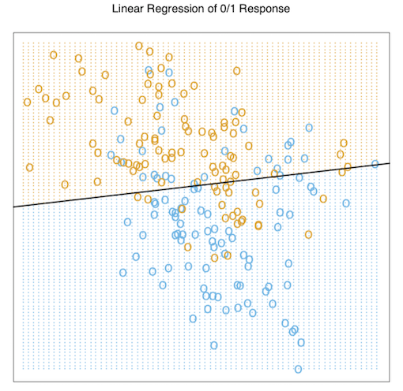
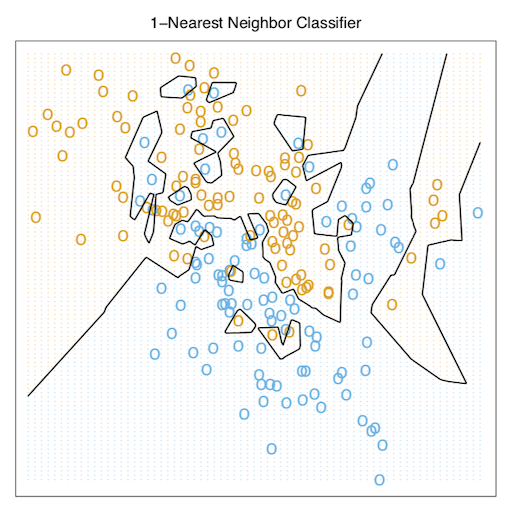

#Two simple Approachs to Prediction#

---

앞의 Introduction에서는 가볍게 지도학습과 비지도학습을 설명하며 글을 시작하였다.

교재의 앞부분에서 중점적으로 다룰 지도학습은 간단하게 입력값에 대한 목표치가 주어져있으며, 이를 가지고 있는 데이터를 이용해 예측하거나 분류하는 것이라고 말할 수 있다.

2단원의 시작으로는 예측에 있어 간단하게 사용하는 두 가지 방법을 소개한다.

* Least Squares

* Nearest Neighbors rule

##Least Squares##

 대표적으로 우리가 알고있는 선형모델을 표현하면 아래와 같다.

$$\hat{Y}=\hat{\beta_0}+\sum\limits_{j=1}^p{X_{j}\hat{\beta_{j}}}$$

위의 식에서 $X^T = (X_1,X_2,..,X_{p})$ 의 형태를 띄는 벡터이다.

 &nbsp;&nbsp;&nbsp;&nbsp; 여기서 $\hat{\beta_0}$는 *intercept*이며 이는 기계학습에서 *bias(편향)*이라 칭하기도한다. 우리는 편의상 $\hat{Y}$를 깔끔하게 표현하기 위해 ${X}$벡터 안에 constant variable 1을 집어 넣어 $\hat{\beta_0}$를 $\hat{\beta}$에 포함시켜 
 $\hat{Y}={X}^T\hat{\beta}$로 표기한다. 이는 선형모델을 내적의 형태로 만들어 표기한다는 것에 있어 또 다른 편리함이 존재한다.
 
 위의 선형모델 식에 따르면 ${Y}$는 scalar지만, 일반적으로 K-vector라고 한다면, ${\beta}$는 $p\times{K}$의 행렬이 된다.
 
 $({X},{\hat{Y}})$는 $p+1$차원의 입출력 공간에 존재하는 hyperplane을 나타내게 된다.
 
&nbsp;&nbsp;&nbsp;&nbsp; 어떻게 하면 가지고 있는 trainig data를 선형모델에 잘 fitting 시킬 수 있을까? 다양한 방법들이 존재하지만, 위에서 언급했듯이 가장 대중적으로 사용하는 방식은 least squares method일 것이다.

 이 방법은 실제 ${y}$값과 선형 모델을 통해 추정한 ${\hat{y}}$ 간의 차이인 잔차의 제곱을 최소화하는 ${\beta}$를 찾는 원리를 이용하며, 이를 수식으로 표현하면 아래와 같다.
 
 $$RSS({\beta})= \sum\limits_{i=1}^{N}({y_{i}}-{x_{i}}^T{\beta})^2$$
 
 
 $RSS({\beta})$는 파라미터에 대해 2차항의 함수 꼴이기에 최소값이 언제나 존재하지만, 고유의 해를 갖진 않을 수도 있다. 
 
 해를 구하는 것을 행렬로 도식화 한다면 아래와 같이 표현할 수 있다.
 
 $$RSS({\beta})=(\mathbf{y}-\mathbf{X}{\beta}^T)(\mathbf{y}-\mathbf{X}{\beta})$$
 
 여기서 **X** 는 Nxp 행렬이며 각각의 행은 입력 벡터를 의미하고, **y**는훈련 데이터 셋의 출력값으로 N-vector를 갖는다. 위의 식을 {\beta}에 대해서 미분을 해보면 우리는  아래와 같은 normal equations을 얻을 수 있다.
 
 $$\mathbf{X}^T(\mathbf{y}-\mathbf{X}{\beta})=0$$

 만약 $\mathbf{X}^T\mathbf{X}$가 nonsingular 즉 $det(\mathbf{X}^T\mathbf{X})=0$이라면 유니크한 값을 갖는 해는 ${\hat{\beta}}=(\mathbf{X}^T\mathbf{X})^{-1}\mathbf{X}^T\mathbf{y}$ 이며, i번째 입력값 ${x_{i}}$의 fitted value는 $\hat{y_{i}}=\hat{y}(x_{i})=x_{i}^T\hat{\beta}$가 된다.

 전체 fitted surface는 p개의 파라미터 $\hat{\beta}$로 이루어져있다. 직관적으로 볼 때 이는 우리가 지나치게 많은 데이터 셋을 가지고 있지 않아도 특정 모델에  fitting 시킬 수 있음을 보여준다.

**Example**

&nbsp;&nbsp;&nbsp;&nbsp; 선형 모델을 이용한 간단한 분류의 예시를 살펴보자.

 

 &nbsp;&nbsp;&nbsp;&nbsp;이는 교재 figure 2.1에 수록된 산점도이다. 이는 $X_1$ 과 $X_2$ 쌍의 산점도를 나타내며, 출력되는 class variable G는 BLUE or ORANGE로 두 가지가 있다. 각 클래스 별로는 100개의 데이터가 존재하며, 선형모델을 적용하여 이 데이터에 fitting을 한다. 회귀분석을 위해 response Y를 BLUE면 0으로, ORANGE면 1로 표기하며, fitted values인 $\hat{Y}$는 예시에 제시된 규칙에 따라서 $\hat{Y}$가 0.5보다 크다면 fitted class variable인 $\hat{G}$를 ORANGE(=1)로, 그렇지 않으면 BLUE(=0)로 반환한다.
 
 $\mathbf{R}^2$ 공간에서의 점들의 셋은 위에서 언급한 rule에 의해 두 가지로 분류되며, 이 때의 ${\{x: x^T{\hat{\beta}}=0.5}\}$ 의 hyperplane이 (여기서는 1차원의 직선을 의미한다.) *decision boundary*가 된다.
 
이 경우에서 우리는 *decision boundary*를 기준으로 몇몇의 잘못 분류되어있는 점들을 확인할 수 있다. **이러한 오분류가 일어나는 것이 모델이 너무 엄격해서 일까 ? 아니면 이러한 몇몇 error들은 불가피한 오류인 것일까?** 우리가 가지고 있는 training data를 어떻게 얻게 되었는지를 언급하지 않은 상태에서 두 가지 가능한 시나리오를 생각해보자.(data가 어떻게 gathering되었는지 알 수 있다면 판단은 조금 달라진다는 것을 의미하는 것일까? 추후에 알아보자.)

* Scenario 1 :

각 범주에 속하는 training data는 서로 독립이며 다른 모평균을 갖는 이변량 가우시안 분포에서 생성되었다.

* Scenario 2:

각 범주에 속하는 training data는 각 분포의 모평균이 가우시안 분포를 따르는 10개의 low-variance 가우시안 분포의 혼합모델에서 생성되었다.

&nbsp;&nbsp;&nbsp;&nbsp; 가우시안 분포의 혼합은 generative model로 잘 설명할 수 있다. 여기서 generative model이라 함은, 주어진 여러개의 가우시안 분포 중에서(위의 시나리오2에서는 10개의 가우시안분포.) 어떤 분포를 사용할지를 택하는 discrete한 변수를 생성한 뒤 정해진 density로부터 관측치를 생성하는 모델이라고 설명할 수 있다. 

한 클래스마다 하나의 가우시안 분포를 적용하는 것은(=한 클래스에 속하는 관측치가 하나의 Normal을 따르는 확률변수에서 파생된 것이라면,) 뒤에 4장에서 다시 배우겠지만 1차원의 decision boundary가 최선의 방법이며, 이때 우리가 얻은 추정치가 최적의 결과일 것이다. 하지만 이러한 선형적인 decision boundary 케이스에서 두 범주 간 영역의 overlap은 불가피하며 예측해야하는 미래의 데이터 또한 이러한 overlap의 늪에서 자유로울 수 없을 것이다.

 만약 여러개의 범주가 빽빽하게 서로 각각의 다른 정규분포로부터 나온 확률변수에서 파생된 것이라면, 이야기는 조금 달라진다. 이 때는 직선으로 그은 decision boundary가 최적의 의사결정을 내리는데에 적절하지 않을 가능성이 높으며, 실제로도 그렇다. 이런 케이스에서의 최적의 decision boundary는 위와 다르게 더 nonlinear 할 것이며, disjoint하게 클래스 간의 구분을 잘 해줄 것이지만 이를 얻기란 매우매우 어려운 일이다.(설령 너무나도 잘 분류하고 싶어서 꼬불꼬불 구역을 나눈다 하더라도 과적합의 문제 또한 발생할 수 있겠지..)
 
 
 &nbsp;&nbsp;&nbsp;&nbsp; 이 내용은 추후에 조금 더 다뤄보도록 하고 위에서 언급한 두번째 시나리오에 조금 더 적합한, 선형회귀와는 N극과 S극 마냥 반대선상에 있는 다른 분류방법을 보도록 하자.
 
## Nearest-Neighbor Methods ##
 
 
 &nbsp;&nbsp;&nbsp;&nbsp;Nearest-Neighnor Methods는 입력공간에서의 x와 가장 가까운 거리에 있는 training set T 안에 있는 관측치들로 $\hat{Y}$를 형성하는 방법이다. 특히 k개의 최근접 이웃으로 fitting한 $\hat{Y}$는 아래와 같이 정의할 수 있다.
 
 $$\hat{Y}(x)=\frac{1}{k}\sum\nolimits_{x_i \in N_{k}(x)}{y_{i}}$$
 
 여기서 $N_{k}(x)$란 training sample안에서 점 $x_{i}$과 제일 가까운 k개의 관측치를 의미한다. 가장 nearest한 거리는 어떻게 정의되는가? 이 방법에서 우리는 Euclidean distance를 가정하며, 이는 x에서 유클리디안 거리로 제일 가까운 k개의 관측치들을 찾고, 이들의 **종속변수**(Response)의 평균을 구하는 것이다.
 
  
 
 &nbsp;&nbsp;&nbsp;&nbsp;앞에서 언급한 binary classification의 예제를 이번에는 Nearest-Neighbor Methods를 이용하여 접근해보고자 한다. 문제에서 k는 15로 지정하였으며, binary로 coded된 출력변수의 15개 평균으로 model fitting을 했다. 위의 방법은 관측된 값이 (0,1)로 binary class의 두 가지 결과값으로 나오기 때문에, 최근접 이웃의 방법을 따르면 우리가 얻게되는 $\hat{Y}$는 $x_{i}$주변의 15개의 관측치의 종속변수들 안에서 Orange의 비율을 나타낼 것이다.
 
 &nbsp;&nbsp;&nbsp;&nbsp; 앞서 least squares 방법을 쓴 것에 비해 위의 방법은 오분류한 클래스들이 다소 적어 보인다. 그림만으로도 확인이 가능하듯이 이 예제에 한해서는 최소제곱법보다는 k=15의 최근접이웃방법을 적용하는 것이 classification에 더 좋은 모델임을 보여준다. 또 다른 그림을 보자.
 
  
  
 
  &nbsp;&nbsp;&nbsp;&nbsp; 위의 그림 k를 1로 설정하고 최근접이웃 방법을 사용한 모습이다. 일일이 확인해보면 모든 데이터들이 한개도 빠짐없이 바르게 분류되어있음을 확인할 수 있다. 우리는 이를 통해 몇가지 사실을 알았다.
  
* k최근접이웃 방법에서는 훈련데이터들의 에러가 대략 k에 대한 증가함수라는 것을 알 수 있다. 또한 k가 1이라면 error는 항상 0이다.
  
* k최근접이웃은 p개의 파라미터를 갖는 최소제곱법과 달리 오로지 k한개만의 모수를 갖고 이를 통해 모델이 결정된다.
  
 우리는 효과적인 k의 값은 대개 p보다는 큰 $N/k$이며, 이는 k값이 증가함에 따라 감소함을 알 수 있다. 만약 이웃들간의 영역이 겹치지 않는다면 우리는 각 region마다 하나의 모수를 fitting할 것이기 때문이다.
 
  이와 같은 특징을 갖는 최근접이웃의 방법은 우리가 앞서 제시한 두개의 시나리오 상황에서 특히 시나리오2에 더 적합한 분류기법이다.  정규분포를 따르는 자료에서 decision boundary가 불필요하게 noisy가 많았기 때문이다.
  
  
*From Least Squares to Nearest Neighbors*

&nbsp;&nbsp;&nbsp;&nbsp; 최소제곱법은 모델 setting이 아주 smooth하고, fitting에 있어서 안정적이다. 하지만 이는 선형 decision boudary가 타당하다는 아주 무거운 가정을 만족해야한다는 단점이 있다. 

 반대로 최근접이웃방법은 가정의 제약은 거의 없고 어떤 상황에서든 적절하게 k를 조정하여 사용할 수있다는 장점이 있다. 하지만 이는 decision boundary가 매우 복잡하게 비선형적인 form을 띄기 때문에, 적은 편향을 갖지만, 높은 분산을 지닌다.
 
  **variance-bias trade off**의 문제로써, 두가지의 방법은 순서대로 **(low variance-high bias), (high variance-low bias)**를 갖는다.
 
 
 각각의 방법은 각자 적합한 상황이 있으며, 시나리오1에는 최소제곱법이, 시나리오2에서는 최근접이웃법이 적절할 것으로 보여진다.

&nbsp;&nbsp;&nbsp;&nbsp; 오늘날 이 두가지 방법은 가장 대중적으로 쓰이는 대표적인 방법이다. 일례로 k=1 최근접이웃방법은 시장의 대부분에서 저차원의 문제를 해결하는데 사용되는 방법이다.  

##Statistical Decision Thoery##
 

 이번 단원에서는 이 전에 언급했었던 두가지 모델 등을 포함한 몇몇의 모델을 발전시키는데 인사이트를 제공해줄 몇가지 이론 등을 발전시켜보고자 한다. 먼저 quantative한 output들에 대하여 생각해볼 것이며, random variables(확률변수)과 probability space(확률공간)에 대해서 논의를 할 것이다.
 
 먼저 ${X} \in \mathbf{R}^p$는 실수의 입력벡터이며, ${Y} \in \mathbf{R}$는 출력되는 확률변수이다. 또한 이둘의 결합분포는 $Pr(X,Y)$로 표기한다.
 
 우리는 $Y$를 예측하기 위해 주어진 입력변수 $X$를 이용하여 $f(X)$라는 함수를 찾고자한다. 이 이론은 예측에 있어서 error를 penalize하는 loss function 
 $L(Y,f(X)$를 필요로한다. 이에 대한 예시로 우리에게 가장 잘 알려진 *squared error loss*가 있다. (=$L(Y,f(X)))= (Y-f(X))^2$).
 
 이는 우리가 f를 찾을 수 있게하며, 식을 전개하면 아래와 같다.
 
 $$EPE(f) = E(Y-f(X))^2 = \int[y-f(x)]^2f(x,y)dxdy$$
 이를 X에 대해 조건부식으로 표현하면 
 
 $$EPE(f) = {E}_{X}{E}_{Y|X}([Y-f(X)]^2|X)$$
 
가 되며 EPE를 pointwise하게 만족시키는 f(x)는 아래와 같이 표현할 수 있고 그 밑에 이어지는 식이 그때의 해($f(X)$)이다.

$$f(x)=argmin_{c}E_{Y|X}([Y-c]^2|X=x)$$

$$f(x)=E(Y|X=x)$$
 이 해는 조건부평균을 의미하며 또한 regression function으로 잘 알려져있다.
 다시말해 average squared error가 최적의 예측척도로 여겨질 때, best prediction of $Y$ at any point $X=x$는 Y의 X에 대한 조건부 평균이라는 것이다.
 
 **k-NN methods에서는 해의 추정치를 아래와 같이 표현한다.**
 
 $$\hat{f}(x)=Ave(y_{i}|x_{i} \in N_{k}(x))$$
  
 위 식에서는 두가지의 approximation이 존재하는데, 
 
 
* 기댓값은 샘플 데이터들의 평균으로 근사한다는 것과,

* 한 점에서의 conditioning은 목표지점과 가까운 어떤 지역의 conditioning으로 relax된다는 것이다.

 만약 knn에서 샘플의 사이즈가 아주크고, k또한 크다면, 평균은 더 안정적으로 변할 것이고, 결합확률분포의 mild regularity conditions하에서 $f(x)$가 $E(Y|X=x)$로 근사한다. 하지만 종종 우리가 다루는 데이터들의 표본의 크기는 항상 크지가 않으며, 차원이 커지면 새롭게 발생하는 문제들도 존재한다. 이는 추후 뒷장에서 다뤄보도록 하자.
 
 
&nbsp;&nbsp;&nbsp;&nbsp; 우리는 knn과 최소제곱법이 모두 조건부 기댓값을 통해 $f(x)$를 찾아가는 것을 알았다. 하지만 최소제곱법에서는 두가지 조건을 가정해야한다.

* 회귀함수 $f(x)$가 globally linear function에 의해 잘 근사되어야한다는 것.
 
* $\beta=[E(XX^T)]^{-1}E(XY)$ 

 knn 방법은 $f(x)$가 locally constant function에 의해서 잘 근사되어야한다는 가정을 필요로한다.

&nbsp;&nbsp;&nbsp;&nbsp; $L_2$ loss function 대신 $L_1: E|Y-f(X)|$를 쓸 수는 없는걸까? 이에 대한 해답은 아래와 같다.

$$\hat{f}(x)=median(Y|X=x)$$
이는 location에 대한 다른 측정방법이며 조건부 평균에 비해서는 조금더 robust한 estimates이다. 하지만 이러한 loss function에 대한 접근은 미분을 함에 있어서 불연속점을 갖고있기 때문에 널리 사용될 수 있는 방법은 아니다. 외부의 변화에 더 robust한 loss function들은 뒷 장에서 추후에 추가 설명을 할 것이다. 하지만 그럼에도 역시 squared error methods가 가장 널리 알려져있고 편리한 방법일 것이다.

 &nbsp;&nbsp;&nbsp;&nbsp; 출력변수가 categorical output이라면 어떨까? 이는 수치형 자료일 때와 같은 paradigm을 공유하며, 오직 예측오차를 penalize하는 loss function만 다르면 된다. loss function은 $K\times{K}$의 matrix $\mathbf{L}$이며, 이는 대각원소가 0이고 모든 원소가 nonnegative한 행렬이다. 여기서 $L(k,l)$은 K class에 속하는 관측치를  L class에 분류하였을 때 드는 cost를 의미한다.
 
 우리는 대개 loss funtion으로 $zero-one$ loss function을 사용하며, 이때 expected prediction error는 아래와 같다.
 
 $$EPE=E(L(G,\hat{G}(X))]$$
 
 이를 앞에와 똑같은 방법으로 X에 대해 조건부 기대값을 걸면
 
 $$EPE=E_{X}\sum\limits_{k=1}^{K}L[G_{k},\hat{G}(X)]Pr(G_{k}|X)$$
 로 표현된다.
 
 똑같이 EPE pointwise를 최소화하게 만족하는 $\hat{G}(x)$는 
 $argmin_{{g}\in {G}}\sum\limits_{k=1}^KL(G_{k},g)Pr(G_{k}|X=x)$이고 0-1 loss function에서 이를 간략하게 아래처럼 표현할 수 있다.
 
 $$\hat{G}(x)=argmin_{{g}\in {G}}[1-Pr(g|X=x)]$$
  또는, $\hat{G}(x)=G_{k}$ if $Pr(G_{k}|X=x)=max_g\in{G}Pr(g|X=x)$로 표기가능하다.
  
  위의 해는 *Bayes classifier*로 알려져 있으며, 이는 조건부 이산분포 $Pr(G|X)$를 이용하여 가장 probable한 class에 분류하는 것이다. 베이즈 분류기의 error rate는 
  *Bayes rate*로 불린다.
  
  