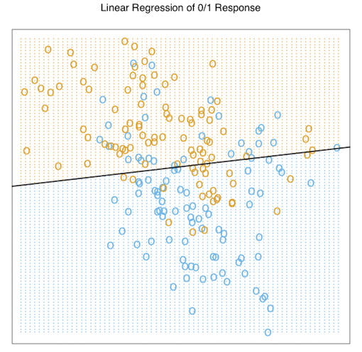
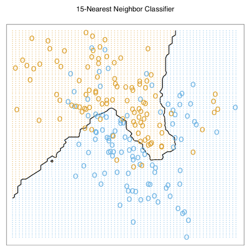
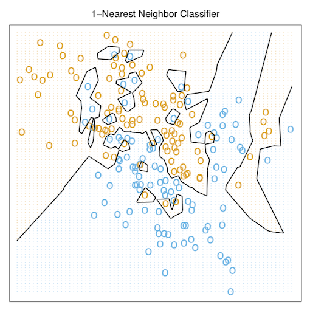

---
#Two simple Approachs to Prediction#

---

앞의 Introduction에서는 가볍게 지도학습과 비지도학습을 설명하며 글을 시작하였다.

교재의 앞부분에서 중점적으로 다룰 지도학습은 간단하게 입력값에 대한 목표치가 주어져있으며, 이를 가지고 있는 데이터를 이용해 예측하거나 분류하는 것이라고 말할 수 있다.

2단원의 시작으로는 예측에 있어 간단하게 사용하는 두 가지 방법을 소개한다.

* Least Squares

* Nearest Neighbors rule

##Least Squares##

 대표적으로 우리가 알고있는 선형모델을 표현하면 아래와 같다.

$$\hat{Y}=\hat{\beta_0}+\sum\limits_{j=1}^p{X_{j}\hat{\beta_{j}}}$$

위의 식에서 $X^T = (X_1,X_2,..,X_{p})$ 의 형태를 띄는 벡터이다.

 &nbsp;&nbsp;&nbsp;&nbsp; 여기서 $\hat{\beta_0}$는 *intercept*이며 이는 기계학습에서 *bias(편향)*이라 칭하기도한다. 우리는 편의상 $\hat{Y}$를 깔끔하게 표현하기 위해 ${X}$벡터 안에 constant variable 1을 집어 넣어 $\hat{\beta_0}$를 $\hat{\beta}$에 포함시켜 
 $\hat{Y}={X}^T\hat{\beta}$로 표기한다. 이는 선형모델을 내적의 형태로 만들어 표기한다는 것에 있어 또 다른 편리함이 존재한다.
 
 위의 선형모델 식에 따르면 ${Y}$는 scalar지만, 일반적으로 K-vector라고 한다면, ${\beta}$는 $p\times{K}$의 행렬이 된다.
 
 $({X},{\hat{Y}})$는 $p+1$차원의 입출력 공간에 존재하는 hyperplane을 나타내게 된다.
 
&nbsp;&nbsp;&nbsp;&nbsp; 어떻게 하면 가지고 있는 trainig data를 선형모델에 잘 fitting 시킬 수 있을까? 다양한 방법들이 존재하지만, 위에서 언급했듯이 가장 대중적으로 사용하는 방식은 least squares method일 것이다.

 이 방법은 실제 ${y}$값과 선형 모델을 통해 추정한 ${\hat{y}}$ 간의 차이인 잔차의 제곱을 최소화하는 ${\beta}$를 찾는 원리를 이용하며, 이를 수식으로 표현하면 아래와 같다.
 
 $$RSS({\beta})= \sum\limits_{i=1}^{N}({y_{i}}-{x_{i}}^T{\beta})^2$$
 
 
 $RSS({\beta})$는 파라미터에 대해 2차항의 함수 꼴이기에 최소값이 언제나 존재하지만, 고유의 해를 갖진 않을 수도 있다. 
 
 해를 구하는 것을 행렬로 도식화 한다면 아래와 같이 표현할 수 있다.
 
 $$RSS({\beta})=(\mathbf{y}-\mathbf{X}{\beta}^T)(\mathbf{y}-\mathbf{X}{\beta})$$
 
 여기서 **X** 는 Nxp 행렬이며 각각의 행은 입력 벡터를 의미하고, **y**는훈련 데이터 셋의 출력값으로 N-vector를 갖는다. 위의 식을 {\beta}에 대해서 미분을 해보면 우리는  아래와 같은 normal equations을 얻을 수 있다.
 
 $$\mathbf{X}^T(\mathbf{y}-\mathbf{X}{\beta})=0$$

 만약 $\mathbf{X}^T\mathbf{X}$가 nonsingular 즉 $det(\mathbf{X}^T\mathbf{X})=0$이라면 유니크한 값을 갖는 해는 ${\hat{\beta}}=(\mathbf{X}^T\mathbf{X})^{-1}\mathbf{X}^T\mathbf{y}$ 이며, i번째 입력값 ${x_{i}}$의 fitted value는 $\hat{y_{i}}=\hat{y}(x_{i})=x_{i}^T\hat{\beta}$가 된다.

 전체 fitted surface는 p개의 파라미터 $\hat{\beta}$로 이루어져있다. 직관적으로 볼 때 이는 우리가 지나치게 많은 데이터 셋을 가지고 있지 않아도 특정 모델에  fitting 시킬 수 있음을 보여준다.

**Example**

&nbsp;&nbsp;&nbsp;&nbsp; 선형 모델을 이용한 간단한 분류의 예시를 살펴보자.

 

 &nbsp;&nbsp;&nbsp;&nbsp;이는 교재 figure 2.1에 수록된 산점도이다. 이는 $X_1$ 과 $X_2$ 쌍의 산점도를 나타내며, 출력되는 class variable G는 BLUE or ORANGE로 두 가지가 있다. 각 클래스 별로는 100개의 데이터가 존재하며, 선형모델을 적용하여 이 데이터에 fitting을 한다. 회귀분석을 위해 response Y를 BLUE면 0으로, ORANGE면 1로 표기하며, fitted values인 $\hat{Y}$는 예시에 제시된 규칙에 따라서 $\hat{Y}$가 0.5보다 크다면 fitted class variable인 $\hat{G}$를 ORANGE(=1)로, 그렇지 않으면 BLUE(=0)로 반환한다.
 
 $\mathbf{R}^2$ 공간에서의 점들의 셋은 위에서 언급한 rule에 의해 두 가지로 분류되며, 이 때의 ${\{x: x^T{\hat{\beta}}=0.5}\}$ 의 hyperplane이 (여기서는 1차원의 직선을 의미한다.) *decision boundary*가 된다.
 
이 경우에서 우리는 *decision boundary*를 기준으로 몇몇의 잘못 분류되어있는 점들을 확인할 수 있다. **이러한 오분류가 일어나는 것이 모델이 너무 엄격해서 일까 ? 아니면 이러한 몇몇 error들은 불가피한 오류인 것일까?** 우리가 가지고 있는 training data를 어떻게 얻게 되었는지를 언급하지 않은 상태에서 두 가지 가능한 시나리오를 생각해보자.(data가 어떻게 gathering되었는지 알 수 있다면 판단은 조금 달라진다는 것을 의미하는 것일까? 추후에 알아보자.)

* Scenario 1 :

각 범주에 속하는 training data는 서로 독립이며 다른 모평균을 갖는 이변량 가우시안 분포에서 생성되었다.

* Scenario 2:

각 범주에 속하는 training data는 각 분포의 모평균이 가우시안 분포를 따르는 10개의 low-variance 가우시안 분포의 혼합모델에서 생성되었다.

&nbsp;&nbsp;&nbsp;&nbsp; 가우시안 분포의 혼합은 generative model로 잘 설명할 수 있다. 여기서 generative model이라 함은, 주어진 여러개의 가우시안 분포 중에서(위의 시나리오2에서는 10개의 가우시안분포.) 어떤 분포를 사용할지를 택하는 discrete한 변수를 생성한 뒤 정해진 density로부터 관측치를 생성하는 모델이라고 설명할 수 있다. 

한 클래스마다 하나의 가우시안 분포를 적용하는 것은(=한 클래스에 속하는 관측치가 하나의 Normal을 따르는 확률변수에서 파생된 것이라면,) 뒤에 4장에서 다시 배우겠지만 1차원의 decision boundary가 최선의 방법이며, 이때 우리가 얻은 추정치가 최적의 결과일 것이다. 하지만 이러한 선형적인 decision boundary 케이스에서 두 범주 간 영역의 overlap은 불가피하며 예측해야하는 미래의 데이터 또한 이러한 overlap의 늪에서 자유로울 수 없을 것이다.

 만약 여러개의 범주가 빽빽하게 서로 각각의 다른 정규분포로부터 나온 확률변수에서 파생된 것이라면, 이야기는 조금 달라진다. 이 때는 직선으로 그은 decision boundary가 최적의 의사결정을 내리는데에 적절하지 않을 가능성이 높으며, 실제로도 그렇다. 이런 케이스에서의 최적의 decision boundary는 위와 다르게 더 nonlinear 할 것이며, disjoint하게 클래스 간의 구분을 잘 해줄 것이지만 이를 얻기란 매우매우 어려운 일이다.(설령 너무나도 잘 분류하고 싶어서 꼬불꼬불 구역을 나눈다 하더라도 과적합의 문제 또한 발생할 수 있겠지..)
 
 
 &nbsp;&nbsp;&nbsp;&nbsp; 이 내용은 추후에 조금 더 다뤄보도록 하고 위에서 언급한 두번째 시나리오에 조금 더 적합한, 선형회귀와는 N극과 S극 마냥 반대선상에 있는 다른 분류방법을 보도록 하자.
 
## Nearest-Neighbor Methods ##
 
 
 &nbsp;&nbsp;&nbsp;&nbsp;Nearest-Neighnor Methods는 입력공간에서의 x와 가장 가까운 거리에 있는 training set T 안에 있는 관측치들로 $\hat{Y}$를 형성하는 방법이다. 특히 k개의 최근접 이웃으로 fitting한 $\hat{Y}$는 아래와 같이 정의할 수 있다.
 
 $$\hat{Y}(x)=\frac{1}{k}\sum\nolimits_{x_i \in N_{k}(x)}{y_{i}}$$
 
 여기서 $N_{k}(x)$란 training sample안에서 점 $x_{i}$과 제일 가까운 k개의 관측치를 의미한다. 가장 nearest한 거리는 어떻게 정의되는가? 이 방법에서 우리는 Euclidean distance를 가정하며, 이는 x에서 유클리디안 거리로 제일 가까운 k개의 관측치들을 찾고, 이들의 **종속변수**(Response)의 평균을 구하는 것이다.
 
  
 
 &nbsp;&nbsp;&nbsp;&nbsp;앞에서 언급한 binary classification의 예제를 이번에는 Nearest-Neighbor Methods를 이용하여 접근해보고자 한다. 문제에서 k는 15로 지정하였으며, binary로 coded된 출력변수의 15개 평균으로 model fitting을 했다. 위의 방법은 관측된 값이 (0,1)로 binary class의 두 가지 결과값으로 나오기 때문에, 최근접 이웃의 방법을 따르면 우리가 얻게되는 $\hat{Y}$는 $x_{i}$주변의 15개의 관측치의 종속변수들 안에서 Orange의 비율을 나타낼 것이다.
 
 &nbsp;&nbsp;&nbsp;&nbsp; 앞서 least squares 방법을 쓴 것에 비해 위의 방법은 오분류한 클래스들이 다소 적어 보인다. 그림만으로도 확인이 가능하듯이 이 예제에 한해서는 최소제곱법보다는 k=15의 최근접이웃방법을 적용하는 것이 classification에 더 좋은 모델임을 보여준다. 또 다른 그림을 보자.
 
  
  
 
  &nbsp;&nbsp;&nbsp;&nbsp; 위의 그림 k를 1로 설정하고 최근접이웃 방법을 사용한 모습이다. 일일이 확인해보면 모든 데이터들이 한개도 빠짐없이 바르게 분류되어있음을 확인할 수 있다. 우리는 이를 통해 몇가지 사실을 알았다.
  
* k최근접이웃 방법에서는 훈련데이터들의 에러가 대략 k에 대한 증가함수라는 것을 알 수 있다. 또한 k가 1이라면 error는 항상 0이다.
  
* k최근접이웃은 p개의 파라미터를 갖는 최소제곱법과 달리 오로지 k한개만의 모수를 갖고 이를 통해 모델이 결정된다.
  
 우리는 효과적인 k의 값은 대개 p보다는 큰 $N/k$이며, 이는 k값이 증가함에 따라 감소함을 알 수 있다. 만약 이웃들간의 영역이 겹치지 않는다면 우리는 각 region마다 하나의 모수를 fitting할 것이기 때문이다.
 
  이와 같은 특징을 갖는 최근접이웃의 방법은 우리가 앞서 제시한 두개의 시나리오 상황에서 특히 시나리오2에 더 적합한 분류기법이다.  정규분포를 따르는 자료에서 decision boundary가 불필요하게 noisy가 많았기 때문이다.
  
  
*From Least Squares to Nearest Neighbors*

&nbsp;&nbsp;&nbsp;&nbsp; 최소제곱법은 모델 setting이 아주 smooth하고, fitting에 있어서 안정적이다. 하지만 이는 선형 decision boudary가 타당하다는 아주 무거운 가정을 만족해야한다는 단점이 있다. 

 반대로 최근접이웃방법은 가정의 제약은 거의 없고 어떤 상황에서든 적절하게 k를 조정하여 사용할 수있다는 장점이 있다. 하지만 이는 decision boundary가 매우 복잡하게 비선형적인 form을 띄기 때문에, 적은 편향을 갖지만, 높은 분산을 지닌다.
 
  **variance-bias trade off**의 문제로써, 두가지의 방법은 순서대로 **(low variance-high bias), (high variance-low bias)**를 갖는다.
 
 
 각각의 방법은 각자 적합한 상황이 있으며, 시나리오1에는 최소제곱법이, 시나리오2에서는 최근접이웃법이 적절할 것으로 보여진다.

&nbsp;&nbsp;&nbsp;&nbsp; 오늘날 이 두가지 방법은 가장 대중적으로 쓰이는 대표적인 방법이다. 일례로 k=1 최근접이웃방법은 시장의 대부분에서 저차원의 문제를 해결하는데 사용되는 방법이다.  

##Statistical Decision Thoery##
 

 이번 단원에서는 이 전에 언급했었던 두가지 모델 등을 포함한 몇몇의 모델을 발전시키는데 인사이트를 제공해줄 몇가지 이론 등을 발전시켜보고자 한다. 먼저 quantative한 output들에 대하여 생각해볼 것이며, random variables(확률변수)과 probability space(확률공간)에 대해서 논의를 할 것이다.
 
 먼저 ${X} \in \mathbf{R}^p$는 실수의 입력벡터이며, ${Y} \in \mathbf{R}$는 출력되는 확률변수이다. 또한 이둘의 결합분포는 $Pr(X,Y)$로 표기한다.
 
 우리는 $Y$를 예측하기 위해 주어진 입력변수 $X$를 이용하여 $f(X)$라는 함수를 찾고자한다. 이 이론은 예측에 있어서 error를 penalize하는 loss function 
 $L(Y,f(X)$를 필요로한다. 이에 대한 예시로 우리에게 가장 잘 알려진 *squared error loss*가 있다. (=$L(Y,f(X)))= (Y-f(X))^2$).
 
 이는 우리가 f를 찾을 수 있게하며, 식을 전개하면 아래와 같다.
 
 $$EPE(f) = E(Y-f(X))^2 = \int[y-f(x)]^2f(x,y)dxdy$$
 이를 X에 대해 조건부식으로 표현하면 
 
 $$EPE(f) = {E}_{X}{E}_{Y|X}([Y-f(X)]^2|X)$$
 
가 된다. 위의 식은 조건부 확률을 통해 구할 수 있으며, 증명이 다소 간단하니 살짝만 살펴보자.

$$EPE(f) = \int[y-f(x)]^2Pr(dx,dy)$$

$$= \int[y-f(x)]^2f(x,y)dxdy$$

$$=\int_x\int_y[y-f(x)]^2f(x,y)dxdy$$

$$=\int_x\int_y[y-f(x)]^2f(x)f(y|x)dxdy$$ 
 
$$=\int_x(\int_y[y-f(x)]^2f(y|x)dy)f(x)dx$$

$$=\int_x(E_{Y|X}([Y-f(X)^2|X=x))f(x)dx$$

$$= E_XE_{Y|X}([Y-f(X)]^2|X=x)$$

여기서 EPE를 pointwise하게 만족시키는 f(x)는 아래와 같이 표현할 수 있고 그 밑에 이어지는 식이 그때의 해($f(X)$)이다.

$$f(x)=argmin_{c}E_{Y|X}([Y-c]^2|X=x)$$

$$f(x)=E(Y|X=x)$$
 이 해는 조건부평균을 의미하며 또한 regression function으로 잘 알려져있다.
 다시말해 average squared error가 최적의 예측척도로 여겨질 때, best prediction of $Y$ at any point $X=x$는 Y의 X에 대한 조건부 평균이라는 것이다.
 
 수리통계학적인 기법을 사용해서 우리는 위에서 언급한 조건부평균이 최소자승예측자라는 것을 보일 수 있다. 이를 수식으로 표현하면 아래와 같다.
 
 
$For\ any\ function\ of\ X,\ say\ u(x),$

$$E[(Y-u(X))^2|X] \geq E[(Y-E[Y|X])^2|X]$$

$i.e.,\ E[Y|X] is\ equal\ to\ argmin_{u(X)}E[(Y-u)^2|X].$ 

이를 증명하면 아래와 같이 식전개를 할 수있다.

$$E[(Y-u(X))^2|X]=E[Y-\textbf{E[Y|X]}+\textbf{E[Y|X]}-u(X))^2|X]$$

$$=E[{(Y-E[Y|X])+(E[Y|X]-u(X))}^2|X]$$
$$=E[(Y-E(Y|X])^2|X)]+E[(E[Y|X]-u(X))^2|X]$$

$$+2E[(Y-E[Y|X])(E[Y|X]-u(X))|X]$$

$$=E[(Y-E[Y|X])^2|X]+(E[Y|X]-u(X))^2$$

$$\because E[(Y-E[Y|X])(E[Y|X]-u(X))|X]=(E[Y|X]-u(X))E[Y-E[Y|X]|X]=0$$
여기서 마지막 cross term이 0이 되는 이유는 $E[Y-E[Y|X]|X]$에 힌트가 있다. $E[Y|X]$의 조건부평균은 random variable의 형태이지만 이 식의 앞에 X에 대한 조건부 평균이 한번 더 씌여있는 것 때문인데, 이럴경우에 E[Y|X]는 constant꼴을 갖는다. (Given X=x이기 때문에) 고로 식전개를 하면 $E[Y|X]-E[Y|X]$꼴이므로 0이된다. 

또는 다르게 생각하여 E[Y|X]는 X에대한 함수형태로 나오기때문에 이를 g(X)로 정의하여 문제를 풀 수도 있다.

그렇다면 식은 $E[Y-g(X)|X]$의 형태가 되며 이를 전개하면 $E[Y|X]-g(X)=0, \because g(X)=E[Y|X]$가 되어 위와 같은 식을 얻을 수 있다.

부등호를 정리하면 아래와 같이 표현되며,

$$E[(Y-u(X))^2|X] \geq E[(Y-E[Y|X])^2|X]$$

그러므로 임의의 $X=x$점에 대한 best prediction of $Y$는 조건부 평균이 된다는 것을 알 수 있다.

 
 **k-NN methods에서는 해의 추정치를 아래와 같이 표현한다.**
 
 $$\hat{f}(x)=Ave(y_{i}|x_{i} \in N_{k}(x))$$
  
 위 식에서는 두가지의 approximation이 존재하는데, 
 
 
* 기댓값은 샘플 데이터들의 평균으로 근사한다는 것과,

* 한 점에서의 conditioning은 목표지점과 가까운 어떤 지역의 conditioning으로 relax된다는 것이다.

 **만약 knn에서 샘플의 사이즈가 아주크고, k또한 크다면, 평균은 더 안정적으로 변할 것이고, 결합확률분포의 mild regularity conditions하에서 $f(x)$가 $E(Y|X=x)$로 근사한다**. 하지만 종종 우리가 다루는 데이터들의 표본의 크기는 항상 크지가 않으며, 차원이 커지면 새롭게 발생하는 문제들도 존재한다. 이는 추후 뒷장에서 다뤄보도록 하자.
 
 이전 단계에서 OLS estimator가 linearity 가정 하에서 $E[Y|X=x]$에 대한 consistent estimator라는 것을 보였다. KNN  method에 대해서도 이가 성립하는지 증명을 해보자.
 
 mild regularity conditions이 타당하다 가정을 하고 $k,N \rightarrow \infty,\ \frac{k}{N} \rightarrow 0$ 이라면, 
 
 $$avg(Y|X \in N_{k}(x)) \xrightarrow{P} E[Y|X=x]$$
 
 임을 Empirical explanation을 통해 증명해보자.
 
 KNN 방법을 풀어헤쳐쓰면 아래와 같은 점들이 모여있는 것으로 생각할 수 있다.
 
 $$(x+\Delta_1,y_1),\ (x+\Delta_2,y_2),\  (x+\Delta_{k-1},y_{k-1}),\ (x+\Delta_{k},y_k)$$

 또한 이 점들에 대해서 아래와 같은 식을 만족한다. 
 
 $$(||x-a|| \geq ||max_{j}(\Delta_{j}))||, a\in N_{k}(x)^c, j=1,...,k)$$
 
여기서 $avg(Y|X \in N_k(x)) \equiv \frac{y_1+..+y_{k}}{k} \xrightarrow{P} E[Y]$
이 식이 약대수의 법칙에 의해 equivalent하다고 볼 수 있을까? 아쉽게도 그렇지 않다.

이러한 식 도출의 과정은 $\frac{k}{N} \rightarrow \infty$라는 가정을 무시해서 나오는 결과이다. 만약 $k \rightarrow \infty$라는 가정만 있고 data set의 사이즈에 대한 가정이 없다면 위의 식은 맞을지도 모른다.

 이렇게 생각해보자. 우리는 x에 대한 조건부 평균 Y를 구하는 것인데, x에 종속적이게 대응하는 Y의 점들 k개를 생각해볼 수 있다. 여기서 k가 무한대로 간다면 우리는 거의 모든 x의 점들에 대응하는 Y를 고려하고 이러한 y들의 x에 대한 조건부평균을 구하는 것인데, 모든 x에 대하여 Y를 구했기 때문에 그냥 Y에 대한 평균을 구하는 것과 확률적으로 일치할 것이다. 하지만 k의 사이즈에 비해 기하급수적으로 data set의 사이즈가 커진다면 이는 data set에서 k개의 관측치가 차지하는 공간을 모든 x에 대한 y의 대응값으로 생각할 수 **없기**때문에 이때는 X에 대한 Y의 조건부평균으로 보는 것이 합당할 것이다. 이를 간단한 시뮬레이션을 통해 확인해보도록 하겠다.
 
 
 
&nbsp;&nbsp;&nbsp;&nbsp; 우리는 knn과 최소제곱법이 모두 조건부 기댓값을 통해 $f(x)$를 찾아가는 것을 알았다. 하지만 최소제곱법에서는 두가지 조건을 가정해야한다.

* 회귀함수 $f(x)$가 globally linear function에 의해 잘 근사되어야한다는 것.
 
* $\beta=[E(XX^T)]^{-1}E(XY)$ 

 knn 방법은 $f(x)$가 locally constant function에 의해서 잘 근사되어야한다는 가정을 필요로한다.

&nbsp;&nbsp;&nbsp;&nbsp; $L_2$ loss function 대신 $L_1: E|Y-f(X)|$를 쓸 수는 없는걸까? 이에 대한 해답은 아래와 같다.

$$\hat{f}(x)=median(Y|X=x)$$
이는 location에 대한 다른 측정방법이며 조건부 평균에 비해서는 조금더 robust한 estimates이다. 하지만 이러한 loss function에 대한 접근은 미분을 함에 있어서 불연속점을 갖고있기 때문에 널리 사용될 수 있는 방법은 아니다. 외부의 변화에 더 robust한 loss function들은 뒷 장에서 추후에 추가 설명을 할 것이다. 하지만 그럼에도 역시 squared error methods가 가장 널리 알려져있고 편리한 방법일 것이다.

 &nbsp;&nbsp;&nbsp;&nbsp; 출력변수가 categorical output이라면 어떨까? 이는 수치형 자료일 때와 같은 paradigm을 공유하며, 오직 예측오차를 penalize하는 loss function만 살짝 바꿔주면 된다. loss function은 $K\times{K}$의 matrix $\mathbf{L}$이며, 이는 대각원소가 0이고 모든 원소가 nonnegative한 행렬이다. 여기서 $L(k,l)$은 K class에 속하는 관측치를  L class에 분류하였을 때 드는 cost를 의미한다.
 
 우리는 대개 loss funtion으로 $zero-one$ loss function을 사용하며, 이때 expected prediction error는 아래와 같다.
 
 $$EPE=E(L(G,\hat{G}(X))]$$
 
 이를 앞에와 똑같은 방법으로 X에 대해 조건부 기대값을 걸면
 
 $$EPE=E_{X}\sum\limits_{k=1}^{K}L[G_{k},\hat{G}(X)]Pr(G_{k}|X)$$
 로 표현된다.
 
 똑같이 EPE pointwise를 최소화하게 만족하는 $\hat{G}(x)$는 
 $argmin_{{g}\in {G}}\sum\limits_{k=1}^KL(G_{k},g)Pr(G_{k}|X=x)$이고 0-1 loss function에서 이를 간략하게 아래처럼 표현할 수 있다.
 
 $$\hat{G}(x)=argmin_{{g}\in {G}}[1-Pr(g|X=x)]$$
  또는, $\hat{G}(x)=G_{k}$ if $Pr(G_{k}|X=x)=max_g\in{G}Pr(g|X=x)$로 표기가능하다.
  
  위의 해는 *Bayes classifier*로 알려져 있으며, 이는 조건부 이산분포 $Pr(G|X)$를 이용하여 가장 probable한 class에 분류하는 것이다. 베이즈 분류기의 error rate는 
  *Bayes rate*로 불린다.
  
&nbsp;&nbsp;&nbsp;&nbsp; 다시 k-최근접이웃 분류기를 돌아보면, 우리는 이 분류방법이 직접적으로 위의 해에 근사한다는 것을 알 수 있다. 이는 앞에서 확인하였듯이, 주변 이웃을 구성하는 클래스들 안에서 다수결로 예측을 시행하며, 한 지점의 조건부 확률은 주변 점의 이웃들의 조건부 확률로 완화되는 것을 알 수 있다. 또한 그때의 확률은 training-sample의 proportions으로 측정된다.

Binary classification 문제에서 우리는 error의 loss function이 $\hat{f}(X)=E(Y|X)=Pr(G=G_{1}|X)$ , if $G_{1}$ corresponded to Y=1가 되는 것을 알고, 이 것이 K-class로 확장된다면 손실함수는 $E(Y_{k}|X)=Pr(G=G_{k}|X)$가 된다. 이 수식은 더미변수를 활용한 회귀의 과정이 베이즈분류기의 또다른 방법을 보여주는 것을 의미한다.

 하지만 실제 문제를 처리할 때 선형모델을 사용하면서 $\hat{f}(X)$는 무조건 양의 값을 가져야하진 않으며, 이럴 때 우리는 이를 확률의 추정치로 사용할 때 어려움에 당도할 수도 있다. 이러한 문제는 추후 챕터 4장에서 다뤄보도록 하자.
 
 
##Local Methods in High Dimensions

&nbsp;&nbsp;&nbsp;&nbsp; knn averaging을 통해 표본의 크기가 점점 커져도 우리는 언제나 이상적인 최적의 조건부 평균값으로 근사할수있을까? 아쉽게도 이러한 생각은 고차원의 문제에서 **가볍게 깨져버리는 기대**이며 이러한 현상을 우리는 차원의 저주(*curse of dimensionality*)라고 칭한다. 이에 대한 예시를 몇개만 살펴보겠다.

 p차원의 hypercube안에서 균등하게 분포되어 있는 input에 대한 최근접이웃 절차를 살펴보자. 관측치에서 fraction r을 포착하기 위해 타겟 포인트에 대한 hypercubical neighborhood를 보낸다고 생각해보자. 이는 결국 $\frac{r}{volume}$이며, expected dege legnth는 $e_{p}(r)=r^{1/p}$가 될 것이다. 10차원의 예시에서 r을 조정하며 예시를 들자면, $e_{10}(0.01)=0.63$, $e_{10}(0.1)=0.8$이 되며 각 입력변수에 대한 전체 range는 1.0이다. 이는 다시말해 우리가 1%와 10%로 각각입력변수의 local average를 포착하기 위해 커버해야하는 입력변수의 범위가 63%와 80%나 필요하다는 것을 의미한다. 이러한 이웃은 더이상 **local**하지 않다. 이러한 문제를 없애기 위하여 차원을 줄인다고 한다면 이는 더 적은 관측치로 평균값을 내게 되므로, 분산은 더욱 더 커지는 문제가 발생한다. 
 
  또다른 고차원에서의 sparse sampling의 결과로는 모든 표본 지점들이 표본의 경계에 가깝다는 점이다. 이는 다시 말해 차원이 높아질수록 공간의 사이즈는 기하급수적으로 커지는데에 반해 오히려 sample point들이 한 쪽 구석으로 몰려 이루어지게된다는 것을 의미한다.
  
 이는 대부분의 데이터들이 다른 data point들 간의 거리보다 표본공간의 경계와 더 가깝다는 것을 의미하고 training sample의 경계에서는 더욱 더 예측을 어렵게한다는 문제점을 낳는다.
 
 
####여기는 넘 어려워서 이따가하자 

##Statistical Models, Supervised Learning and Function Approximation

&nbsp;&nbsp;&nbsp;&nbsp; 우리의 목표는 input과 output간의 예측적인 관계를 보여주는 함수 $f(x)$에 잘 근사하는 $\hat{f}(x)$를 찾는 것이다. 우리는 Section 2.4를 통해 이론적으로 squared error loss가  양적변수에 대하여 회귀함수 $f(x)=E(Y|X=x)$를 도출하는 것을 배웠다. knn methods는 이러한 조건부 기댓값을 직접적으로 추정해주지만 적어도 아래의 조건에서는 만족하지 않는다는 것을 보여준다.

* 입력공간의 차원이 너무 높다면, 최근접이웃방법은 타겟 포인트에 가까워지지 못하며 큰 error를 발생시킨다.

* 만약 특별한 구조가 존재한다면, 이는 추정치에 대한 편향과 분산을 줄이는데 사용된다.

####A Statistical Model for the Joint Distribution Pr(X,Y)

$$Y=f(X)+\epsilon$$ 
 
 이러한 식이 있다고 가정해보자. (여기서 임의 오차 $\epsilon$은 $E(\epsilon)=0$이며, X에 대해 독립이다.)
 
 이러한 가법오차모델은 실제로 유용한 근사식이다. 실제로 대부분 시스템 안에서의 입출력쌍 $(X,Y)$는 determinisitic 한 $Y=f(X)$의 관계를 만족하지 않는다. 일반적으로 이 둘의 관계에서는 측정되지 안흔 변수들이 존재하고 이들이 Y에 영향을 미치며, 측정오차 또한 포함된다. 
 
 가법 모델의 가정은 이러한 deterministic 한 관계 외의 error $\epsilon$을 잡아낼 수 있다는 것을 전제로 한다.
 
 특정 몇몇의 문제들은 deterministic 한 관계를 갖고 만족하는 모습을 갖는다. 하지만 이러한 문제들으 다루는 것이 아닌 상황이라면 우리가 오차항에 기반한 모델을 사용하는 것이 적절할까? 에 대해 생각을 해볼 수 있다.
 
&nbsp;&nbsp;&nbsp;&nbsp; error에 대한 독립성, 등분산성 정규성등의 가정이 엄격하게 필요한 것은 아니지만, 앞서 배웠던 EPE criterion의 예를 생각해보면 이러한 가정은 상당히 합당하다. 이러한 모델에서는 최소제곱법을 이용하여 모델을 estimation하는 것이 합당해보인다. 

 우리는 독립성 가정의 제약을 간단한 modifications을 통해 해결할 수도 있다. 일례로 $Var(Y|X=x)=\sigma(x)$를 생각해보자. 우리는 Y를 X에 대한 조건부를 걸어 Y의 분산과 평균이 X에 종속적인 관계가 되도록 변형할 수 있다.  일반 적으로 조건부 분포 $Pr(Y|X)$는 X에 종속적일 수 있지만, 가법오차모델에서 이 부분은 배제하여 생각한다.
 
 가법모형은 통상적으로 질적 출력변수 $G$에 대해서는 잘 사용되지 않는다. 이러한 케이스에서 목표함수 $p(X)$는 조건부 밀도 $Pr(G|X)$이며 직접적으로 모델링할 수 있다. 그 예로 binary class 데이터에서 자료들이 독립적인 binary trials에서 오고 두 범주에 속할 확률을 각각 $p(X)$ ,$1-p(X)$로 두는 것이 합리적일 것이다.
 
그러므로 Y가 0-1 로 나뉘어진 질적변수 G인 케이스에서는 $E(Y|X=x)=p(x)$이 되지만, 분산은 $Var(Y|X=x)=p(x)[1-p(x)]$로 x에 대해 종속적이다.

####Supervised Learning

&nbsp;&nbsp;&nbsp;&nbsp; 머신러닝의 관점에서 함수적합의 패러다임은 training set과 input output이 존재하는 시스템에서 일정한 알고리즘에 의해 근사된다.

 이러한 알고리즘은 입출력간의 관계를 보여주는 $\hat{f}$를 원자료와 생성된 출력값 간의 차이인 $y_{i}-\hat{f}(x_{i})$를 통해 변형할 수 있는 특징을 가지고 있고, 이를 *learning by example*이라고 칭한다.
 
 ####Function Approximation
 
 &nbsp;&nbsp;&nbsp;&nbsp; 학습 패러다임에 대한 접근은 수학, 통계학의 분야에서는 함수근사와 추정으로 여겨진다. 
 
  우리가 조우하게 되는 많은 근사들은 데이터에 따라 적합하게 변형되는 모수 $\theta$의 set을 갖는다. 그 예로 선형모델 $f(x)=x^T\beta$는 모수 $\theta=\beta$를 갖는다. 또다른 유용한 근사분류기법은 *linear basis expansions*으로 표현할 수 있다. 
  $$f_{\theta}(x)=\sum\limits_{k=1}^Kh_{k}(x)\theta_{k}$$
  
  여기서 말하는 $h_{k}$는 적절한 함수의 집합 혹은 입력벡터 x의 변환형태이다. 전통적인 예로 polynomial 과 trigonometric expansions 등이 있고 이 때의 $h_{k}$는 $x_{1}^2, x_1x_2^2, cos(x_1)$ 등이 있다. 우리는 또한 비선형형태의 확장 또한 사용할 수가 있는데, 인공신경망 모델에서 일반적으로 쓰이는 sigmoid 변환을 예로 들 수 있으며, 이러한 form은 아래와 같다.
  
  $$h_{k}(x)=\frac{1}{1+exp(-x^T\beta_{k})}$$
  
  우리는 최소제곱법을 사용하면서 선형모델에서 $RSS(\beta)$를 최소화 하여 모수 $\theta$의 함수로 취급하고 모수를 추정하는데 사용할 수 있다.
  
  선형 모델에서는 우리는 minimization problem을 통해 단순한 closed form의 해를 구할 수 있다. 이는 basis function 방법론에서도 통용되며, 숨겨진 또다른 모수를 갖지않는한 똑같이 적용된다. 그렇지 않은 경우라면 우리는 iterative methods나 numerical optimazation을 통해 해를 구해야 한다.
  
  최소제곱법은 아주 편리하고 대중적이지만, 항상 판단의 척도가 되는 것은 아니다.
  
  더 general한 추정의 원리의 예로는 *maximum likelihood estimation*이 있다. 
  $$L(\theta)=\prod_{i=1}^Nf(x_{i};\theta)$$
  $$l(\theta)=\sum\limits_{i=1}^Nlogf(x_{i};\theta)$$
 MLE를 얻는 원리는 다음과 같다. 가장 합리적인 모수 $\theta$는 관찰된 표본을 얻을 확률이 가장높을 경우이다.  
 
 가법오차모델 $Y=f_{\theta}(X)+{\epsilon}$에서의 최소제곱을 통해 얻은 estimators는 조건부 likelihood를 이용했을 때의 최대우도(maximum likelihood)와 같다.
 
 $$Pr(Y|X,\theta)=N(f_{\theta}(X),\sigma^2)$$
 
 고로 추가적인 정규성 가정을 더하는 것은 제한적으로 보일지라도, 결과는 같다. 이 데이터에서 log-likelihood는 아래와 같다.
 
 $$L(\theta)=-\frac{N}{2}log(2{\pi})-Nlog{\sigma}-\frac{1}{2\sigma^2}\sum\limits_{i=1}^N(y_{i}-f_{\theta}(x_{i}))^2$$
 
 위의 식에서 $\theta$를 포함하는 항은 오직 마지막 항이며, 이는 $RSS(\theta)$의 scalar negative miltiplier이다.
 
 조금 더 흥미로운 예제로는 질적 출력변수 $G$에 대한 회귀함수 $Pr(G=G_{k}|X=x)$에 대한 mutinomial likelihood이다. 우리가 주어진 X에 대하여 각 클래스가 속할 조건부확률이  $Pr(G=G_{k}|X=x)=p_{k,\theta}(x), k=1,...,K$ 로 표기되는 모델을 갖고있다고 생각해보자. 이 때의 위 식의 log-likelihood(cross entropy)는 아래와 같이 표현된다.
 (미안한데 진짜 뭐가 흥미로운지 하나도 모르겠다..)
 
 $$L(\theta)=\sum\limits_{i=1}^Nlogp_{g_{i},\theta}(x_{i})$$
 
 
##Structured Regression Models

&nbsp;&nbsp;&nbsp;&nbsp; 우리는 최근접이웃이나 다른 local methods가 직접적으로 특정 점에서의 함수를 추정한다는 것에 초점을 맞추고 있지만, 이는 가끔 차원으로 인해 어려움을 맞딱들인다는 사실을 배웠다. 이러한 접근법은 저차원의 문제에서는 부적절할 수도 있으며, 오히려 더 구조화고 제약된 조건을 걸어 모델을 짜는 것이 데이터를 더 효율적으로 사용하는 방법일 수도 있다.

 $$RSS(f)=\sum\limits_{i=1}^N(y_{i}-f(x_{i}))^2$$
 
 위의 식을  최소화 하는 해를 구하는 것은 training points $({x_{i}},y_{i})$를 지나는 함수 ${\hat{f}}$가 무한히 존재할 수도있다. 이러한 해들 중 몇몇은 test points에서 아주 형편없는 predictors가 될 것이다. 만약 관측치 쌍의 갯수가 많다면 이러한 리스크는 제한될 수도 잇다. 우리가 조금 더 효율적으로 이 문제를 접근하려면 N을 무작정 늘리는 것이 아닌, 유한한 N안에서 최소화 문제에 조금 더 제약을 걸어 보다 작은 함수의 집합을 얻어야한다. **이러한 해들에 대한 제약이 이 책의 주요 토픽이다.**
 
 여기서 하나 명확히 해야할 것은 우리가 유일한 해를 얻기 위해 제약을 거는 것이 해의 복잡성으로 인해 나오는 모호성을 없앨 수는 없다는 것이다.
 
##Classes of Restricted Estimators

 비모수회귀나 다양한 학습 방법들은 우리가 추가하는 제약이 어떤 nature를 갖느냐에 따라 다르게 분류된다. 각각의 클래스들은 한개 혹은 그 이상의 parameter를 갖는데, 때때로 local neighborhood의 효과적인 size를 조절해주는 smoothing parameter들이 있다. 우리는 여기서 class of restricted estimators들을  넓은 의미로 3가지로 분류하여 설명을 한다.
 
####1.Roughness Penalty and Bayesian Methods
 
 먼저 $RSS(f)$를 penalize하여 컨트롤하는 함수가 있다.
 
 이는 1차원의 입력변수에 대한 cubic smoothing spline method이다.
 
 쉽게 설명하면 cubic spline 이란, 점들을 매끄럽게 연결하는 알고리즘인데, 두 점을 잇는 곡선을 3차 다항식을 이용하여 사용하기 때문에 cubic이라 칭한다.
 
 $$PRSS(f;\lambda)=RSS(f) + {\lambda}J(f)$$
 
 
 $$PRSS(f;\lambda)=\sum\limits_{i=1}^N(y_{i}-f(x_{i}))^2 + {\lambda}\int[f^{''}(x)]^2dx$$
 
 roughness penalty는 $f$의 큰 2차미분 값들에 영향을 미치며, penalty의 정도는 $\lambda \geq 0$인 $\lambda$에 의해 표현된다. $\lambda=0$ 는 no smoothing을 의미하며  penalty가 존재하지 않게 되는 것이고, $\lambda = \infty$ 의 경우는 오로지 x내의 선형함수만을 허용하게 된다. (smoothing을 무한히 많이해서  RSS(f)와 같은 식이라고 보면 된다.)
 
 Penalty function J는 어떤 차원에서든 특별한 버전으로 만들어지고 특별한 구조를 짤 수 있다.
 
 Penalty function 또는 regularization methods는 이런 종류의 함수의 smooth behavior에 대한 사전적 믿음을 나타내며, 이는 Bayesian framework내에서 적용가능하다.
 
 penalty J는 log-prior에 해당하며, 함수 $PRSS(f;\lambda)$는 log-posterior distribution을, $PRSS(f;\lambda)$를 최소화하는 것은 posterior mode를 찾는 것과 상응한다. 이에 대한 심화내용은 뒤의 챕터 5와 챕터 8 에서 후술할 것이다.
 
 
####2.Kernal Methods and Local Regression

&nbsp;&nbsp;&nbsp;&nbsp; 이 방법은 local neighborhood의 nature를 특정지음으로써 회귀함수 혹은 조건부 기댓값에 대한 추정치를 제공하는 방법이다.

 local neighborhood는 *kernel function* $K_{\lambda}(x_0,x)$에 의해 specify 되는데, 이 함수는 $x_{0}$주변의 x점들에 가중치를 부여하는 함수이다. 
 
 가우시안 커널은 일례로 정규확률밀도함수에 기반하여 가중함수를 갖게 되는데 그 식은 아래와 같다.
 
 $$K_{\lambda}(x_0,x)=\frac{1}{\lambda}exp[-\frac{||x-x_0||^2}{2{\lambda}}]$$
 
  이는 $x_0$으로부터 squared Euclidean 거리를 통해 멀어지는 지점들에 대해 지수적으로 가중치를 부여하는 원리이다.
  
  여기서 파라미터 $\lambda$는 정규밀도의 분산을 의미하며, 이웃의 너비를 결정한다. 가장 간결한 kernel estimate의 form은 **Nadaraya-Watson weighted average**이며 식은 아래와 같다.
  
  $$\hat{f}(x_0)=\frac{\sum\limits_{i=1}^NK_{\lambda}(x_0,x_{i})y_{i}}{\sum\limits_{i=1}^NK_{\lambda}(x_0,x_{i})}$$
  
 위의 식은 error를 최소화 하는 회귀함수 f(x)가 $E[Y|X=x]$인 점을 이용하여 이를 조건부확률로 쪼갠 후, 각각 marginal distribution인 $f(x)$와 joint distribution
인 $f(x,y)$에 두개의 kernel density를 plug하여 $y_{i}$에 가중치를 부여하는 함수라고 볼 수 있다.
  일반적으로 우리는 $f(x_0)$의 local 회귀 추정치를 $f_{\hat{\theta}}(x_0)$ 로 표기하고, $\hat{\theta}$를 최소화하는 식은 
  
  $$RSS(f_{\theta},x_0)=\sum\limits_{i=1}^NK_{\lambda}(x_0,x_{i})(y_{i}-f_{\theta}(x_{i}))^2$$ 이다.
  
  여기서 $f_{\theta}$는 어떤 모수화된 함수이며 low-order polynomial 등이 있다.
  다른 예를 보자. 
  
*$f_{\theta}={\theta}_0$인 constant function이면 이 함수의 결과값은 위에서 언급한 Nadaraya-Watson estimate를 갖는다.

*$f_{\theta}={\theta}_0+{\theta}_1x$ 는 local linear regression model을 갖는다.

등이 있다.

 정리하자면 최근접이웃 방법은 더 데이터에 의존적인 metric을 갖는 kernel method라고 볼 수 있다. 여기서 knn의 metric은 아래와 같으며,
 
 $$K_{k}(x,x_0)=I(||x-x_0|| \leq||x_{(k)}-x_0||)$$
 여기서 $x_{(k)}$는 $x_0$으로부터 *k*번째 만큼 떨어진 training 관측치 이고, $I(S)$는 집합 S의 indicator 함수이다. 이 방법론들 역시 고차원에서는 차원의 저주를 벗어나기 위해 적절한 변형이 필요하며, 이는 6장에서 후술하겠다.
 
 
####3. Basis Functions and Dictionary Methods

&nbsp;&nbsp;&nbsp;&nbsp; 이번에 소개하는 방법은 친숙한 선형모델과 다항모델로의 확장을 포함하지만, 그 중에서도 더 유연하고 중요하게 여겨지는 다양한 모델들을 포함한다. 

모델에 대한 함수 *f*는 basis function의 선형확장 form을 띄며 아래와 같은 형태를 갖는다.

$$f_{\theta}(x)=\sum\limits_{m=1}^M{\theta}_{m}h_{m}(x)$$
 여기서 $h_{m}$은 입력변수 x에 대한 함수이며, linear term은 모수 $\theta$에 의해 결정된다. 이 basis functions의 큰 틀은 굉장히 다양한 방법론을 포함하고 있으며 이를 설명할 수 있는데 더 자세한 예는 추후의 챕터에서 다뤄본다고 한다.(책이 너무 불친절하죠 첨에,,?)
 
 간단한 예시로 *Radial basis functions*가 있는데 이는 symmetric한 p차웡늬 커널을 특정 centroid에 위치시키는 방법이다.
 
 이는 위의 식에서 입력변수 x에 대한 함수가 $K_{\lambda{m}}({\mu},x)$의 형태이며 여기서 kernal K는 일반적으로 정규확률 kernel인 $K_{\lambda}({\mu},x)=e^{-||x-{\mu}||^2/2{\lambda}}$가 많이 사용된다.
 
 어떤 의미를 갖는지, 여기서 이 모델의 예시들로 어떠한 확장을 할 수 있는지는 아직까지 챕터2만을 읽고는 이해가 힘든 것 같다. 추후 뒷 챕터에서 또 다룬다고 한다..
 
##Model Selection and the Bias-Variance Tradeoff

&nbsp;&nbsp;&nbsp;&nbsp;모든 모델들은 모수에 대한 smoothing과 complexity가 결정되어야한다. 

* penalty term의 multiplier

* kernel의 너비

* basis functions의 갯수

등으로 말이다.

 이러한 조건들이 어떻게 움직이냐에 따라 우리는 training과 test sample에 대해 적절한 bias와 variance에 어떻게 제약을 걸고 모델을 꾸려나갈지를 결정할 수 있다. 
  

 knn 회귀 알고리즘을 예시로 편향 분산 trade-off 관계를 살펴보자.
 
 $x_0$에서의 expected prediction error는 test 혹은 generalization error 라고 알려져있으며 식을 분해하면 아래와 같다.
 
 $$EPE_{k}(x_0)=E[(T-\hat{f}_{k}(x_0))^2|X=x_0]$$
 
 $$= {\sigma}^2+[Bias^2(\hat{f}_{k}(x_0))+Var_{\tau}(\hat{f}_{k}(x_0))]$$
 
 $$= {\sigma}^2 + [f(x_0)-\frac{1}{k}\sum\limits_{l=1}^kf(x_{(l)})]^2+ \frac{{\sigma}^2}{k}$$
 
 이는 3 terms로 나눠서 표현식을 살펴볼 수 있는데, 첫번째 텀의 ${\sigma}^2$은 *irreducible* error이다. 즉 우리가 설령 참값의 $f(x_0)$를 알고있다하더라도 이는 새로운 test target의 분산이기에 우리의 control을 벗어난 변수이다. 
 
 두번째 term은 편향의 제곱을 의미하며 편향이란 $\hat{f}_{k}(x_0)$와 실제 $f({x_0})$간의 차이를 말한다. 이는 k에 대해 단조증가 함수이며 k가 증가함에 따라 커진다. 
 
 세번째 term은 new target의 분산을 k로 나눈 것이므로, k가 커짐에 따라 값이 감소한다.
 
 위의 관계를 통해 우리는 모델들이 예측에 있어서 갖고 있는 딜레마 bias-variance trade off를 확인할 수 있다.
 
 우리는 통상적으로 편향분산간의 딜레마를 줄이고 test error를 최소화 하기위해 모델의 complexity를 정하는데, 일반적으로 우리는 test error에 대한 뚜렷한 추정값으로 MSE(=training error)를 사용한다. 하지만 불행하게도 이는 model complexity가 적절하게 고려되지 않는다면 training error는 test error에 대해 좋은 추정값이 되지 못한다.
 
 prediction 방법에서 test error를 측정하는 방법들은 추후 7장에서 더 논의 해보고 
 매우 찜찜하지만 2장은 여기서 마무리 하겠다.
 
 
  
  
