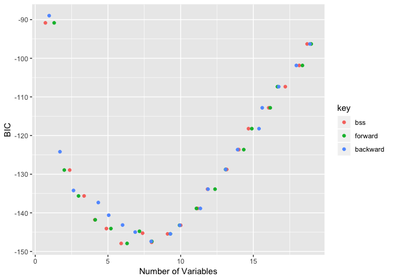

---

# Linear Methods for Regression


##3.3 Subset Selection

&nbsp;&nbsp;&nbsp;&nbsp; 최소제곱법을 통한 추정이 종종 만족스럽지 않은 이유는 두가지가 있다.

 * prediction accuracy

 * interpretation
 
 최소제곱법은 낮은 bias를 갖지만 높은 분산을 갖기도 한다.
 
 **prediction accuracy**는 때때로 shrinking 이나 몇 회귀계수들을 0으로 축소시키는 방법을 통해 개선되기도 하는데, 이는 낮은 bias를 포기하는대신 predicted value의 분산을 줄임으로써 전체적인 모델정확성을 향상시킨다.
 
 만약 많은 predictors가 존재한다면 우리는 종종 예측에 좀 더 강한 영향을 주는 smaller subset으로 모델을 꾸리려 할 것이다. 
 
 큰 그림을 위해 우리는 기꺼이 몇몇 영향력이 적은 detail한 부분들을 버리기도 한다.
 
 이번 section에서는 몇가지의 variable subset selection 방법을 살펴보도록 할 것이다. 
 
 이러한 여러 방법들은 결국 model selection의 한 과정이며 이는 선형 모델에만 국한되어있지않고, 추후에 다른 모델에서의 적용을 다룰 것이다. 
 
 이제부터 몇가지 choosing subset method를 살펴보자.
 
 

####1. Best-Subset Selection

 Best subset regression은 가능한 모든 모델을 고려하여 그 중 가장 좋은 모델이 무엇인지를 subset size k를 통해 찾아주는 방법이다. $k \in  \{0,1,2,..,p\}$
 
 간단한 예시를 통해 위의 subset selection 방법을 확인해보자.
 

```r
library(ISLR)
names(Hitters)
```

```
##  [1] "AtBat"     "Hits"      "HmRun"     "Runs"      "RBI"      
##  [6] "Walks"     "Years"     "CAtBat"    "CHits"     "CHmRun"   
## [11] "CRuns"     "CRBI"      "CWalks"    "League"    "Division" 
## [16] "PutOuts"   "Assists"   "Errors"    "Salary"    "NewLeague"
```

```r
Hitters <- na.omit(Hitters)

#Best Subset Selection method!
#Best Subset Selection이 search하는 predictor 갯수의 디폴트값은 8
#변수의 갯수가 많지 않으니 max로 탐색해보자


library(leaps)
bss <- regsubsets(Salary~.,Hitters,nvmax=length(names(Hitters))-1)
summary(bss)
```

```
## Subset selection object
## Call: regsubsets.formula(Salary ~ ., Hitters, nvmax = length(names(Hitters)) - 
##     1)
## 19 Variables  (and intercept)
##            Forced in Forced out
## AtBat          FALSE      FALSE
## Hits           FALSE      FALSE
## HmRun          FALSE      FALSE
## Runs           FALSE      FALSE
## RBI            FALSE      FALSE
## Walks          FALSE      FALSE
## Years          FALSE      FALSE
## CAtBat         FALSE      FALSE
## CHits          FALSE      FALSE
## CHmRun         FALSE      FALSE
## CRuns          FALSE      FALSE
## CRBI           FALSE      FALSE
## CWalks         FALSE      FALSE
## LeagueN        FALSE      FALSE
## DivisionW      FALSE      FALSE
## PutOuts        FALSE      FALSE
## Assists        FALSE      FALSE
## Errors         FALSE      FALSE
## NewLeagueN     FALSE      FALSE
## 1 subsets of each size up to 19
## Selection Algorithm: exhaustive
##           AtBat Hits HmRun Runs RBI Walks Years CAtBat CHits CHmRun CRuns
## 1  ( 1 )  " "   " "  " "   " "  " " " "   " "   " "    " "   " "    " "  
## 2  ( 1 )  " "   "*"  " "   " "  " " " "   " "   " "    " "   " "    " "  
## 3  ( 1 )  " "   "*"  " "   " "  " " " "   " "   " "    " "   " "    " "  
## 4  ( 1 )  " "   "*"  " "   " "  " " " "   " "   " "    " "   " "    " "  
## 5  ( 1 )  "*"   "*"  " "   " "  " " " "   " "   " "    " "   " "    " "  
## 6  ( 1 )  "*"   "*"  " "   " "  " " "*"   " "   " "    " "   " "    " "  
## 7  ( 1 )  " "   "*"  " "   " "  " " "*"   " "   "*"    "*"   "*"    " "  
## 8  ( 1 )  "*"   "*"  " "   " "  " " "*"   " "   " "    " "   "*"    "*"  
## 9  ( 1 )  "*"   "*"  " "   " "  " " "*"   " "   "*"    " "   " "    "*"  
## 10  ( 1 ) "*"   "*"  " "   " "  " " "*"   " "   "*"    " "   " "    "*"  
## 11  ( 1 ) "*"   "*"  " "   " "  " " "*"   " "   "*"    " "   " "    "*"  
## 12  ( 1 ) "*"   "*"  " "   "*"  " " "*"   " "   "*"    " "   " "    "*"  
## 13  ( 1 ) "*"   "*"  " "   "*"  " " "*"   " "   "*"    " "   " "    "*"  
## 14  ( 1 ) "*"   "*"  "*"   "*"  " " "*"   " "   "*"    " "   " "    "*"  
## 15  ( 1 ) "*"   "*"  "*"   "*"  " " "*"   " "   "*"    "*"   " "    "*"  
## 16  ( 1 ) "*"   "*"  "*"   "*"  "*" "*"   " "   "*"    "*"   " "    "*"  
## 17  ( 1 ) "*"   "*"  "*"   "*"  "*" "*"   " "   "*"    "*"   " "    "*"  
## 18  ( 1 ) "*"   "*"  "*"   "*"  "*" "*"   "*"   "*"    "*"   " "    "*"  
## 19  ( 1 ) "*"   "*"  "*"   "*"  "*" "*"   "*"   "*"    "*"   "*"    "*"  
##           CRBI CWalks LeagueN DivisionW PutOuts Assists Errors NewLeagueN
## 1  ( 1 )  "*"  " "    " "     " "       " "     " "     " "    " "       
## 2  ( 1 )  "*"  " "    " "     " "       " "     " "     " "    " "       
## 3  ( 1 )  "*"  " "    " "     " "       "*"     " "     " "    " "       
## 4  ( 1 )  "*"  " "    " "     "*"       "*"     " "     " "    " "       
## 5  ( 1 )  "*"  " "    " "     "*"       "*"     " "     " "    " "       
## 6  ( 1 )  "*"  " "    " "     "*"       "*"     " "     " "    " "       
## 7  ( 1 )  " "  " "    " "     "*"       "*"     " "     " "    " "       
## 8  ( 1 )  " "  "*"    " "     "*"       "*"     " "     " "    " "       
## 9  ( 1 )  "*"  "*"    " "     "*"       "*"     " "     " "    " "       
## 10  ( 1 ) "*"  "*"    " "     "*"       "*"     "*"     " "    " "       
## 11  ( 1 ) "*"  "*"    "*"     "*"       "*"     "*"     " "    " "       
## 12  ( 1 ) "*"  "*"    "*"     "*"       "*"     "*"     " "    " "       
## 13  ( 1 ) "*"  "*"    "*"     "*"       "*"     "*"     "*"    " "       
## 14  ( 1 ) "*"  "*"    "*"     "*"       "*"     "*"     "*"    " "       
## 15  ( 1 ) "*"  "*"    "*"     "*"       "*"     "*"     "*"    " "       
## 16  ( 1 ) "*"  "*"    "*"     "*"       "*"     "*"     "*"    " "       
## 17  ( 1 ) "*"  "*"    "*"     "*"       "*"     "*"     "*"    "*"       
## 18  ( 1 ) "*"  "*"    "*"     "*"       "*"     "*"     "*"    "*"       
## 19  ( 1 ) "*"  "*"    "*"     "*"       "*"     "*"     "*"    "*"
```

```r
bss.table <- summary(bss)
names(bss.table)
```

```
## [1] "which"  "rsq"    "rss"    "adjr2"  "cp"     "bic"    "outmat" "obj"
```

```r
par(mfrow=c(2,2))
plot(bss.table$rss,xlab="# of Variables",ylab="RSS",type="l")
plot(bss.table$adjr2,xlab="# of Variables", ylab ="Adjusted R-square",type="l")
points(which.max(bss.table$adjr2),bss.table$adjr2[which.max(bss.table$adjr2)],col="red",cex=2,pch=20)
plot(bss.table$cp,xlab="# of Variables", ylab ="Cp",type="l")
points(which.min(bss.table$cp),bss.table$cp[which.min(bss.table$cp)],col="red",cex=2,pch=20)
plot(bss.table$bic,xlab="# of Variables", ylab ="BIC",type="l")
points(which.min(bss.table$bic),bss.table$bic[which.min(bss.table$bic)],col="red",cex=2,pch=20)
```

<!-- -->
 
 
 
 위는 ISLR 패키지의 Hitters 데이터를 가져왔으며 best subset selection의 방법을 사용하기 위해 leaps 패키지의 regsubsets함수를 사용하였다. 
 
 첫번째 플롯을 확인해보면 RSS는 subset k의 사이즈가 커질수록 감소하는 모습을 보이는데, 이는 우리가 무작정 변수의 갯수를 늘리는 것이 가장 좋은 subset selection이라는 것을 의미하지 않는다. 
 
 training RSS는 full model을 사용하여 회귀를 돌렸을 때 가장 낮은 값을 갖기 때문에 RSS만으로는 좋은 모델이라 결론짓기 어렵다. 
 
 또한 이는 과적합으로 연결되어 test RSS는 정반대의 결과를 가져올 수 있다.
 
 그리하여 나머지 수정결정계수와 mallow's Cp, BIC 지표를 추가로 확인하여 결정계수의 최고점과 Cp, BIC의 최소점을 찍어 그때의 size k를 빨간 점으로 표시하였다.
 
 

```r
coef(bss,5)
```

```
##  (Intercept)        AtBat         Hits         CRBI    DivisionW 
##   97.7684116   -1.4401428    7.1753197    0.6882079 -129.7319386 
##      PutOuts 
##    0.2905164
```

 위와 같이 특정 size k에서의 회귀계수 또한 확인할 수 있다.

### 2&3. Forward, backward Stepwise Selection

 Best Subset Selection기법은 predictors의 갯수가 40개 이상이 넘어가면 매우 비효율적이며 계산이 불가능하다는 단점이 있다. 
 
 그리하여 이에 대한 대안으로 사용되는 것이 전진선택법과 후진제거법 등이 있다. 
 
 전진선택법은 intercept만 갖고 있는 reduced model에서 시작하여 model fit을 개선시킬 수 있는 predictor들을 추가하는 방법이며, 후진제거법은 full model에서 시작하여 전진선택법과 반대의 방법으로 모델을 형성한다.
 
 
 

```r
library(ggplot2)
library(tidyverse)
```

```
## ── Attaching packages ─────────────────────────────────────────── tidyverse 1.2.1 ──
```

```
## ✔ tibble  2.0.1     ✔ purrr   0.3.0
## ✔ tidyr   0.8.2     ✔ dplyr   0.7.8
## ✔ readr   1.3.1     ✔ stringr 1.3.1
## ✔ tibble  2.0.1     ✔ forcats 0.3.0
```

```
## ── Conflicts ────────────────────────────────────────────── tidyverse_conflicts() ──
## ✖ dplyr::filter() masks stats::filter()
## ✖ dplyr::lag()    masks stats::lag()
```

```r
bss.f <- regsubsets(Salary~.,Hitters,nvmax=length(names(Hitters))-1,method="forward")
bss.b <- regsubsets(Salary~.,Hitters,nvmax=length(names(Hitters))-1,method="backward")


bss.f.table <- summary(bss.f)
bss.b.table <- summary(bss.b)
names(bss.f.table)
```

```
## [1] "which"  "rsq"    "rss"    "adjr2"  "cp"     "bic"    "outmat" "obj"
```

```r
x <- seq(1,19,1)
y1 <- bss.table$bic
y2 <- bss.f.table$bic
y3 <- (bss.b.table$bic)
df <- data.frame(x,y1,y2,y3)

df2=gather(df,key,value,-x)
g<- ggplot(df2,aes(x=x,y=value,color=key))+ geom_jitter()
g<-g+ scale_colour_hue(labels=c('bss','forward','backward'))
g <- g+ylab("BIC")+xlab("Number of Variables")
g
```

<!-- -->
 
 
###4 Forward-Stagewise Regression

이 방법은 위에서 소개한 Forward stepwise보다는 좀 더 제약이 많다. 

Forward stepwise와 비슷하게 이 또한 intercept만 있는 모델에서 시작하지만 이때의 intercept 가 $\bar{Y}$이다. Centered된 predictors의 계수를 시작이 0이도록 하는 것이다. 

각 단계에서 알고리즘은 지금의 잔차와 가장 상관관계가 높은 변수를 확인해 이에 대한 잔차와 단순선형회귀를 하여 얻은 계수를 사용한다.

이 작업은 잔차가 어느 변수와도 유의한 관계를 가지지 않을때 까지 계속된다.

이 방법은 Stepwise 방법과는 달리 한번 모델에 포함된 변수들은 이후에 제거되지 않는다.


##Shrinkage Methods 

&nbsp;&nbsp;&nbsp;&nbsp;가끔은 predictors들의 부분집합을 남기고 나머지 부분들을 버림으로써 subset selection 방법은 full model을 사용했을 때 보다 더 낮은 prediction error를 갖고 용이한 해석을 이끌기도 한다. 

하지만 이는 **discrete process**인데, (변수를 버리거나 남기거나 하는 것은) 이는 종종 high variance를 갖고, prediction error of the full model을 줄이지 못하기도 한다.

Shrinkage methods는 좀더 continuous하며, 높은 변동성에 크게 제약을 받지 않는 방법이기에, 이번 소단원에서는 이에 대해서 다뤄보겠다.

###Ridge Regression

&nbsp;&nbsp;&nbsp;&nbsp; Ridge regression은 coeeicients의 size에 **penalty**를 걸어 이들을 축소시키는 방법이다.

Ridge 회귀는 고로 penalized된 residual sum of squares를 최소화 하는 방향으로 모델을 만들게 되는데 이를 수식으로 표현하면 아래와 같다.


$${\hat{\beta}}^{ridge}=argmin_{\beta}\{\sum_{i=1}^N(y_{i}-{\beta}_0-\sum_{j=1}^px_{ij}{\beta}_{j})^2+{\lambda}\sum_{j=1}^p{\beta}_{j}^2\}$$

여기서 ${\lambda} \geq 0$은 축소의 정도를 결정하는 complexity parameter인데, 이 람다의 값이 커질수록 계수를 0으로 보내는 축소가 더 많이 이루어진다.

위 식은 아래와 같이도 표현할 수 있다.

$${\hat{\beta}}^{ridge}=argmin_{\beta}\sum_{i=1}^N(y_{i}-{\beta}_0-\sum_{j=1}^px_{ij}{\beta}_{j})^2,$$

$$subject\ to\ \sum_{j=1}^p{\beta}_{j}^2 \leq t $$

각 식에서 ${\lambda}$와 $t$의 값은 1:1대응이 성립한다.


식을 확인해보면 우리는 intercept 항에 대해서는 penalization이 진행되지 않았다는
 것을 확인할 수 있는데, 이는 target $y_{i}$에 c만큼의 상수를 더해주는 것이 예측값이 c만큼 이동한다는 의미와 다르기 때문이다.
 
 
 ${\lambda}$를 통해 얻은 penalized RSS의 해는 centered된 predictors를 사용한 재모수화로 두 부분으로 쪼개지는데, 이는 $x_{ij}$가 $x_{ij}-\bar{x}_{j}$로 대체됨을 의미힌다.
 
 여기서 intercept ${\beta}_0$를 $\bar{Y}$로 추정하며, 나머지 계수들은 intercept가 없는 ridge regression 으로 centered된  $x_{ij}$들을 추정하게 된다.
 
 이러한 중심화가 수행되었다고 가정했을때, input matrix $\mathbf{X}$는 $p+1$개가 아닌 $p$개의 열을 갖는다.
 
 이러한 식과 그때의 해를 행렬로 표현하면 아래와 같다.
 
 $$RSS({\lambda})=(\mathbf{y}-\mathbf{X}{\beta})^T(\mathbf{y}-\mathbf{X}{\beta})+{\lambda}{\beta}^T{\beta}$$
 
 $${\hat{\beta}}^{ridge}=(\mathbf{X}^T{\mathbf{X}}+{\lambda}\mathbf{I})^{-1}\mathbf{X}^T\mathbf{y}$$
 
 $\mathbf{I}$는 $p\times{p}$의 항등행렬이다. 
 
 우리는 quadratic penalty ${\beta}^T{\beta}$를 사용하였기 때문에, ridge regression 의 해는 $\mathbf{y}$에 대한 선형 함수가 된다.
 
 이 해는 역행렬을 구하기 전에 $\mathbf{X}^T\mathbf{X}$의 대각원소에 양의 상수를 더한다.
 
 이는 문제를 **nonsingular**하게 해주며 $\mathbf{X}^T\mathbf{X}$가 full rank가 아니어도 괜찮게 해준다.
 
 아래에 첨부한 그림은 prostate cancer 예제를 통해 얻은 그림인데, 이는  
 $df({\lambda})$에 따라 ridge 회귀계수의 추정치가 변화하는 것을 보여준다.
 
 
 $df({\lambda})$는 penalty ${\lambda}$에 대한 함수로  *effective degress of freedom*을 보여준다.
 
 
 
 
 만약 입력변수들이 orthonormal 하다면, ridge의 추정치는 최소제곱법 추정치의 scaled version이 된다.
 
 ${\hat{\beta}}^{ridge}=\frac{\hat{\beta}}{1+{\lambda}}$


&nbsp;&nbsp;&nbsp;&nbsp;중심화된 입력행렬 $\mathbf{X}$의 고유값분해(*singular value decomposition*, SVD)를 통해 우리는 ridge regression의 특성에 대해 추가적인 insight를 얻을 수 있다.

이러한 분해는 다양한 통계적 방법에 대한 분석에 매우 용이한 방법이다.

$N\times{p}$  $\mathbf{X}$행렬의 고유값분해는 아래와 같은 form을 갖는다.

$$\mathbf{X}=\mathbf{U}\mathbf{D}\mathbf{V}^T$$

여기서 $\mathbf{U}$와 $\mathbf{V}$는 $N\times{p}$, $p\times{p}$의 직교행렬이고, $\mathbf{U}$의 열은 $\mathbf{X}$의 열공간을 span하며, $\mathbf{V}$의 열들이 행공간을 span한다.

$\mathbf{D}$는 $p\times{p}$의 대각행렬이며, 대각원소들은 $d_1\geq{d_2}\geq...\geq{d_{p}}\geq0$인 $\mathbf{X}$의 singular value들이다.

만약 한개라도 $d_j=0$이라면, $\mathbf{X}$는 singular이다.

SVD를 통해 우리는 least squares fitted vector를 아래와 같이 표현할 수 있다.

$$\mathbf{X}{\hat{\beta}^{ls}}=\mathbf{X}{(\mathbf{X}^T\mathbf{X})}^{-1}\mathbf{X}^T\mathbf{y}$$

$$=\mathbf{X}(\mathbf{V}\mathbf{D}^2\mathbf{V}^T)^{-1}\mathbf{X}^T\mathbf{y}$$

$$=\mathbf{X}\mathbf{V}\mathbf{D}^{-2}\mathbf{V}^T\mathbf{X}^T\mathbf{y}$$

$$=\mathbf{U}\mathbf{D}\mathbf{V}^T\mathbf{V}\mathbf{D}^{-2}\mathbf{V}^T\mathbf{X}^T\mathbf{y}$$

$$=\mathbf{U}\mathbf{D}^{-1}\mathbf{V}^T\mathbf{X}^T\mathbf{y}$$

$$=\mathbf{U}\mathbf{D}^{-1}\mathbf{V}^T\mathbf{V}\mathbf{D}\mathbf{U}^T\mathbf{y}=\mathbf{U}\mathbf{U}^T\mathbf{y}$$

로 표현가능하다.

여기서 $\mathbf{U}^T\mathbf{y}$는 orthonormal basis $\mathbf{U}$에 대한 $\mathbf{y}$의 좌표들이다.

이 증명은 $\mathbf{U}$와 $\mathbf{V}$의 열들이 orthogonal하다는 성질과 각 열들이 $\mathbf{X}\mathbf{X}^T$와 $\mathbf{X}^T\mathbf{X}$의 eigenvector라는 성질을 이용하여 식전개를 한 것이다.

그렇다면 이제 ridge solutions은 아래와 같이 구할 수 있다.

$$\mathbf{X}{\hat{\beta}}^{ridge}=\mathbf{X}(\mathbf{X}^T\mathbf{X}+{\lambda}\mathbf{I})^{-1}\mathbf{X}^T\mathbf{y}$$

$$=\mathbf{U}\mathbf{D}\mathbf{V}^T(\mathbf{V}\mathbf{D}^{-2}\mathbf{V}^T+\frac{{1}}{\lambda}\mathbf{I})\mathbf{V}\mathbf{D}\mathbf{U}^T\mathbf{y}$$

$$=\mathbf{U}\mathbf{U}^T\mathbf{y}+\frac{1}{\lambda}\mathbf{U}\mathbf{D}^2\mathbf{U}^T\mathbf{y}$$

$$=\mathbf{U}(\mathbf{I}+\frac{1}{\lambda}\mathbf{D}^2)\mathbf{U}^T\mathbf{y}$$

$$=\mathbf{U}\mathbf{D}(\mathbf{D}^{-2}+\frac{1}{\lambda})\mathbf{D}\mathbf{U}^T\mathbf{y}$$

$$=\mathbf{U}\mathbf{D}(\mathbf{D}^2+\lambda\mathbf{I})^{-1}\mathbf{D}\mathbf{U}^T\mathbf{y}$$

$$=\sum_{j=1}^p\mathbf{u}_{j}\frac{d_j^2}{d_j^2+\lambda}\mathbf{u}_j^T\mathbf{y}$$
 
 여기서 $\mathbf{u}_j$들은 $\mathbf{U}$의 열들이다. 
 

```r
#Do SVD!

library(MASS)
```

```
## 
## Attaching package: 'MASS'
```

```
## The following object is masked from 'package:dplyr':
## 
##     select
```

```r
X <- matrix(c(3,7,0,1,9,3,5,0,0,7),ncol = 2, nrow = 5)
XtX <- t(X)%*%X
eigen(XtX)
```

```
## eigen() decomposition
## $values
## [1] 222.2305288   0.7694712
## 
## $vectors
##            [,1]       [,2]
## [1,] -0.7929002  0.6093515
## [2,] -0.6093515 -0.7929002
```

```r
V <- eigen(XtX)$vectors
Vt <- t(V)
singular_values <- sqrt(eigen(XtX)$values)
singular_values
```

```
## [1] 14.9073985  0.8771951
```

```r
D <- diag(singular_values)
U = vector()       
for(i in 1:length(V[1,])){
    U = append(U,1/singular_values[i]*X %*% V[,i])
  }
U = matrix(U,ncol = length(V[1,]))

SVD <- function(X){  
      XtX = t(X)%*%X
      V =eigen(XtX)$vectors
      Vt = t(V)
      
      singular_values =sqrt(eigen(XtX)$values)
      D=diag(singular_values)

      U=vector() 
	for(i in 1:length(V[1,])){
	U = append(U,1/singular_values[i]*X %*% V[,i])
}
      U=matrix(U,ncol = length(V[1,]))      
      return(list(U=U,D=D,Vt=Vt))
}

U <- SVD(X)$U
D <- SVD(X)$D
Vt<- SVD(X)$Vt

U%*%D%*%Vt
```

```
##      [,1] [,2]
## [1,]    3    3
## [2,]    7    5
## [3,]    0    0
## [4,]    1    0
## [5,]    9    7
```

```r
X
```

```
##      [,1] [,2]
## [1,]    3    3
## [2,]    7    5
## [3,]    0    0
## [4,]    1    0
## [5,]    9    7
```

```r
Y <- c(1,0,5,3,2)

# \mathbf{X}{\hat{\beta}}^{ls} = UU^Ty check

X%*%solve(XtX)%*%t(X)%*%Y
```

```
##            [,1]
## [1,] -0.2631579
## [2,]  1.5847953
## [3,]  0.0000000
## [4,]  1.0116959
## [5,]  1.4093567
```

```r
U%*%t(U)%*%Y
```

```
##            [,1]
## [1,] -0.2631579
## [2,]  1.5847953
## [3,]  0.0000000
## [4,]  1.0116959
## [5,]  1.4093567
```

```r
#ridge case
lambda <- 500*diag(2)

U%*%D%*%solve(D^2+lambda)%*%D%*%t(U)%*%Y
```

```
##            [,1]
## [1,] 0.16991962
## [2,] 0.35051469
## [3,] 0.00000000
## [4,] 0.03365766
## [5,] 0.46379444
```

```r
Xbeta_ridge <- matrix(0,5,2)

for (j in 1:ncol(X)){
	Xbeta_ridge[,j] <- ((diag(D)[j]^2)/(diag(D)[j]^2+500))*U[,j]%*%t(U[,j])%*%Y
	}
	
as.matrix(rowSums(Xbeta_ridge))
```

```
##            [,1]
## [1,] 0.16991962
## [2,] 0.35051469
## [3,] 0.00000000
## [4,] 0.03365766
## [5,] 0.46379444
```

```r
U%*%D%*%solve(D^2+lambda)%*%D%*%t(U)%*%Y	
```

```
##            [,1]
## [1,] 0.16991962
## [2,] 0.35051469
## [3,] 0.00000000
## [4,] 0.03365766
## [5,] 0.46379444
```
