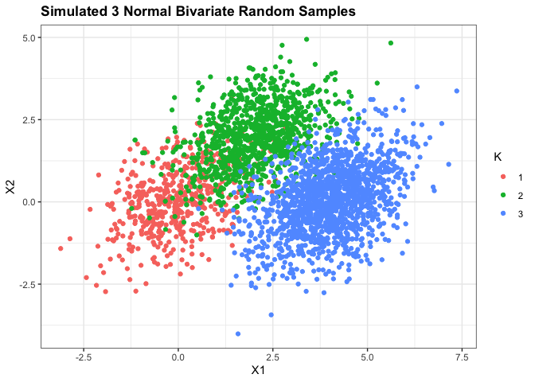
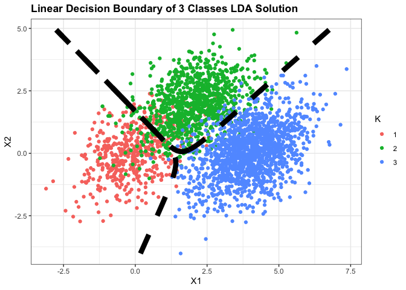

#04 Linear Methods for Classifications


##Introduction

본 단원에서는 classifications에 대해서 다룰 예정이며 분류 문제에 관해서 linear model에 대해서 논한다.

우리는 독립변수 $G(x)$가 이산집합에서 값을 가질 때, 입력 공간을 labelling된 일종의 region들의 모음으로 나눌 수 있다.

분류문제에서 선형모델을 논한다는 것은, **Decision Boundary** 가 선형이라는 것이다.

선형 결정계는 다양한 방법을 통해 찾을 수 있는데, 2장에서는 범주형 지시 변수들로 선형 회귀 모델을 적합하여 적합값의 크기대로 분류하기도 하였다.

$K$개의 범주형 변수가 있다고 가정해보자. 그리고 k번째 지시종속변수에 대해 적합한 선형모델이 $\hat{f}_k(x)=\hat{\beta}_{k0}+\hat{\beta}^T_kx$ 라고 해보자.

범주 k와 l을 구분하는 decision boundary는 $\hat{f}_k(x)=\hat{f}_l(x)$를 만족하는 점들이 될 것이다.

이는 어떤 범주의 쌍에서든 참이기 때문에, 입력공간은 piecewise hyperplanar decision boundary들로 나뉘게 된다.

이러한 회귀적인 접근은 각 범주에 discriminant functions $\sigma_k(x)$를 모델링하고 x를 discriminant function이 가장 큰 값을 갖는 범주에 분류하는 방법 중 하나이다.

posterior probability $Pr(G=k|X=x)$를 모델링 하는 것 또한 이러한 방법의 한 부류이다.

$\sigma_k(x)$또는 $Pr(G=k|X=x)$가 x에 대해 선형이라면, decision boundary 또한 선형일 것이다.


우리가 여기서 필요로 하는 조건은, $\sigma_k(x)$또는 $Pr(G=k|X=x)$의 monotone transformation(ex. log변환)의 결과가 선형성만 띄면 된다!

이러한 예로 가장 유명한 monotone transformation은 다들 알다시피 logit 변환을 예로 들 수 있다.

$Pr(G=1|X=x)=\frac{exp(\beta_0+\beta^Tx)}{1+exp(\beta_0+\beta^Tx)}$

$Pr(G=2|X=x)=1-\frac{exp(\beta_0+\beta^Tx)}{1+exp(\beta_0+\beta^Tx)}$

$logit(\hat{p})=log\frac{\hat{p}}{1-\hat{p}}$

이런 변환의 결과가 linear decision boundary를 이루는 것은 다음을 보며 확인할 수 있다.

$log\frac{Pr(G=1|X=x)}{Pr(G=2|X=x)}=\beta_0+\beta^Tx$


이 경우 decision boundary는 **log odds**가 0이 되는 지점들이고(odds=$\frac{p}{1-p}$), 이는 ${\{x|\beta_0+\beta^Tx=0}\}$로 정의되는 초평면일 것이다.


우리는 여기서 두개의 방법론을 다룰 것이다. 이는 유명하지만 엄연히는 매우 다른 방법이며, 이는 선형의 log odds 혹은 logits을 갖는 linear discriminant analysis(LDA), 그리고 linear logistic regression이다.

이 둘의 본질적인 차이는 linear function이 training data에 적합되는 방식에 있다.

 직접적인 방법론으로는 범주들 사이의 decision boundary를 선형으로 모델링하는 것인데, 이는 p차원의 입력 공간을 갖는 이진 분류 문제에서 결정계를 초평면으로 모델링 하는 것이 된다.
 
 이는 normal vector 와 cut point로 초평면을 분리하는 원리인데, 이렇게 초평면을 분리하는 방법중 대표적인 두 가지는 아래와 같다.
 
 먼저 perception 모델로, 이는 training data내에 데이터를 분리시키는 초평면이 있다면 찾아주는 알고리즘이고,
 
 두번쨰로는 optimally separating hyperplane이 존재한다면 이를 찾고, 아니라면 **training data 내에 겹치는 부분에 대한 측또를 최소화하는 초평면을 찾는 방법**이다.
 
 이 단원에서는 선형결정계에서 다루지만, 이는 일반화를 한 경우이며, 예를 들어 우리가 변수집합을 단지 단일변수만 카운팅하는 게 아니라, cross-product(벡터곱과 외적)이나 제곱항등을 추가하여 충분히 확장시킬 수 있다.
 
 이런 방법은 선형함수가 이차함수를 통해 증강된 공간 내에 존재하게 됨으로써, 이런 케이스에서 linear decision boundarty는 quadratic decision bounday가 되는 것을 의미한다.
 
 
##Linear Regression of an Indicator Matrix
 
 여기서 각 종속변수의 범주들은 지시변수로 코딩된다. 따라서 범주의 개별 클래스의 갯수가 K개라면, 지시변수 또한 $Y_k$로 K개가 있을 것이며 $G=k$면 $Y_k=1 \ or\ Y_k=0$일 것이다.
 
 이들은 모여서 $Y=(Y_1,..,Y_k)$인 벡터를 이루고 N개의 training instances 들은 $N \times K$의 **indicatior response matrix Y**를 이룬다.
 
 이러한 matrix는 각행에 1개의 1을 갖고, 0과 1로만 이루어진 행렬일 것이다.
 
 이러한 matrix Y의 각 열에 선형 회귀 모형을 적합하면 우리는 아래와 같은 결과를 얻을 것이다.
 
 $$\hat{Y}=X(X^TX)^{-1}X^TY$$

각 종속 열 $y_k$에 대한 계수 벡터가 있고, $(p+1) \times K$의 계수 행렬 $\hat{B}=(X^TX)^{-1}X^TY$이 존재한다. 따라서 X는 p개의 독립변수가 있을 때 절편 계수를 포함하는 p+1개의 열을 갖는 model matrix이다.

입력값 x를 갖는 새로운 관측치에 대한 분류는 아래와 같다.

* 추정된 출력값인 K개의 벡터 $\hat{f}(x)^T=(1,x^T)\hat{B}$를 계산한다.

* 가장 큰 값을 파악하여 아래와 같이 분류한다.

$$\hat{G}(x)=argmax_k\hat{f}_k(x)$$

허나 과연 이러한 접근방법의 정당성은 어디로부터 나올까? 

한가지 정당화로는 이러한 회귀 방법론을 조건부 기댓값에 대한 추정치로 보는 것이다.

우리가 2장에서 살폈듯이, 우리는 KNN같은 classification의 경우나 선형 회귀 모델에서 함수근사의 최적해가 x에 대한 Y의 조건부평균이라는 것을 확인한 적이 있었다.(회귀에서는 최소자승법을 통해 조건부기댓값이 최적의 해라는 것을 밝혔던 적이 있다. 아무튼 있다.)

고로 확률변수 $Y_k$가 있다고 할때, $E(Y_k|X=x)=Pr(G=k|X=x)$이며 따라서 각 $Y_k$에 대한 조건부 기댓값이 궁극적인 목표가 되는 것이다.

하지만 이러한 방법의 real issue는 조건부 기댓값에 대한 근사가 엄격한 선형 회귀 모형보다 얼마나 더 좋냐는 것이다.

여기서 다루는 지시변수에 대한 선형회귀는 사실 그 추정값이 **음수이거나 1보다 클 경우가 존재**한다. 이는 확률의 정의에 어긋나는 것이지만, 또 다시 보면 이러한 근사방법이 잘 작동하지 않을 것이라는 보장도 없긴하다.


만약 우리가 선형회귀를 독립변수들의 기저 확장 $h(x)$로 적합한다면, 이러한 방법은 확률에 대한 일치추정치로 도출될 수 있을 것이다.

이는 말로만 해서는 잘 감이 안오는데 다행히도 5장에서 다룬다고 한다..


같은 문제에 대한 보다 직관적인 관점은 각 범주에 target $t_k$를 설정하는 것이다. 

여기서 $t_k$는 $K\times K$ 항등행렬의 k번째 열이다.

우리의 예측문제는 각 관측치에 적합한 종속 변수의 값을 산출하는 것이다. 이는 관측치 i에 대한 종속 벡터 $y_i$(Y의 i번째 행)가 $g_i=k$면 $y_i=t_k$의 값을 갖는 것이다.

이러한 모델에 대한 최소제곱법에 의한 선형모델을 적합하면 아래와 같다.

$$min_B\sum_{i=1}^N||y_i-[1,x_i^T)B]^T||^2$$

이러한 적합도니 벡터들의 종속변수 값들로부터의 유클리디안 거리들의 제곱합으로 새로운 관측치는 적합벡터 $\hat{f}(x)$를 계산하여 가장 가까운 종속 변수 값에 분류하는 방법을 포함하게 될 것이다.

$$\hat{G}(x)=argmin_k||\hat{f}(x)-t_k||^2$$

이러한 제곱합 기준은 multiple response linear regression과 매우 유사하다.

하지만 이러한 회귀 방법의 심각한 결점은 범주의 갯수가 3개 이상일 때 발생한다.

회귀 모델의 엄격한 본질은 범주들이 다른 범주들에 의해 masked될 수 있다는 것이다. K를 3으로만 놓고 LDA와 linear regression of the indicator Variables의 차이를 봐도, 선형회귀에서 middle class를 완벽히 놓치는 것을 확인할 수 있다.


##Linear Discriminant Analysis(LDA)

분류 문제에 대해 결정계는 최적의 분류를 위해 우리가 범주에 속할 사후확률 $Pr(G|X)$를 알아내는 것을 의미한다.

$f_k(x)$를 범주 G=k에서 X의 범주 조건부 밀도라고 하고, $\pi_k$를 k범주에 속할 사전 확률이라고 하면($\sum\pi=1$), 베이즈 정리를 통해 아래와 같은 결과를 도출할 수 있다.

$$Pr(G=k|X=x)=\frac{Pr(X|G)Pr(G)}{\sum_{l=1}^GPr(X|G_l)PR(G_l)}$$

분류의 능력 측면에서 $f_k(x)$를 아는 것이 $Pr(G=k|X=x)$를 아는 것과 같다는 것을 알 수 있다.

범주 밀도에 기반한 모델들에 대한 많은 기술들이 있다. 하지만 우리는 여기서 일례로 각 범주 밀도를 다변량 정규 분포로 모델링한다고 해보자.

$$f_k(x)=\frac{1}{(2\pi)^{p2}|\sum_k|^{1/2}}e^{-\frac{1}{2}(x-\mu_K)\sum_k^{-1}(x-\mu_k)}$$

LDA는 우리가 범주들이 같은 공분산 행렬을 갖는다는 특수한 가정을 통해 시작된다.

즉 LDA는 다변량 정규분포 가정과 조건부 분포들의 등분산성 가정이 존재한다.

여기서 두 범주 k와 l을 비교할때, log-ratio를 들여다보는 것이 충분히 가능한데, 식을 통해 우리는 log-ratio가 x에 대해 선형임을 알 수있다.

$$log\frac{Pr(G=k|X=x)}{Pr(G=l|X=x)}=log\frac{f_k(x)}{f_l(x)}+log\frac{\pi_k}{\pi_l}$$

$$=log(exp(-\frac{1}{2}(x-\mu_k)^T{\sum}^{-1}(x-\mu_k)+log\frac{\pi_k}{\pi_l}
\frac{1}{2}(x-mu_l)^T{\sum}^{-1}(x-\mu_l)))$$


$$=log\frac{\pi_k}{\pi_l}-\frac{1}{2}(\mu_k+\mu_l)^T{\sum}^{-1}(\mu_k-\mu_l)+x^T{\sum}^{-1}(\mu_k-\mu_l)$$

동등한 공분산 행렬들은 normalization factors들이 소거 되게 하며, exponent들의 2차항 또한 소게되게 만든다.

이러한 선형 log-odds 함수는 k와 l을 구분하는 결정계가 $Pr(G=k|X=x)=Pr(G=l|X=x)$가 되게하는 지점들의 집합이며, x에 대해 선형인 p차원에서의 초평면임을 의미한다.

따라서 모든 결정계들이 선형이며 $R^p$를 범주들로 나뉘는 지역들로 나누면, 이러한 지역들이 초평면에 의해 분리 되게 된다.

LDA에서 추정을 할 경우, 다변량 정규분포들의 공유하는 공분산 행렬과 평균에 대해서 추정을 해야하는데, 이는 우리가 다변량 정규분포에서의 MLE를 알기때문에, 이를 이용하여 추정하면 된다.


이 경우 우리는 Linear Discriminant functions이 다음과 같음을 확인 가능하다.

$$\sigma_k(x)=x^T_{(1\times p)}{\sum}^{-1}_{(p\times p)}\mu_{k{(p\times 1)}}-\frac{1}{2}\mu_{k{(1\times p)}}^T{\sum}^{-1}_{(p\times p)}\mu_{k{(p\times 1)}}+ log\pi_{k (p\times 1)}$$

* 사전확률 $\hat{\pi_k}=N_k/N$

* 평균 $\hat{mu_k}=\sum_{g_i=k}x_i/N_k$

* 공분산행렬 $\hat{\sum}=\sum_{g_i=k}(x_i-\hat{\mu_k})(x_i-\hat{\mu_k})^T/(N-k)$

공분산 행렬의 경우 분포의 N-K를 통해 MLE가 아닌 표본분산을 사용한다.

결국 가중평균인 셈.


##example 3 classes and p=2 

같은 공분산 행렬을 갖는 정규분포에서 자료가 샘플링 되었다는 가정 하에서 LDA를 시행해보았다.

$X|K = 1  \sim N_2(\begin{bmatrix} 0 \\ 0 \end{bmatrix},\begin{bmatrix} 1 & 0.4 \\ 0.4 & 1 \end{bmatrix}), n_1= 500$

$X|K = 2  \sim N_2(\begin{bmatrix} 2 \\ 2 \end{bmatrix},\begin{bmatrix} 1 & 0.4 \\ 0.4 & 1 \end{bmatrix}), n_2= 1000$


$X|K = 3  \sim N_2(\begin{bmatrix} 4 \\ 0 \end{bmatrix},\begin{bmatrix} 1 & 0.4 \\ 0.4 & 1 \end{bmatrix}), n_3= 1500$


```r
## generating 3 bivariate normal distributions with a common covariance matrix using gaussian copula
library(ggplot2)
```

```
## Warning: As of rlang 0.4.0, dplyr must be at least version 0.8.0.
## ✖ dplyr 0.7.8 is too old for rlang 0.4.1.
## ℹ Please update dplyr with `install.packages("dplyr")`.
```

```r
set.seed(2013122059)
# defining function using gaussian copula
generator_gc=function(n,mu,rho,diag){
  R=rbind(c(1,rho),c(rho,1))
  A=t(chol(R))
  U=matrix(nrow=n,ncol=2)
  W=matrix(nrow=n,ncol=2)
  # simulation
  for (i in 1:n){
    Z=rnorm(2,0,1)
    W=A%*%Z
    U[i,]=pnorm(W)
  }
  X=matrix(nrow=n,ncol=2)
  colnames(X)=paste0('X',1:2)
  for (j in 1:2){
    X[,j]=qnorm(U[,j],mean=mu[j],sd=sqrt(diag[j]))
  }
  return (X)
}

# parameters

n=c(500,1000,1500)
mu=rbind(c(0,0),c(2,2),c(4,0))
rho=0.4
var=c(1,1)


for (i in 1:3){
  class=paste0('k',i)
  K=factor(rep(i,n[i]))
  assign(class,data.frame(generator_gc(n=n[i],mu=mu[i,],rho=rho,diag=var),K))
}
df3=data.frame(rbind(k1,k2,k3))

# visualization of simulated samples
ggplot(df3,aes(x=X1,y=X2,color=K))+
  geom_point()+
  theme_bw()+
  ggtitle('Simulated 3 Normal Bivariate Random Samples')+
  theme(plot.title=element_text(face='bold'))
```

<!-- -->


```r
# defining linear discriminant function for 3 classes
ldf=function(df){
  result=list()
  # getting prior, mu and common sigma estimates
  N=nrow(df)
  p=ncol(df)-1
  k=length(unique(df$K))
  nk=numeric(k)
  muhat=matrix(nrow=k,ncol=p)
  xk=list()
  ss=list()
  for (i in 1:k){
    x=as.matrix(df[df$K==i,-ncol(df)])
    xk[[i]]=x
    nk[i]=nrow(x)
    muhat[i,]=as.matrix(apply(x,2,mean))
    dev=apply(x,1,function(x)x-muhat[i,])
    ss[[i]]=dev%*%t(dev)
  }
  pihat=prop.table(nk)
  sigmahat=Reduce('+',ss)/(N-k)
  result[['pihat']]=pihat
  result[['muhat']]=muhat
  result[['sigmahat']]=sigmahat
  # discriminant functions for each class
  delta=function(x,sigmahat,muhat,pihat){
    return (t(x)%*%solve(sigmahat)%*%muhat
            -0.5*(t(muhat)%*%solve(sigmahat)%*%muhat)+log(pihat))
  }
  delta_mat=matrix(nrow=N,ncol=k)
  for (j in 1:k){
    # xk should be matrix!
    delta_mat[,j]=apply(as.matrix(df[,1:p]),
                        1,delta,
                        sigmahat=sigmahat,
                        muhat=muhat[j,],
                        pihat=pihat[j])
  }
  result[['delta mat']]=delta_mat
  return (result)
}

result=ldf(df3)
delta_mat=result[['delta mat']]
colnames(delta_mat)=c('K1','K2','K3')

# decision rule.. which class' value is maximum?
df3$Khat=factor(apply(delta_mat,1,which.max))
## using contour for visualization of decision boundary

# using contour of posterior probabilities for visualization of decision boundary
pihat=result[['pihat']]
muhat=result[['muhat']]
sigmahat=result[['sigmahat']]

gridx=seq(min(df3[,1]),max(df3[,1]),length.out=100)
gridy=seq(min(df3[,2]),max(df3[,2]),length.out=100)
grid=expand.grid(gridx,gridy)


likelihood=function(x,sigmahat,muhat){
  return (exp(-0.5*t(x-muhat)%*%solve(sigmahat)%*%(x-muhat)))
}

posterior=matrix(nrow=nrow(grid),
                 ncol=3)
for (k in 1:3){
  posterior[,k]=apply(as.matrix(grid[,1:2]),1,likelihood,sigmahat=sigmahat,muhat=muhat[k,])*pihat[k]
}
posterior=t(apply(posterior,1,prop.table))
posterior=cbind(grid,posterior)
colnames(posterior)=c('x1','x2','k1','k2','k3')

# final visualization using contour of posterior probabilities
ggplot(df3,aes(x=X1,y=X2))+
  geom_point(aes(color=K))+
  geom_contour(data=posterior,aes(x=x1,y=x2,z=k1),breaks=c(0,0.5),color='black',size=3,
               lty=2)+
  geom_contour(data=posterior,aes(x=x1,y=x2,z=k2),breaks=c(0,0.5),color='black',size=3,
               lty=2)+
  theme_bw()+
  ggtitle('Linear Decision Boundary of 3 Classes LDA Solution')+
  theme(plot.title=element_text(face='bold'))
```

<!-- -->


책에서는 사후 확률의 대소를 비교하여 범주를 결정하는 과정에서 존재하는 정규성 가정에 대한 강조와 함께 정규성 가정을 만족하지 않는 경우 cut-point를 empirically하게 훈련 데이터의 에러를 최소화하는 방향으로 선택할수도 있음을 이야기하고 있다.

