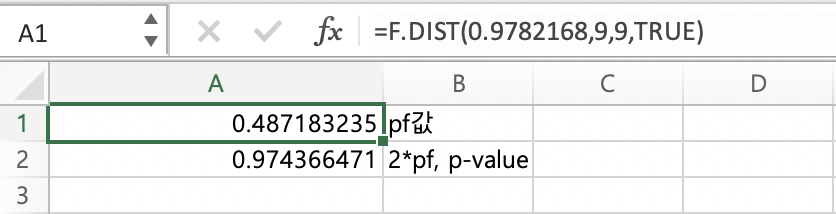
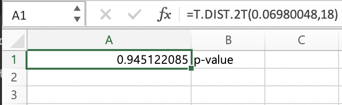
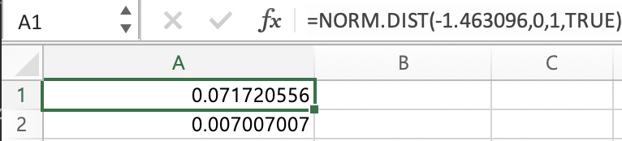

#Design of Experiments HW1

### 2.25

###(a) 등분산 가설검정을 하라.  $\alpha=0.05$로 수행하라.

###(b) (a)의 결과를 사용하여 집단 간 평균연소시간이 같다는 가설검정을 수행하라. $\alpha=0.05$를 사옹하고, p-value 또한 구하여라.

###(c) R을 이용하여 잔차에 대한 normal qqplot을 수행하라.

###2.46

(a)의 문제를 풀기 위해서는 먼저 모집단에서 iid하게 추출된 샘플에 대해 정규성 가정이 만족하는지에 대해 논의하여야한다. 하지만 (c)에서 그 정규성 논의를 다룰 예정이니, **1.모집단이 정규분포인 경우와, 2. 모집단이 정규분포가 아닌 다른분포인 경우를 고려해야한다.**

먼저 모집단이 정규분포가 아니라는 가정하에서 할 수 있는 Levene test를 시행해보겠다. 


```{r}

library(lawstat)
sample_1 <- c(65,81,57,66,82,82,67,59,75,70)
sample_2 <- c(64,71,83,59,65,56,69,74,82,79)

sample <- c(sample_1,sample_2)
group <- c(rep(1,10),rep(2,10))
dat <- data.frame(group,sample)
head(dat)
levene.test(sample,group,location='mean')
```

모집단이 정규분포가 아니라고 가정을 하였을 시, 이떄의 p-value 값은 0.9699가 나오며, 이는 원래 귀무가설인 '그룹간의 분산이 등분산이다'를 기각할 수 없음을 의미한다. 하지만 이는 모집단이 정규분포라는 가정을 사용하지 않았기 때문에, F통계량을 이용한 검정을 사용할 수 없다.


다음으로 모집단에서 추출한 샘플이 **정규분포에서 추출되었다면** , R에 내장되어있는 함수를 통해 Bartlett's test를 시행해볼 수 있다.


```{r}
library(stats)
bartlett.test(sample~group,dat)
```

등분산성 검정에서의 귀무가설과 대립가설은 아래와 같다.

*$H_0:\sigma^2_1=\sigma^2_2$*

*$H_1:{\sigma^2_1}\ne{\sigma^2_2}$*

위의 청크창을 확인한 결과 p-value가 0.9743으로 매우 높은 값으로 나와 귀무가설을 기각할 수 없다는 것을 보여주므로, 위의 두 그룹실험은 이분산성을 갖지 않음(즉 귀무가설인 등분산성이다를 기각할 수 없음)을 의미한다.

이번에는 직접 계산기를 통해 얻은 값과 R에서 제시한 p-value값이 같은지 확인해보겠다.

등분산성 검정에서 귀무가설이 참이라는 전제하에 사용되는 검정통계량 F는 다음과 같다.

$$F=\frac{s_1^2}{s_2^2}$$

```{r}
#sample의 분산이 표본분산이므로, 두 집단의 표본분산은 아래와 같이 구해진다.
var(sample_1)
var(sample_2)
F <- var(sample_1)/var(sample_2)
F

upper <- qf(0.975,9,9)
lower <- qf(0.025,9,9)
upper
lower

```


두 집단의 자유도는 모두 9로 같으며, 기각역을 확인하면 upper과 lower가 각각 4.025와 0.248로 나온다. 여기서의 검정통계량 F는 약 0.978로써,

p-value를 구하기 위해서는 pf()함수를 통해 lower.tail을 True로 설정하여 계산하면 계산기를 통해 얻는 결과값과 같다. 여기서 lower.tail을 T로 설정하는 이유는 F로 설정했을 시 p-value 값이 1을 초과하기 때문에, 왼쪽꼬리면적을 기준으로 사용하는 것이다.

```{r}
pvalue <- 2*pf(F,9,9,lower.tail=T)
pvalue

```

추가로 엑셀을 이용하여 pvalue를 직접 계산해보자.

 


p-value는 0.9743으로 Bartlett 검정을 통해 얻은 R결과값과 직접 계산기를 통해 구한 결과값과 같다는 것이 확인되었다.


##(b)
 (a)의 결과를 통해 우리는 두 집단의 분산이 등분산임을 기각할 수 없다는 결론을 내렸다. 고로 두 집단이 등분산이라는 연장선 하에 두 집단의 평균이 같은지 아닌지를 비교하고자 한다.

만약 우리가 **모분산**을 안다면 우리는 Z통계량을 통해 정규분포를 이용한 검정을 사용할 수 있다. 하지만 우리는 모분산을 실제로 모를뿐더러, 가지고 있는 단서라고는 두 모집단의 분산이 같다는 것만 알아내었다.

고로 우리는 pooled variance를 이용하여 t통계량을 통한 t검정을 수행하여야한다.

먼저 귀무가설과 대립가설은 아래와 같고,

*$H_0: {\mu_1} - {\mu_2} =0$*

*$H_1: {\mu_1} -{\mu_2} \ne 0$*

사용 될 T 통계량은 아래와 같다.

$$T= \frac{\bar{X_1}-\bar{X_2}}{\sqrt{s_p^2}(\frac{1}{n_1}+\frac{1}{n_2})},\  *s_p^2= \frac{(n_1-1)s_1^2+(n_2-1)s_2^2}{n_1+n_2-2}$$

두 집단의 자유도는 9로 동일하며 pooled variance를 계산하면 아래와 같다.

```{r}
sp <- (9*var(sample_1)+9*var(sample_2))/10+10-2
sp
```

```{r}
t <- (mean(sample_1)-mean(sample_2))/sqrt(sp*(1/20))
t
p <- 2*pt(t,18,lower.tail=F)
p
```



엑셀의 계산기로 직접계산해본 결과 R에서 얻은 p-value값과 동일하게 나옴을 확인할 수 있다.


**p-value값은 약 0.945**로 매우 크게 나오며, 관찰된 통계량보다 더 극단적인 값이 나올 확률이 0.945라는 뜻으로 귀무가설을 기각하기에 아주 힘든 값임을 의미한다. 고로 우리는 귀무가설을 기각할 통계적 유의성을 얻을 수 없으며, 이는 **두 집단의 연소시간 간의 평균차이가 존재하지 않는다는 것을 의미한다**.

##(c) 이 문제에서 집단의 잔차에 대해 정규성 가정을 논하라

우리는 잔차에 대해서 qqnorm 그래프를 그려보아 잔차가 정규분포를 띄는지를 확인해 볼 수 있다. 잔차라는 것은 중요한 정보를 제외한 나머지 찌꺼기라고 해석할 수 있는데, 이 잔차는 어떠한 의미도 가져서는 안되며 정규분포를 띄어야한다. 

잔차란 관측치와 fitted value 값의 차이로 볼 수 있으며, 이 집단 데이터에서 fitted value는 표본평균이 된다.

고로 잔차와 이에 대한 normal qqplot을 그려본 결과는 아래와 같다.

```{r}
residual1 <- sample_1-mean(sample_1)
residual2 <- sample_2-mean(sample_2)

par(mfrow=c(1,2))
qqnorm(residual1)
qqnorm(residual2)
```

육안으로 확인해보았을 때, 그래프가 45도 각도로 잘 늘여있는 걸 보아 잔차가 정규성을 띄는 것을 보인다. 이를 fitdistr함수를 사용하면 아래와 같은 모수를 갖는 정규분포에 흡사하다는 것을 확인할 수 있다.

```{r}
library(MASS)
fitdistr(residual1,'normal')
fitdistr(residual2,'normal')


```


###2.46 2.25에서 소개한 문제에서 평균 소각 시간의 차이가 2분 일때의 검정력을 찾아라. 평균 시간의 차이가 1분이고 검정력이 최소 0.9가 되기 위한 표본크기를 구하라.

등분산과 equal sample size, $\sigma=9$를 가정하여 문제를 풀어보자.

* Case1) 두 집단간 평균이 2일 때 검정력 찾기

위의 케이스는 등분산과 동일 샘플사이즈를 갖고 모분산을 알기 때문에 Z통계량을 통해 접근해볼 수 있다. 이 때의 Z통계량은 아래와 같다.

$$Z=\frac{\bar{X_1}-{\bar{X_2}}-(\mu_1-\mu_2)}{\sqrt{\frac{2\sigma^2}{n}}}$$

검정력은 귀무가설이 거짓일 때 귀무가설을 기각할 확률이며
이는 $P(\bar{X_1}-\bar{X_2}>c|under\ H_1)\ or\ P(\bar{X_1}-\bar{X_2}<-c|under\ H_1) $와 같다.

이를 위해서 먼저 c를 구해야 하므로, 우리는 유의수준 0.05하에서 c를 구할 수 있다.

먼저 유의수준 $\alpha$의 절반값인 0.025는(양측검정이므로) 귀무가설 하에서 계산되는 것이므로 아래와 같은 식을 통해서 c를 구할 수 있다.

$$P(\frac{\bar{X_1}-{\bar{X_2}}-0}{\sqrt{2\sigma^2/n}}>\frac{c-0}{\sqrt{2\sigma^2/n}})=0.025$$

우리는 Z검정하에서 양측검정하에 $P(Z>1.96)=0.025$라는 사실을 알고 있다. 고로 이를 통해서 역으로 c값을 구해낼 수 있다.

$\frac{c}{\sqrt{(2*81)/10}}= 1.96$이므로, 역산하면

$c = 1.96*\sqrt{16.2}$이므로 

```{r}
c<- sqrt(16.2)*1.96
c
```

critical value는 약 7.88이 나온다.

이를 통해서 검정력을 구해보면,
$P(\frac{\bar{X_1}-\bar{X_2}-2}{\sqrt{16.2}}>\frac{c-2}{\sqrt{16.2}})+P(\frac{\bar{X_1}-\bar{X_2}-2}{\sqrt{16.2}}<\frac{-c-2}{\sqrt{16.2}})$를 구하면 된다.

이는 $P(Z>\frac{c-2}{\sqrt{16.2}})+P(Z<\frac{-c-2}{\sqrt{16.2}})$와 같으며 이 확률값이 검정력이 되는 것이다.

우리는 양측검정으로 시행하였기 때문에 대립가설 하에서 대칭되는 기각역의 절대값을 넘어서는 면적들이 검정력이 된다. 계산한 결과는 아래와 같다.

```{r}
powervalue <- (c-2)/sqrt(16.2)
powervalue

powervalue2 <- (-c-2)/sqrt(16.2)
powervalue2
power1 <- pnorm(powervalue,lower.tail=F)
power2 <- pnorm(powervalue2,lower.tail=T)
power1
power2

beta <- power1+power2
beta

```

 
엑셀로 계산한 결과, r에서 구한 power값과 같게 나옴을 확인할 수 있었다.


 
 청크창의 beta가 여기서의 검정력이며, 보통 양측검정에서는 한쪽 꼬리의 면적이 매우 작아서 그 효과를 무시해도 괜찮으며 한쪽의 면적만 계산하여 검정력을 정하고는 하는데, 위의 케이스는 sample size가 매우 작으며 **이는 필자의 생각이지만, 검정에 사용되는 effect size($\mu_1-\mu_2$)가 매우 작기 때문에 검정력이 아주형편없게 나온다.** 고로 필자는 한쪽 작은 면적의 넓이를 무시하지않고(어차피 양측 모두 매우 작은 면적이기에) 두 면적을 합산하여 계산하였다.

그 결과는 약 **0.078**이 나왔다. 처음에는 검정력이 너무 낮은것을 보고 믿지 못해 3번이나 계산을 다시해보았지만, sample size와 effect size를 고려해보면 충분히 나올 수 있다는 결론을 내렸다. (오답이라면 전적으로 작성자의 무지때문)


 * Case2) 집단간 연소시간의 차가 1분이고 검정력이 최소 0.9가 되기 위한 sample size 찾기
 
 양측검정에서 검정력은 위에서 언급했던 식을 인용하면 아래와 같이 적을 수 있다.
 
 $$P(\frac{\bar{X_1}-\bar{X_2}-1}{\sqrt{2*81/n}}>\frac{c-1}{\sqrt{2*81/n}})+P(\frac{\bar{X_1}-\bar{X_2}-1}{\sqrt{2*81/n}}<\frac{-c-1}{\sqrt{2*81/n}}) \geq 0.9$$
이를 요약하면 $P(Z>(\frac{c-1}{\sqrt{2*81/n}})+P(Z<\frac{-c-1}{\sqrt{2*81/n}}))$로 적을 수 있다. 


이번 케이스에서는 $P(\bar{X_1}-\bar{X_2}<-c|\ under\ H_1)$의 값이 면적값이 매우 작아 구해도 큰 의미가 없기 때문에 이 한쪽 꼬리면적 값의 영향이 미미할 것이라고 가정하고 반대 쪽 꼬리의 면적만으로 검정력을 계산하겠다.

고로 $P(Z> \frac{c-1}{\sqrt{162/n}}) \geq 0.9$를 만족하는 표본크기를 찾으면 된다. 

```{r}
qnorm(0.9,lower.tail=F)
```

 
 위에서 얻은 값은 1.28이지만 정규분포는 대칭을 이루므로, 반대쪽 값에서 -1.281552를 갖게 되므로, r에서 얻은 qnorm값과 같게 나온다.

위의 값을 통해 얻은 qnorm값 약 -1.2815가 검정력을 0.9로 만들어주는 value가 된다. 

이는 $\frac{c}{\sqrt{162/n}}=1.96$과 $\frac{c-1}{\sqrt{162/n}}=-1.281552$ 두 식을 연립방정식을 풀어서 n값을 구하면 된다.


위 식을 c로 정리하여 n을 구하면 n은 $n=2\times(1.96+1.281552)^2$가 되며 이는 약 21.01532가 나오므로,

**검정력이 최소 0.9가 되기 위한 표본크기는 22가 된다.**
