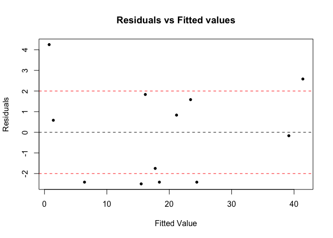
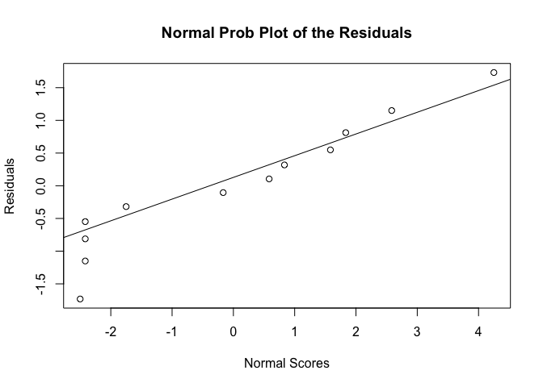
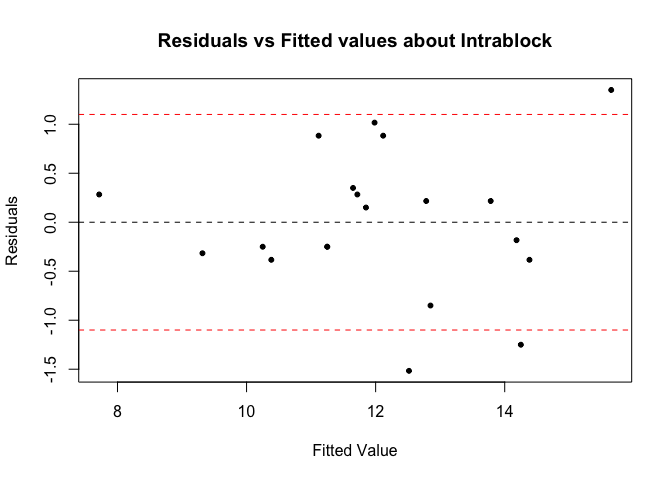
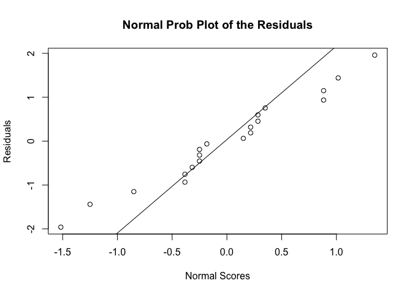
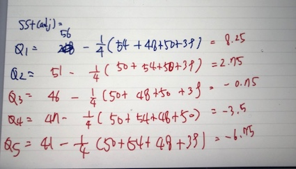
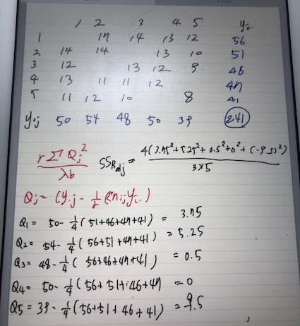

#Design of Experiments HW2

##1.Example 4.3를 풀고 R결과물과 직접 계산한 결과물을 비교하라.

 임의화 완전블록설계모형을 위해서 관측값과 Treatment에 해당하는 세탁용수간의 아노바검정에 Block으로 작용하는 일자별 factor를 추가하여 RCBD 아노바검정을 하면 아래와 같은 결과물이 나온다. 

```r
a <- c(1,2,3,4,1,2,3,4,1,2,3,4)
b <- c(1,1,1,1,2,2,2,2,3,3,3,3)
c <- c(13,22,18,39,16,25,16,44,5,4,2,22)
data <- cbind(a,b,c)
colnames(data) <- c('Day','Treatment','observations')
data <- as.data.frame(data)
data
```

```
##    Day Treatment observations
## 1    1         1           13
## 2    2         1           22
## 3    3         1           18
## 4    4         1           39
## 5    1         2           16
## 6    2         2           25
## 7    3         2           16
## 8    4         2           44
## 9    1         3            5
## 10   2         3            4
## 11   3         3            2
## 12   4         3           22
```

```r
data$Treatment <- as.factor(data$Treatment)
data$Day <- as.factor(data$Day)
rcbd.aov <- aov(observations~Treatment+Day,data=data)
summary(rcbd.aov)
```

```
##             Df Sum Sq Mean Sq F value   Pr(>F)    
## Treatment    2  682.2   341.1   34.98 0.000493 ***
## Day          3 1103.0   367.7   37.71 0.000274 ***
## Residuals    6   58.5     9.7                     
## ---
## Signif. codes:  0 '***' 0.001 '**' 0.01 '*' 0.05 '.' 0.1 ' ' 1
```

ANOVA검정을 위해서 random error가 homoskedasticity 와 homogenous 하다는 가정이 있어야 F-test를 통한 검정이 가능한데, 아래의 간단한 시각화를 통해서 등분산성 검정 과 동질성 검정 또한 해보았다.

데이터의 관측치가 워낙적어(12개) 뚜렷하게 등분산성임을 바로 확인할 수는 없지만, 큰 패턴이 보이지 않는 것으로 보아 **등분산성** 가정을 통해 F검정을 사용하는데 무리가 없음을 확인할 수 있었다. 또한 잔차에 대해 qqplot을 그려보았을 때, 잔차가 정규분포에 잘 fitting되고 있는 모습을 보여주고있다. 이는 error의 추정치인 잔차가 정규분포에 잘 들어맞는 것을 의미한다.

 ANOVA 모델에서 관측치 y값이 확률변수 error와 상수들의 합으로 이루어진 확률변수이므로, error가 정규분포를 갖는다면 관측치 y도 정규분포를 띄게되는데, error의 추정치인 잔차가 정규분포에 잘 들어맞는 것으로 보아, 관측치들 간에 **동질성(homogenous)**이 만족한다고 볼 수 있을 것이다.


```r
residuals <- resid(rcbd.aov)
Fitted <- fitted(rcbd.aov)
plot(Fitted, residuals, xlab="Fitted Value", ylab= "Residuals", pch=20, main="Residuals vs Fitted values")
abline(0,0,lty=2)
abline(2,0,lty=2,col='red')
abline(-2,0,lty=2,col='red')
```

<!-- -->

```r
qqnorm(residuals,datax=T,ylab="Normal Scores", xlab="Residuals", main="Normal Prob Plot of the Residuals")
qqline(residuals,datax=T)
```

<!-- -->


이제 위의 R코드를 통해 구현한 SSTrt, SSB, SSE, MSTrt, MSB, MSE와 F통계량, p-value가 같은지 직접 계산을 통해 확인해보겠다.

위에서 구하고자하는 여러 통계값들의 식은 아래와 같으며, 계산을 위해서는 R프로그램을 통해 계산기용도로 사용하였다.

$$SS_T = \sum_{i=1}^a\sum_{j=1}^by_{ij}^2-\frac{y_{ii}^2}{N},\ a=3,\ b=4, N=12$$

$$SS_{trt}=\frac{1}{b}\sum_{i=1}^ay_{i.}^2-\frac{y_{..}^2}{N}$$

$$SS_{Block} = \frac{1}{a}\sum_{j=1}^by_{.j}^2-\frac{y_{..}^2}{N}$$

$$SSE = SS_T -SS_{trt}-SS_{Block}$$

$$MS_{trt}=\frac{SS_{trt}}{a-1},\ MS_{Block} = \frac{SS_{Block}}{b-1},\ MSE = \frac{SSE}{(a-1)(b-1)}$$

또한 p-value는 treatment와 block의 검정을 통해 얻은 각각의 F-statistics이 순서대로

$F_{(a-1),(a-1)(b-1)}$과 $F_{(b-1),(a-1)(b-1)}$보다 큰 면적의 값을 구한 결과와 동일하다.


```r
ss_y_dotdot <- 13^2 + 22^2 + 18^2 + 39^2 +16^2+ 25^2 +16^2 + 44^2 +5^2 +4^2 +2^2 + 22^2
 N <- 12
 a <- 3
 b <- 4
ss_y_i_dot <- 92^2+ 101^2 + 33^2 
ss_y_j_dot <- 34^2 + 51^2 + 36^2 + 105^2
y_dotdot <- 13+22+18+39+16+25+16+44+5+4+2+22


SST <- ss_y_dotdot - (y_dotdot^2/N)
SStrt <- ss_y_i_dot/b - (y_dotdot^2/N)
SSB <- ss_y_j_dot/a - (y_dotdot^2/N)
SSE <- SST - SStrt - SSB

SST ; SStrt ; SSB ; SSE
```

```
## [1] 1843.667
```

```
## [1] 682.1667
```

```
## [1] 1103
```

```
## [1] 58.5
```

```r
MStrt <- SStrt/(a-1)
MSB <- SSB/(b-1)
MSE <- SSE/((a-1)*(b-1))

MStrt ; MSB ; MSE
```

```
## [1] 341.0833
```

```
## [1] 367.6667
```

```
## [1] 9.75
```

```r
Ftest_about_treatment <- MStrt/MSE
Ftest_about_block <- MSB/MSE

Ftest_about_treatment ; Ftest_about_block
```

```
## [1] 34.98291
```

```
## [1] 37.7094
```

```r
pvalue_for_trt <- pf(Ftest_about_treatment,a-1,(a-1)*(b-1),lower.tail=F)
pvalue_for_block <- pf(Ftest_about_block,b-1,(a-1)*(b-1),lower.tail=F)
pvalue_for_trt ; pvalue_for_block
```

```
## [1] 0.0004927189
```

```
## [1] 0.0002741517
```

위의 코드창이 직접 손계산을 하여 풀은 결과값이며, R코드창과 비교해보았을 때 소숫점에서 미미한 차이만을 갖기에 이론적으로 같은 결과를 가진다는 것을 확인할 수 있다.

또한 Treatment와 Block에 대해서 둘다 F-test를 시행하였을 시 p-value가 $\alpha=0.05$보다 매우 작은 0에 가까운 값이 나오므로, 각 검정들의 귀무가설인 $H_0: \tau_1=..=\tau_3=0$과, $H_0: \beta_1=..=\beta_4=0$이라는 귀무가설을 모두 기각하고, Treatment의 효과와 Block의 효과가 적어도 하나는 유의미한 효과를 갖는다는 것을 의미한다. 

고로 박테리아 성장 억제 효과의 비교실험을 함에 있어, **세탁용수 종류별 간, 실험이 이루어진 날 간에 유의미한 차이가 있다**라고 결론을 내릴 수 있다.


##2. Example 4.40를 풀고 R결과물과 직접 계산한 결과물을 비교하라.

 불완전 균형 블록설계를 위해서 Treatment에 해당하는 첨가제와 관측값인 주행거리간의 아노검정에 Block으로 작용되는 자동차 종류를 factor로 추가하여 BIBD  모형을 R에 돌려본다면 아래와 같은 결과를 갖는다.
 이때 BIBD를 적용하는 이유는 시간 제약의 조건으로 인해서 한 treatment를 모든 블록에 적용할 수 없기 때문이다.(Incomplete)
 

```r
a <- c(1,1,1,1,2,2,2,2,3,3,3,3,4,4,4,4,5,5,5,5)
b <- c(2,3,4,5,1,2,4,5,1,3,4,5,1,2,3,4,1,2,3,5)
c <- c(17,14,13,12,14,14,13,10,12,13,12,9,13,11,11,12,11,12,10,8)
data2 <- cbind(a,b,c)
colnames(data2) <- c("Trt","Block","Observations")
data2 <- as.data.frame(data2)
head(data2)
```

```
##   Trt Block Observations
## 1   1     2           17
## 2   1     3           14
## 3   1     4           13
## 4   1     5           12
## 5   2     1           14
## 6   2     2           14
```

```r
data2$Trt <- as.factor(data2$Trt)
data2$Block <- as.factor(data2$Block)
```
 
 BIBD같은 경우에는 제약에 의한 결측값이 존재하기때문에, Treatment와 block의 효과 중 하나의 효과를 보정해줘야만 한다. 각각의 효과를 보정하여 분석을 시행한 것을 순서대로 Intrablock analysis, Interblock analysis라고 한다.
 
 분석을 시행하기 전에 앞서 등분산성, 동질성 검정을 차례대로 수행해보겠다. 등분산성과 동질성 가정 검정은 treatment 혹은 block 중 어느 부분을 보정해주는 것과 상관없이 원 관측치 데이터는 그대로이므로, case를 나눠어서 확인해볼 필요가 없기 때문에 한번만 수행하였다.
 
 
 

```r
residuals2 <- resid(lm(Observations ~ Block + Trt, data2))
Fitted2 <- fitted(lm(Observations ~ Block + Trt, data2))
plot(Fitted2, residuals2, xlab="Fitted Value", ylab= "Residuals", pch=20, main="Residuals vs Fitted values about Intrablock")
abline(0,0,lty=2)
abline(1.1,0,lty=2,col='red')
abline(-1.1,0,lty=2,col='red')
```

<!-- -->

```r
qqnorm(residuals2,datax=T,ylab="Normal Scores", xlab="Residuals", main="Normal Prob Plot of the Residuals")
qqline(residuals2,datax=T)
```

<!-- -->
 
 육안으로 확인해보았을 때, 등분산성과 동질성 가정에 크게 벗어나는 모습을 보이지 않는 것으로 판단된다.
 
 
이제 Intrablock case로 먼저 BIBD를 시행해보겠다.

```r
BIBD_Intrablock <- anova(lm(Observations ~ Block + Trt, data2))
BIBD_Intrablock
```

```
## Analysis of Variance Table
## 
## Response: Observations
##           Df Sum Sq Mean Sq F value   Pr(>F)   
## Block      4 31.200  7.8000  8.5657 0.002158 **
## Trt        4 35.733  8.9333  9.8103 0.001247 **
## Residuals 11 10.017  0.9106                    
## ---
## Signif. codes:  0 '***' 0.001 '**' 0.01 '*' 0.05 '.' 0.1 ' ' 1
```

이는 Treatment를 보정하였으므로 결과창의 Trt 부분의 P-value를 확인하여야한다. 

0.001로 유의수준 0.05보다 작기에, 귀무가설을 기각할 수 있는 Treatment간에 유의미한 차이가 있다고 볼 수 있다. 

 이 결과창의 통계값들과 직접 손으로 계산한 값이 동일한지를 확인해보겠다.
 
 먼저 공식에 따르면,
 
 $$SS_T = \sum_{i=1}^a\sum_{j=1}^by_{ij}^2-\frac{y_{ii}^2}{N},\ a=5,\ b=5, N=20$$
 
 $$SS_{Block} = \frac{1}{k}\sum_{j=1}^by_{.j}^2-\frac{y_{..}^2}{N},\ k=4,\ r=4$$
 
 $$SS_{Trt(adj)}= \frac{k\sum_{i=1}^aQ_i^2}{{\lambda}a},\ Q_i=(y_{i.}-\frac{1}{k}\sum{n_{ij}}y_{.j}),\ \lambda=3$$
$$SST= SS_{trt(adj)}+SSB+SSE$$

$$MS_{trt(adj)}=\frac{SS_{trt(adj)}}{a-1},\ MSB= \frac{SSB}{b-1},\ MSE=\frac{SSE}{N-a-b+1}$$

$$F_0 = \frac{MSTrt(adj)}{MSE} \sim F_{a-1,N-a-b+1}$$

$$F_0 = \frac{MSB}{MSE} \sim F_{b-1,N-a-b+1}$$
의 식을 얻을 수 있다.

직접 계산을 이용하여 SST와 SSB, SStrt(adj)를 구해보면 아래와 같다.

```r
SST <- (17^2+ 14^2 + 13^2 + 12^2 + 14^2 + 14^2 + 13^2 + 10^2 + 12^2 +13^2+ 12^2+ 9^2 + 13^2+ 11^2 + 11^2 + 12^2 + 11^2 +12^2 + 10^2 + 8^2) - ((241)^2/20)
SST
```

```
## [1] 76.95
```

```r
a=5
b=5
N=20
SS_trtadj <- (4*(8.25^2+2.75^2+(-0.75)^2+(-3.5)^2 + (-6.75)^2))/(3*5)
SS_trtadj
```

```
## [1] 35.73333
```

```r
SSB <- (50^2+54^2+48^2+50^2+39^2)/4 - ((241^2)/20)
MSB <- SSB/(b-1)
MSTrtadj <- SS_trtadj/(a-1)
SSE <- SST - SSB - SS_trtadj
MSE <- SSE/(N-a-b+1)
MSB ; MSTrtadj
```

```
## [1] 7.8
```

```
## [1] 8.933333
```

```r
SSB; SSE ; MSE
```

```
## [1] 31.2
```

```
## [1] 10.01667
```

```
## [1] 0.9106061
```

```r
F_trtadj <- MSTrtadj/MSE
F_block  <- MSB/MSE
F_trtadj; F_block
```

```
## [1] 9.810316
```

```
## [1] 8.565724
```

```r
pvalue_for_trtadj <- pf(F_trtadj,a-1,N-a-b+1,lower.tail=F)
pvalue_for_blo <- pf(F_block,b-1,N-a-b+1,lower.tail=F)
pvalue_for_trtadj
```

```
## [1] 0.001246692
```

```r
pvalue_for_blo
```

```
## [1] 0.002157793
```


 
 
( 보정한 Treatment 제곱합에 Q에 대한 부분은 손계산을 추가하여 이미지로 첨부하였습니다.)

 위의 계산기로 계산한 값과 R결과창에서 얻은 값들이 동일함을 확인할 수 있다.
 검정을 위한 p-value확인은 treatment 부분만 해도 되지만, 블록과 treatment에 대한 p값이 둘다 모두 동일하게 나오고 0.05보다 작은 값읋 가지므로, 기존 treatment간의 효과가 차이가 없다는 귀무가설을 기각하고 treatment간에 유의미한 차이가 있다는 결론을 내릴 수 있다.
 
 
 이번에는 Interblock  case에 대해서도 결과를 확인해보겠다.
 

```r
BIBD_Interblock <- anova(lm(Observations ~ Trt + Block, data2))
BIBD_Interblock
```

```
## Analysis of Variance Table
## 
## Response: Observations
##           Df Sum Sq Mean Sq F value   Pr(>F)   
## Trt        4 31.700  7.9250   8.703 0.002026 **
## Block      4 35.233  8.8083   9.673 0.001321 **
## Residuals 11 10.017  0.9106                    
## ---
## Signif. codes:  0 '***' 0.001 '**' 0.01 '*' 0.05 '.' 0.1 ' ' 1
```
 
 결과를 확인해보면 Intrablock case일때와 아주 미미한 SS값들을 보이는데, 어느 case건간에 모두 귀무가설을 기각할만한 유의한 차이를 갖는 것으로 보인다.
 
 InterBlock case일때는 SSB와 SSTrt의 식이 바뀌는데 이는 아래와 같다.
 
 $$SS_{Trt} = \frac{1}{r}\sum_{i=1}^ay_{i.}^2-\frac{y_{..}^2}{N}$$
 
  $$SS_{B(adj)}= \frac{r\sum_{j=1}^bQ_i^2}{{\lambda}b},\ Q_i=(y_{.j}-\frac{1}{r}\sum{n_{ij}}y_{i.}),\ \lambda=3$$
  
  또 직접 통계값들을 구해보겠다.
  

```r
N=20
a=5
b=5
r=4
k=4
lambda=3
SSB_adj <- (4*(3.75^2+5.25^2+0.5^2+(-9.5)^2))/(3*5)
SSB_adj
```

```
## [1] 35.23333
```

```r
SStrt <- (56^2+51^2+46^2+47^2+41^2)/4 - ((241^2)/N)
SStrt
```

```
## [1] 31.7
```

```r
SST
```

```
## [1] 76.95
```

```r
MStrt <- SStrt/(b-1)
MSBadj <- SSB_adj/(a-1)
MStrt ; MSBadj ; MSE
```

```
## [1] 7.925
```

```
## [1] 8.808333
```

```
## [1] 0.9106061
```

```r
F_blockadj <- MStrt/MSE
F_trt  <- MSBadj/MSE
F_blockadj; F_trt
```

```
## [1] 8.702995
```

```
## [1] 9.673045
```

```r
pvalue_for_trt <- pf(F_trt,a-1,N-a-b+1,lower.tail=F)
pvalue_for_bloadj <- pf(F_blockadj,b-1,N-a-b+1,lower.tail=F)
pvalue_for_trt
```

```
## [1] 0.001321038
```

```r
pvalue_for_bloadj
```

```
## [1] 0.002025597
```
  
  

Q에 대한 식은 위의 이미지를 첨부하였다.

계산값을 확인해보면 R결과창과 역시 수치가 동일하게 나옴을 알 수 있다.
Block부분의 p-value를 확인해보면 0.05보다 매우 작은 0에 가까운 값이 나오므로, 기존 귀무가설을 기각하고, Block간에 유의미한 차이가 있다고 결론내릴 수 있다.
