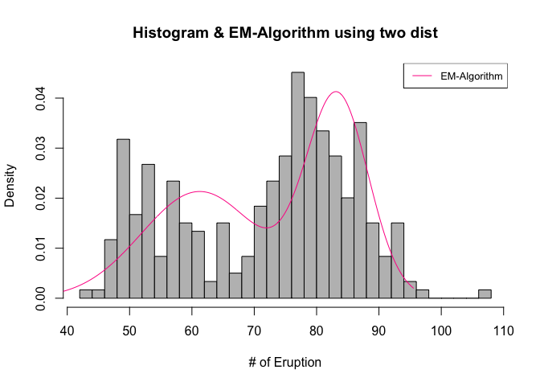

#Intermediate Applied Statistics Final Takehome Exam

###1.

####1-1. Show that we can also check whether $X$ follows $F_0(x)$ by plotting $-log(1-F_0(X))$ versus $-log(1-i/(n+1))'s.$

일반적으로 Normal분포에 fitting할 때 사용하는 qqplot처럼, 
 $-log(1-F_0(X))$ 와 $-log(1-i/(n+1))$의 비교를 해보겠다.
 
$ X \sim F_0(X)$ 를 따른다고 할 때, $F_0(X)$는 누적밀도함수(cdf)이며, 이 cdf의 분포는 Uniform분포가 된다.

위의 식을 다시 풀어서 쓰자면, 이는 주어진 샘플들을 크기 순서대로 나열하였을 때, $x_{(i)} \approx F^{-1}(\frac{i}{n+1})$을 비교하는 것이 그림을 그리는 것과 함께 문제의 답을 보이는 것이 된다. 

이를 이용하여 직접 plot을 그려 qqplot과 비슷한 form을 만들어보고, $x_{(i)} \approx F^{-1}(\frac{i}{n+1})$이 둘의 관계 또한 두 항의 차이가 0과 비슷한지를 체크하는 과정을 통해 보였다.


```r
set.seed(2020311194)
# 100 sample form uniform
a <- runif(100)
x <- sort(a)

#check plot
i <- 1:100
plot(-log(1-x),-log(1-i/(length(x)+1)))
```

<!-- -->

```r
#check the difference of two values

c <- rep(0,length(x))
for (i in 1:length(x)){
  c[i] <- x[i] - qunif(i/(length(x)+1))
}
c
```

```
##   [1] -0.0020358902  0.0032247549  0.0044838281 -0.0037792539 -0.0090086398
##   [6] -0.0178934427 -0.0260260130 -0.0272017346 -0.0303446013 -0.0296651059
##  [11] -0.0255229942 -0.0327193141 -0.0380216380 -0.0427320365 -0.0269755046
##  [16] -0.0350967352 -0.0414608830 -0.0448804717 -0.0537392683 -0.0428289944
##  [21] -0.0196609758  0.0039456506 -0.0020984610 -0.0006890500 -0.0061154514
##  [26] -0.0068897217 -0.0157445365 -0.0090605863 -0.0155620024 -0.0239936088
##  [31] -0.0317101204 -0.0399383068 -0.0026076430  0.0214324310  0.0242884377
##  [36]  0.0179033486  0.0320410312  0.0245256318  0.0191693473  0.0114126480
##  [41]  0.0147882477  0.0071808881  0.0376980454  0.0344877337  0.0414879340
##  [46]  0.0346011515  0.0567058272  0.0498212035  0.0416583978  0.0508939199
##  [51]  0.0422886903  0.0531330912  0.0500616136  0.0405467347  0.0401381934
##  [56]  0.0407216133  0.0322004060  0.0305376502  0.0290926693  0.0304862390
##  [61]  0.0310735891  0.0658745717  0.0578853876  0.0615256389  0.0540617281
##  [66]  0.0452655280  0.0404460451  0.0447246316  0.0353560281  0.0433776455
##  [71]  0.0438249843  0.0442056699  0.0396245396  0.0448213800  0.0573250927
##  [76]  0.0510092447  0.0492991438  0.0394761377  0.0366026018  0.0368163020
##  [81]  0.0370831460  0.0307857112  0.0387236285  0.0680595882  0.0612288510
##  [86]  0.0586341999  0.0559009177  0.0504839753  0.0427199190  0.0378402503
##  [91]  0.0315178029  0.0330100886  0.0246411754  0.0161714742  0.0081281122
##  [96]  0.0010923949  0.0031889546  0.0009318988  0.0129626816  0.0050487876
```

```r
sum(c)
```

```
## [1] 1.757704
```

 Plot을 살펴보았을 때 대략적으로 45도의 각도로 두 값들이 잘 fitting이 되는 것을 확인 할 수 있으며,
 
 100개의 샘플을 뽑아서 진행하여서 모든 항들의 차이가 0에 가까운 값을 갖는 것을 확인하였다.
 
 
 
####1-2. Suppose that $F_0$ is the normal distribution. Take a random sample from $F_0$ and draw two plots in 1). Then discuss the relation between two plots.
 
 

```r
set.seed(2020311194)
a <- rnorm(100,0,1)
x <- sort(a)
i <- 1:length(a)
#Q-Q plot
plot(x,qnorm(i/(length(x)+1)))
```

<!-- -->

```r
#-log(1-F(X)) vs -log(1-i/(n+1))

plot(-log(1-pnorm(x)), -log(1-i/(length(x)+1)))
```

<!-- -->

 plot을 그려서 확인해보았을 때, X를 normal분포에서 샘플링을 하여도, 위의 문제에서 구한 것처럼 fiitting이 잘 되는 것을 볼 수 있다.
 

####1-3. Suppose that the data includes some $x_{i}+'s$ which are actually the censored observations at $x_{i}+'s$. Then describe how we can check whether X follows $F_0(x)$?

생존분석에 있어서 개개인들의 생존시간에 대하여 분석을 시행할 때, 몇명의 사람들의 정보가 censored 되어도, 생존시간에 대한 observation  value와 estimated value간의 분석이 가능하기도 하다,

이는 Cox - Snell Residual를 그려봄으로써 확인할 수 있다.

흔히 survivorship function에 대하여 Uniform 분포를 가정하여 생존분석을 진행하는데, 생존함수 $S(x)$는 
$1-F_0(x)$와 같다.

1-1의 문제에서 사용하였던, Uniform분포의 log transformation을 통하여 Exponential 분포를 만드는 것을 떠올려 본다면, 위의 경우의 quantile 간의 비교가 cox-snell residual method를 통해 풀 수 있음을 시사한다.

Cox - snell residual은, 두 가지의 방법을 통해 censored된 개별 생존시간에 대하여 새로운 값으로 대체하는 방법을 사용하는데, 이는 평균 혹은 중위수를 censored된 time에 더하는 방법이다.

여기서 $-log(1-F_0(x))$는 cumulative hazard function이며, 이는 위에서 확인했던 바와 같이 Exponential 분포를 갖게된다.

censored된 point $x_{i}+'s$는 $x_{i}+E(-log(1-F_0(X_1)))$ 혹은 $x_{i}+Median(-log(1-F_0(X_1)))$의 값으로 대체된다.

cumulative hazard function이$Exp(1)$을 따르므로, 대체될 두 값 역시 $Exp(1)$를 따른다.

이를 통해서 censored된 값을 새로운 값으로 대체하더라도, quantile을 비교하고자하는 값들의 분포는 여전히 그대로며, 수치와 범주가 혼합된 자료들을 numerical하게 대체함으로써 X가 $F_0(x)$의 분포를 따르는지의 여부를 check할 수 있다.


###2.


####2-1.


```r
boy <- c(1,1,1,1,2,2,2,2,3,3,3,3,4,4,4,4,5,5,5,5,6,6,6,6,7,7,7,7,8,8,8,8,9,9,9,9,10,10,10,10,
         11,11,11,11,12,12,12,12,13,13,13,13,14,14,14,14,15,15,15,15,16,16,16,16,17,17,17,17,18,18,18,18,
         19,19,19,19,20,20,20,20)
age <- rep(c(8,8.5,9,9.5),4)
height <- c(47.8,48.8,49,49.7,46.4,47.3,47.7,48.4,
            46.3,48.8,47.8,48.5,45.1,45.3,46.1,47.2,
            47.6,48.5,48.9,49.3,52.5,53.2,53.3,53.7,
            51.2,53,54.3,54.5,49.8,50,50.3,52.7,
            48.1,50.8,52.3,54.5,45,47,47.3,48.3,
            51.2,51.4,51.6,51.9,48.5,49.2,53,55.5,
            52.1,52.8,53.7,55,48.2,48.9,49.3,49.8,
            49.6,50.4,51.2,51.8,50.7,51.8,52.7,53.3,
            47.2,47.7,48.4,49.5,53.3,54.6,55.1,55.3,
            46.2,47.5,48.1,48.4,46.3,47.6,51.3,51.8)
data <- cbind(boy,age,height)
colnames(data) <- c('boy','age','height')
data <- as.data.frame(data)

#CRBD

data$age <- as.factor(data$age)
data.crbd.aov <- aov(height~age+boy,data=data)
summary(data.crbd.aov)
```

```
##             Df Sum Sq Mean Sq F value  Pr(>F)   
## age          3   85.6   28.55   4.486 0.00597 **
## boy          1   32.3   32.30   5.075 0.02720 * 
## Residuals   75  477.3    6.36                   
## ---
## Signif. codes:  0 '***' 0.001 '**' 0.01 '*' 0.05 '.' 0.1 ' ' 1
```

Randomized Completed Block Design을 통해 네 집단간의 평균차이를 비교해보았을 때, age그룹에 대한 p-value는 0.00597인 것으로 보아, 그룹간의 차이가 유의미하게 존재한다는 것을 확인할 수 있다.


####2-2.


```r
#Contrast Method
age8 <- data[data$age==8,3]
age8.5 <- data[data$age==8.5,3]
age9 <- data[data$age==9,3]
age9.5 <- data[data$age==9.5,3]

m <- cbind(age8,age8.5,age9,age9.5)
#sample covariance matrix
mean <- apply(m,2,mean)
cov <- cov(m)
mean <- matrix(mean,4,1)


c1 <- rbind(c(1,-1,0,0),c(0,0,1,-1),c(1,1,-1,-1))
c2 <- rbind(c(-3,-1,1,3),c(1,-1,-1,1),c(-1,3,-3,1))

test_statistics1 <- 20*t(c1%*%mean)%*%solve(c1%*%cov%*%t(c1))%*%(c1%*%mean)
test_statistics1
```

```
##          [,1]
## [1,] 81.95183
```

```r
qf(0.975,1,76)
```

```
## [1] 5.22889
```

```r
test_statistics2 <- 20*t(c2%*%mean)%*%solve(c2%*%cov%*%t(c2))%*%(c2%*%mean)
test_statistics2
```

```
##          [,1]
## [1,] 81.95183
```

```r
qf(0.975,1,76)
```

```
## [1] 5.22889
```

Contrast를 이용하여 네 집단 간의 평균차이를 검정한 결과는 위와 같다.

Orthogonal contrasts(직교대비)를 사용하였을 때 Test Statistics는 다음과 같다.

$T^2\ =\ n(C{\bar(y)})'(CSC')^{-1}(C\bar(y))$

여기서 S는 sample covariance matrix이며, $\bar{y}$는 그룹(age)별 평균, C는 대비행렬이다.

검정통계량의 값이 주어진 두 대비행렬에 대하여 같게 나오는 것을 확인했으며, $F_{\alpha,1,N-a}$와 비교하였을 때,

$F_{0.975,1,76} \approx\  5.23$이므로, 

귀무가설을 기각하여 $\mu_{age8} \neq \mu_{age8.5}$, $\mu_{age8.5} \neq \mu_{age9}$, $\mu_{age9} \neq \mu_{age9.5}$ 라고 결론 지을 수 있다.


####2-3.


```r
library(gee)
gee <- gee(height~age+boy, family='gaussian',id=boy,corstr='exchangeable', data=data)
```

```
## Beginning Cgee S-function, @(#) geeformula.q 4.13 98/01/27
```

```
## running glm to get initial regression estimate
```

```
## (Intercept)      age8.5        age9      age9.5         boy 
##   47.498026    1.075000    1.915000    2.800000    0.110188
```

```r
summary(gee)
```

```
## 
##  GEE:  GENERALIZED LINEAR MODELS FOR DEPENDENT DATA
##  gee S-function, version 4.13 modified 98/01/27 (1998) 
## 
## Model:
##  Link:                      Identity 
##  Variance to Mean Relation: Gaussian 
##  Correlation Structure:     Exchangeable 
## 
## Call:
## gee(formula = height ~ age + boy, id = boy, data = data, family = "gaussian", 
##     corstr = "exchangeable")
## 
## Summary of Residuals:
##        Min         1Q     Median         3Q        Max 
## -3.9915977 -2.0600940 -0.2338158  1.9876410  4.3408459 
## 
## 
## Coefficients:
##              Estimate Naive S.E.   Naive z Robust S.E.  Robust z
## (Intercept) 47.498026 1.12410540 42.254068  1.00232618 47.387794
## age8.5       1.075000 0.29693589  3.620310  0.15441422  6.961794
## age9         1.915000 0.29693589  6.449203  0.28366133  6.751008
## age9.5       2.800000 0.29693589  9.429645  0.36048578  7.767297
## boy          0.110188 0.09260266  1.189901  0.09118725  1.208370
## 
## Estimated Scale Parameter:  6.363825
## Number of Iterations:  1
## 
## Working Correlation
##           [,1]      [,2]      [,3]      [,4]
## [1,] 1.0000000 0.8614498 0.8614498 0.8614498
## [2,] 0.8614498 1.0000000 0.8614498 0.8614498
## [3,] 0.8614498 0.8614498 1.0000000 0.8614498
## [4,] 0.8614498 0.8614498 0.8614498 1.0000000
```

GEE Method를 통하여 얻은결과는 위와 같다.

Summary를 통해 input값이 한단위 증가할 때의 age에 따른 Y값(여기선 Bone의 Height)의 변화를 확인할 수 있다.

Exchangeable로 covariance structure를 짰으며, Y값 jaw's bone height가 age가 증가함에 따라 더 큰 영향을 받아 더 크게 증가한다는 것을 확인할 수있다.

####2-4.


```r
library(nlme)
mm <- lme(height~age,random=~age|boy,data=data)
anova(mm)
```

```
##             numDF denDF  F-value p-value
## (Intercept)     1    57 8412.129  <.0001
## age             3    57   27.317  <.0001
```

```r
summary(mm)
```

```
## Linear mixed-effects model fit by REML
##  Data: data 
##        AIC      BIC    logLik
##   266.9375 301.8985 -118.4688
## 
## Random effects:
##  Formula: ~age | boy
##  Structure: General positive-definite, Log-Cholesky parametrization
##             StdDev    Corr                
## (Intercept) 2.4915026 (Intr) age8.5 age9  
## age8.5      0.5071428 -0.202              
## age9        1.2038249 -0.144  0.576       
## age9.5      1.5782937 -0.168  0.423  0.969
## Residual    0.3498422                     
## 
## Fixed effects: height ~ age 
##              Value Std.Error DF  t-value p-value
## (Intercept) 48.655 0.5625822 57 86.48514       0
## age8.5       1.075 0.1584255 57  6.78552       0
## age9         1.915 0.2910304 57  6.58007       0
## age9.5       2.800 0.3698507 57  7.57062       0
##  Correlation: 
##        (Intr) age8.5 age9  
## age8.5 -0.212              
## age9   -0.169  0.514       
## age9.5 -0.189  0.393  0.912
## 
## Standardized Within-Group Residuals:
##         Min          Q1         Med          Q3         Max 
## -1.77709165 -0.27034918  0.01023047  0.26877890  1.86032622 
## 
## Number of Observations: 80
## Number of Groups: 20
```

Mixed model을 이용하고, 같은 개인에 대해서 시간에 따라 반복측정한 자료에 대한 분석을 시행하기 때문에 time에 따라 covariance가 일정하지 않을 것이라는 기본 가정을 한 후 추정하고자하는 모델식에서 절편과 기울기에 대해 둘다 random effect를 주도록 모델을 구성하였다. 이는 수식화 하면 아래와 같다.

$$y_{ij} = \beta_0+\beta_1t_{ij}+b_{0i}+b_{1i}t_{ij}+e_{ij}$$

결과를 보자면, 각 age에 대하여 p-value가 유의하게 나오는 것을 확인할 수 있으며,  age의 증감에 따라 Y값 bone height 또한  증가량이 유의미하게 증가하는 추세 또한 확인 할 수 있다. 


####2-5.

위의 네가지 방법에서 추정한 모수의 개수는 첫째로 CRBD방법의 경우는 4개가 된다.

Boy를 block으로 설정하고, age 집단간의 평균차이를 비교하고자 하는 것으로, 각 age group별 평균을 추정하여 검정을 시행하기에 추정된 모수의 개수는 4개이다.

contrast방법에서 추정한 모수의 개수 또한 4개일 것이다. 4개의 집단 간의 평균차이를 비교하는 것은 위와 같되, 대비를 이용하여 다중비교를 시행한 방법이기 때문이다.

GEE-exchangeable을 사용하였을 때 추정하는 모수의 개수는 5개이다. age group간의 covariance matrix를 추정하여 그룹간의 차이를 확인하는 과정에서 age의 공분산행렬은 $4\times4$ 행렬이며, exchangeable로 분산을 제외한 공분산원소를 같은 값으로 추정하였기 때문에, 추정에 사용된 모수의 개수는 5개다.

Mixed model에서 추정된 모수의 개수는 2개이다. 임의효과를 곁들인 혼합모형에서 주된 관심사는 임의로 관측치들을 추출하여 그들의 분산에 대해서 확인하는 것이다. 문제에서 절편과 기울기 모두에게 임의효과를 추가하여 모델식을 추정하였기에, 이 두 모수에 대한 추정값은 2개이다.


위의 4가지 방법의 가장 큰 차이로는 주된 관심사가 무엇이냐로 접근할 수 있다.

CRBD와 contrast 방법은 집단 간의 평균차이가 있는지의 여부를 확인하는 것으로, age가 시간에 지남에 따라 어떤 경향성을 띄는지는 확인할 수 없고 오로지 그 값의 차이가 유의미한지만을 확인할 수 있다.

하지만 GEE와 Mixed model은 시간에 따른 covariance를 고려하기 때문에 차이 뿐아니라, age에 따른 Y값의 증감 등의 pattern을 체크할 수 있다.


###3.


####3-1.

```r
#gee
no <- c(283,30,140,21,274,26,134,18,266,32,134,14)
yes <- c(17,20,12,14,24,26,14,21,28,24,22,17)
previous <- c(0,1,0,1,0,1,0,1,0,1,0,1)
s <- c(0,0,1,1,0,0,1,1,0,0,1,1)
t <- c(10,10,10,10,9,9,9,9,8,8,8,8)
data <- cbind(no,yes,previous,s,t)
data <- as.data.frame(data)

library(gee)
gee <- gee(cbind(yes,no)~previous+s+t,id=1:nrow(data),family=binomial,corstr='exchangeable',data=data)
```

```
## Beginning Cgee S-function, @(#) geeformula.q 4.13 98/01/27
```

```
## running glm to get initial regression estimate
```

```
## (Intercept)    previous           s           t 
##  -0.2925632   2.2110745   0.2959619  -0.2428077
```

```r
summary(gee)
```

```
## 
##  GEE:  GENERALIZED LINEAR MODELS FOR DEPENDENT DATA
##  gee S-function, version 4.13 modified 98/01/27 (1998) 
## 
## Model:
##  Link:                      Logit 
##  Variance to Mean Relation: Binomial 
##  Correlation Structure:     Exchangeable 
## 
## Call:
## gee(formula = cbind(yes, no) ~ previous + s + t, id = 1:nrow(data), 
##     data = data, family = binomial, corstr = "exchangeable")
## 
## Summary of Residuals:
##      Min       1Q   Median       3Q      Max 
## 11.91869 15.79896 20.05870 23.61013 27.90335 
## 
## 
## Coefficients:
##               Estimate Naive S.E.    Naive z Robust S.E.   Robust z
## (Intercept) -0.2925632 0.52898439 -0.5530658  0.40667174 -0.7194086
## previous     2.2110745 0.09891071 22.3542483  0.09359790 23.6231200
## s            0.2959619 0.09775188  3.0276852  0.07310746  4.0483131
## t           -0.2428077 0.05918439 -4.1025632  0.04489908 -5.4078543
## 
## Estimated Scale Parameter:  0.3909426
## Number of Iterations:  1
## 
## Working Correlation
##      [,1]
## [1,]    1
```

data를 만들고 GEE method를 사용한 결과는 위와 같다.

분석한다면, 시간이 지남에 따라 illness에 걸릴 확률은 낮아짐을 확인할 수 있고, 산모의 흡연력은 illness에 positive한 영향을, 그리고 반복측정에 있어서 사전병력이 이후의 age의 illness확률을 증가시키는 것으로 확인된다.


####3-2.

```r
#regressive logistic model
fit1 <- glm(cbind(yes,no)~previous+s+t,family=binomial, data=data)
summary(fit1)
```

```
## 
## Call:
## glm(formula = cbind(yes, no) ~ previous + s + t, family = binomial, 
##     data = data)
## 
## Deviance Residuals: 
##      Min        1Q    Median        3Q       Max  
## -0.98143  -0.30047  -0.09456   0.36684   0.96039  
## 
## Coefficients:
##             Estimate Std. Error z value Pr(>|z|)    
## (Intercept) -0.29256    0.84603  -0.346   0.7295    
## previous     2.21107    0.15819  13.977   <2e-16 ***
## s            0.29596    0.15634   1.893   0.0583 .  
## t           -0.24281    0.09466  -2.565   0.0103 *  
## ---
## Signif. codes:  0 '***' 0.001 '**' 0.01 '*' 0.05 '.' 0.1 ' ' 1
## 
## (Dispersion parameter for binomial family taken to be 1)
## 
##     Null deviance: 207.2212  on 11  degrees of freedom
## Residual deviance:   3.1186  on  8  degrees of freedom
## AIC: 64.392
## 
## Number of Fisher Scoring iterations: 3
```

regressive logistic model을 사용하여 얻은 결과는 위와 같다.

모델에 대해 추정한 계수가 위의 gee method와 같게 나오는 것을 확인할 수 있으며, 해석은 위의 방법과 동일하게 받아들일 수 있다. 추가적으로 확인할 수 있는 것은, p-value가 통계적으로 유의하게 나오는 것으로 보아 각 변수들이 illness에 대해 유의미하게 작용하고 있다는 것을 알 수 있다.

####3-3.


###4.

####4-1. Draw the histogram


```r
geyser <- c(80,71,57,80,75,77,60,86,77,56,81,50,89,54,90,73,60,83,65,82,84,
            54,85,58,79,57,88,68,76,78,74,85,75,65,76,58,91,50,87,48,93,54,
            86,53,78,52,83,60,87,49,80,60,92,43,89,60,84,69,74,71,108,50,77,
            57,80,61,82,48,81,73,62,79,54,80,73,81,62,81,71,79,81,74,59,81,
            66,87,53,80,50,87,51,82,58,81,49,92,50,88,62,93,56,89,51,79,58,
            82,52,88,52,78,69,75,77,53,80,55,87,53,85,61,93,54,76,80,81,59,
            86,78,71,77,76,94,75,50,83,82,72,77,75,65,79,72,78,77,79,75,78,
            64,80,49,88,54,86,51,96,50,80,78,81,72,75,78,87,69,55,83,49,82,
            57,84,57,84,73,78,57,79,57,90,62,87,78,52,98,48,78,79,65,84,50,
            83,60,80,50,88,50,84,74,76,65,89,49,88,51,78,85,65,75,77,69,92,
            68,87,61,81,55,93,53,84,70,73,93,50,87,77,74,72,82,74,80,49,91,
            53,86,49,79,89,87,76,59,80,89,45,93,72,71,54,79,74,65,78,57,87,
            72,84,47,84,57,87,68,86,75,73,53,82,93,77,54,96,48,89,63,84,76,
            62,83,50,85,78,78,81,78,76,74,81,66,84,48,93,47,87,51,78,54,87,  
            52,85,58,88,79)
hist(geyser,main='Histogram of Old faithful geyser Eruption', xlab='# of Eruption',prob=T,breaks=30)
```

<!-- -->


####4-2.

```r
hist(geyser,main='Histogram of Old faithful geyser Eruption', xlab='# of Eruption',prob=T,col='grey',breaks=30)
lines(density(geyser))
lines(density(geyser,bw=1.5,kernel="epanechnikov"),col='red')
legend('topright',legend='non-parametric',col='red',lty=1:2,cex=0.8)
```

<!-- -->


####4-3. Assume a normal distribution, and esimate the mean and standarad deviation.

Fitdistr함수를 통해 노말분포에 피팅하여 모수가 어떻게 나오는지 확인하고 이를 그려보았다.


```r
hist(geyser,main='Histogram of Old faithful geyser Eruption', xlab='# of Eruption',prob=T,col='grey',breaks=30)
curve(dnorm(x, mean=mean(geyser), sd=sd(geyser)), 
      col="blue", lwd=2, add=T, yaxt="n")
legend('topright',legend='Normal Dist',col='blue',lty=1:2,cex=0.8)
```

<!-- -->


####4-4.

EM-Algorithm을 시행하기 앞서, 이는 geyser 데이터가 두개의 분포가 섞여있는 것으로 가정하고 문제를 시작해야하므로, rough한 방법이지만, 데이터를 절반으로 나눈 후 (299개를 149개와 150개) 이를 sorting하여 각각에 fitdistr를 사용하여 모수를 추정한 후, 이를 초기값으로 사용하여 EM-algorithm을 진행해보기로 하였다.


```r
library(MASS)
```

```
## 
## Attaching package: 'MASS'
```

```
## The following object is masked _by_ '.GlobalEnv':
## 
##     geyser
```

```r
x <- sort(geyser)
a <-x[1:149]
b <- x[150:299]
fitdistr(a,'normal')
```

```
##       mean          sd    
##   60.7986577    9.5713357 
##  ( 0.7841144) ( 0.5544526)
```

```r
fitdistr(b,'normal')
```

```
##       mean          sd    
##   83.7600000    5.4548816 
##  ( 0.4453892) ( 0.3149377)
```

```r
set.seed(2020311194)
x1 <- rnorm(149,60,9)
x2 <- rnorm(150,83,5)
p <- 0.5
x1_mean <- 60
x1_sd <- 8
x2_mean <- 83
x2_sd <-6
x <- c(x1,x2)


for (i in 1:length(geyser)){
  den_x <- p*dnorm(x, x1_mean, x1_sd) + (1-p)*dnorm(x, x2_mean, x2_sd)
  p1 <-  p*dnorm(x, x1_mean, x1_sd)/den_x
  p2 <-  1 - p1

  pi <- sum(p1)/length(geyser)
x1_mean <- sum(p1*x)/sum(p1)
x2_mean <- sum(p2*x)/sum(p2)
  newx1_sd <- sum(p1 *(x-x1_mean)^2)/ sum(p1)
  x1_sd<- sqrt(newx1_sd)
  newx2_sd <- sum(p2 *(x-x2_mean)^2)/ sum(p2)
  x2_sd<- sqrt(newx2_sd)
}

x<-seq(min(x),max(x),len=299)
density_em2 <- p*dnorm(x,x1_mean,x1_sd) + (1-p)*dnorm(x,x2_mean,x2_sd)


hist(geyser,main='Histogram & EM-Algorithm using two dist', xlab='# of Eruption',prob=T,col='grey',breaks=30)
lines(x,density_em2,col='deeppink')
legend('topright',legend='EM-Algorithm',col='deeppink',lty=1:2,cex=0.8)
```

<!-- -->

```r
pi ; x1_mean; x1_sd; x2_mean ; x2_sd
```

```
## [1] 0.520283
```

```
## [1] 61.23908
```

```
## [1] 9.351038
```

```
## [1] 83.3176
```

```
## [1] 4.99325
```

추정한 5개의 모수 $\pi_1,\ \mu_1,\ \sigma_1,\ \mu_2,\ \sigma_2$는 각각
 0.52, 61.24, 9.35, 83.3, 4.99가 나온다.
 
 
 
 ####4-5.
 
 이번에는 3가지의 노말분포를 가정하고 문제를 접근해야하므로, 위의 문제와 똑같은 방식에서 개수만 늘려주는 형식으로, 3개로 구간을 나누어서 노말분포에 fitting 시키고 문제를 진행하였다.
 

```r
x <- sort(geyser)
a <-x[1:99]
b <- x[100:199]
c <- x[200:299]
fitdistr(a,'normal')
```

```
##       mean          sd    
##   54.8383838    5.3251966 
##  ( 0.5352024) ( 0.3784452)
```

```r
fitdistr(b,'normal')
```

```
##       mean          sd    
##   75.4700000    3.5339921 
##  ( 0.3533992) ( 0.2498910)
```

```r
fitdistr(c,'normal')
```

```
##       mean          sd    
##   86.4700000    4.6871207 
##  ( 0.4687121) ( 0.3314295)
```

```r
set.seed(2020311194)
x1 <- rnorm(99,55,5)
x2 <- rnorm(100,75,3.5)
x3 <- rnorm(100,86,4.7)
pi1 <- 0.3
pi2 <- 0.4
x1_mean <- 55
x1_sd <- 6
x2_mean <- 75
x2_sd <-4

x3_mean <- 86
x3_sd <- 5
x <- c(x1,x2,x3)


for (i in 1:length(geyser)){
  den_x <- pi1*dnorm(x, x1_mean, x1_sd) + pi2*dnorm(x, x2_mean, x2_sd)+
  (1-pi1-pi2)*dnorm(x, x3_mean, x3_sd)
  p1 <-  pi1*dnorm(x, x1_mean, x1_sd)/den_x
  p2 <-  pi2*dnorm(x, x2_mean, x2_sd)/den_x
  p3 <- 1-p1-p2
  
  new_p1 <- sum(p1)/length(geyser)
   new_p2 <- sum(p2)/length(geyser)
 
  
x1_mean <- sum(p1*x)/sum(p1)
x2_mean <- sum(p2*x)/sum(p2)
x3_mean <- sum(p3*x)/sum(p3)
  newx1_sd <- sum(p1 *(x-x1_mean)^2)/ sum(p1)
  x1_sd<- sqrt(newx1_sd)
  newx2_sd <- sum(p2 *(x-x2_mean)^2)/ sum(p2)
  x2_sd<- sqrt(newx2_sd)
  newx3_sd <- sum(p3 *(x-x3_mean)^2)/ sum(p3)
  x3_sd<- sqrt(newx3_sd)
}

x<-seq(min(x),max(x),len=299)
density_em3 <- pi1*dnorm(x,x1_mean,x1_sd) + pi2*dnorm(x,x2_mean,x2_sd)+
(1-pi1-pi2)*dnorm(x,x3_mean,x3_sd)


hist(geyser,main='Histogram & EM-Algorithm using three dist', xlab='# of Eruption',prob=T,col='grey',breaks=30)
lines(x,density_em3,col='orange')
legend('topright',legend='EM-Algorithm2',col='orange',lty=1:2,cex=0.8)
```

<!-- -->

```r
new_p1 ; new_p2 ; x1_mean; x1_sd; x2_mean ; x2_sd ; x3_mean ; x3_sd
```

```
## [1] 0.3307159
```

```
## [1] 0.3771631
```

```
## [1] 55.10935
```

```
## [1] 4.865457
```

```
## [1] 75.35787
```

```
## [1] 3.730488
```

```
## [1] 87.44965
```

```
## [1] 3.88705
```
 
 추정한 5개의 모수 $\pi_1,\ \pi_2,\  \mu_1,\ \sigma_1,\ \mu_2,\ \sigma_2,\ \mu_3,\ \sigma_3$는 각각
 0.33, 0.377, 55.1, 4.8, 75.35, 3.7, 87.45, 3.88로 나왔다.
 
 이를 EDA적 관점에서 살펴보면 위의 두가지 분포를 사용하였던 EM-Algorithm보다는 목표했던 노말분포의 모수와 다소 차이가 있는데, 이는 두번째 봉우리의 오른쪽 끝이 약간 솟아나있지만 두개의 분포로 보기에는 약간 무리가 있기때문으로 사료된다.
 

####4-6. which one is the best among 1,2,3,4,5 ?

육안으로 살펴본다면 먼저 두개의 봉우리를 check한 것들 중에서 best를 뽑으려 한다. 추가로 non-parametric method는 fitting의 관점에서는 얼추 괜찮아 보이지만, smoothness를 고려해보았을 때, 최적의 선택으로 채택하기에는 근거가 조금 부족한 것으로 판단해 best select에서 제외하기로 하였다.

늘 이런 판단에서는 bias-variance간의 trade off가 발생하지만, 너무 underfitting하지 않은 것을 채택하기 위해 이봉분포를 detect하지 못한 model은 버려내면서 Bias를 조금 덜어내고, 남은 모델 중에 data의 variance도 고려하고자 한다.

먼저 사용했던 모든 모델들의 density line들을 히스토그램에 덧붙혀 그리면 아래와 같다.


```r
hist(geyser,main='Histogram of Old faithful geyser Eruption', xlab='# of Eruption',prob=T,breaks=30)
lines(density(geyser,bw=1.5,kernel="epanechnikov"),col='red')
curve(dnorm(x, mean=mean(geyser), sd=sd(geyser)), 
      col="blue", lwd=2, add=T, yaxt="n")
lines(x,density_em2,col='deeppink')
lines(x,density_em3,col='orange')
legend('topright',legend=c('non-parametric','Normal','EM-ALgorithm','EM-Algorithm2'),
       col=c('red','blue','deeppink','orange'),lty=1:4,cex=0.8)
```

<!-- -->


*막상 적었지만 clear criterion를 논하는 것을 생각하기가 어려워 여기까지만 문제를 풀었습니다.. 감사합니다*
