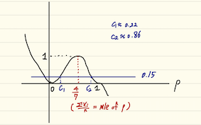

#Intermediate Applied Statistics Quiz 1#

##1. 일정기간 후 7마리 중 4마리가 사망하였다.##

###1) 모든 개체의 사망할 확률을 p로 동일하다고 하고 각 객체의 사망여부가 독립이라는 가정 하에서 이항분포를 이용하여 likelihood function을 쓰시오.###

 각 개체들의 사망확률이 동일하고, 서로 독립이라는 가정을 한다면, 이는 이항분포 $Bin(7,p)$로 표현할 수 있으며, 이항분포는 서로 독립인 베르누이 시행을 n번 반복한 형태이므로, 각 개체들($X_i,\ i=1,..,7$)은 $Ber(1,p)$의 분포를 갖는다고 볼 수 있다.
 
이에 대한 likelihood function은 아래와 같다.

$L(p;x)=\prod_{i=1}^7f(x_i;p)$

$= p^{x_1}(1-p)^{1-x_1}p^{x_2}(1-p)^{1-x_2}..p^{x_7}(1-p)^{1-x_7}$

$= p^{\sum_{i=1}^7 {x_i}}(1-p)^{n-\sum_{i=1}^7{x_i}},\ n=7$

여기에 추가로 몇번째 개체에서 이벤트가 발생했는지에 대한 조합의 수로 $nCx,\ \sum{x_i}=x$가 있지만, likelihood 함수로 관심모수를 추정하는데에 있어서는 $nCx$는 모수 p에 대해 미분을 할 시 사라질뿐 아니라, 필요한 정보가 아니기 때문에 생략하여 표현해도 무방하다.

###2) Score function을 구하고 p에 따른 score function을 그리시오.###

 Score function은 log-likelihood를 관심모수에 대해서 1차미분을 한 함수이다.
 
 이를 계산하면 아래와 같다.
 
 $S(p) = 	\frac{\partial }{\partial p}logL(p)$
 
 $=\frac{\partial }{\partial p}(\sum{x_i}logp + (n-\sum{x_i})log(1-p)) $
 
 $= \frac{\sum{x_i}}{p}+\frac{\sum{x_i}-n}{1-p}$
 
 $=\frac{\sum{x_i}-np}{p(1-p)}$
 
 score function은 likelihood function의 기울기를 나타내는 함수이므로, p가 mle일때 0을 지나가는 모습을 갖게된다. 기울기를 나타내는 함수이기에, score function은 자연스럽게 decreasing function의 form을 갖게 되며, 이를 얼추 그림으로 표현한다면 아래와 같을 것이다.
 
 
 
###3) likelihood based confidence interval을 구하시오###
 
likelihood 에 기반해 신뢰구간을 구한다면, likelihood ratio를 이용하여 이 ratio가 특정 cutoff 지점보다 크게 만드는 p의 범위를 구하는 것이다. 

이 예제의 likelihood ratio는 다음과 같다.

$\frac{p^y(1-p)^{n-y}}{\hat{p}^y(1-\hat{p})^{n-y}},\ \hat{y}\ is\ mle\ of\ p,\ y=\sum{x_i}$

$=\frac{p^4(1-p)^3}{(4/7)^4(3/7)^3}$

mle를 구해보면 $\frac{\sum{x_i}}{n}$이 나오므로, $\frac{4}{7}$을 사용한 것이다.

계속해서 전개하면, $\frac{p^4(1-p)^3}{(4/7)^4(3/7)^3} > c$이며 이는 

$-2log\frac{p^4(1-p)^3}{(4/7)^4(3/7)^3} < -2logc =3.84$

이며 이는 $\{p^4(1-p)^3 > 0.019 \}$와 같고 이를 p에 대해서 풀면,

**(0.22,0.87)**을 얻을 수 있으며, 이것이 곧 likelihood based로 구한 95% 신뢰구간이 된다.

###4) p=0.3임을 검정하고자한다. likelihood ratio function을 그리고 0.05의 유의수준에서의 cutoff를 구하여 검정하시오.###

likelihood ratio는 위에서 구한 것을 이용하여 확인하면 위와 같은 그림을 얻을 수 있다. 함수의 분모 부분의 $\hat{\theta}$는 MLE를 사용하기 때문에 $\frac{4}{7}$를 넣었다.

LRT에서 $R(p)= \frac{(0.3)^4(0.7)^3}{(4/7)^4(3/7)^3}$이며, 유의수준 0.05에서 LRT의 cutoff point는 ratio의 값이 0.15가 되는 지점이 된다. 고로 ratio 값이 0.15보다 작을 시, 귀무가설을 기각하게 된다.

이를 계산해보면 0.33이 나오게 되므로, 이에 따라 p=0.3인 귀무가설을 기각할 수 없다는 결론을 내릴 수 있다.

##2. 다음은 독약의 양에 따른 일정기간 후의 사망여부에 대한 자료이다.##
##(독양의 양, 사망여부) = (1,Dead), (2,Dead), (1,Alive), (1,Alive), (3,Alive), (3,Dead), (2,Dead).##

##각 개체의 사망할 확률을 $p_i$라 할 때 likelihood function은 다음과 같다.##
##$L(p_1,p_2,..p_7)=p_1p_2(1-p_3)(1-p_4)(1-p_5)p_6p_7$##

###1) Likelihood가 최대가 되는 각 p값을 구하시오.

여기서 p는 사망할 확률을 나타내는 것이므로, 단순하게 접근하면 이 풀이는 쉽게 접근이 가능하다.

죽은 사람의 p값에 1을 주고, 살아남은 사람의 p값에 0을 주게된다면, Likelihood는 1로 최대가 되게 된다. 

그렇기 때문에 likelihood를 최대로 하는 p값들은 다음과 같다.

$p_1=1,\ p_2=1,\ p_3=0,\ p_4=0,\ p_5=0,\ p_6=1,\  p_7=1$

###2) $p_i=\alpha$ 일때 likelihood가 최대가 되는 \alpha를 구하고 이러한 모형이 적합한지를 논하시오.

모든 p값이 같다면 likelihood function은 다음과 같이 표현이 가능하다.

$L(\alpha)=\alpha^4(1-\alpha)^3$

likelihood를 최대로 하기위해 MLE를 구해보면,

$\frac{\partial}{\partial \alpha}logL(\alpha)= \frac{4}{\alpha}+ \frac{-3}{1-\alpha}$ 처럼 표현가능하고, 이 식이 0으로 되게하는 $\alpha$를 찾으면 된다.

이를 계산하면 $\alpha = \frac{4}{7}$를 얻게 된다.

하지만 이 모형이 적합한지를 논한다면, **'적합하지 않다'**라고 말해야 할 것이다.

모든 개체들이 사망할 확률이 같고 사망확률 자체 외에 다른 요인이 포함되어있지않다면, 올바른 모형적합이라고 말할 수 있겠지만, 위의 샘플에는 투여한 독약의 양이라는 정보가 하나 더 추가되어있다. 

이와 같은 모형적합을 하게된다면, 독약의 투여정도와는 상관없이 likehood를 계산하게 되는 것이므로, 모든 요인을 고려하지 않았기 때문에 적절한 모형이라고 말할 수 없을 것이다.

###3) $p_i=\alpha+\beta{x_i}$ 일 때 likelihood를 쓰고 최대가 되는 $\alpha,\ \beta$를 어떻게 구할 수 있겠는가?###

먼저 likelihood식을 전개하면 아래와 같다.

$(\alpha+\beta{x_1})(\alpha+\beta{x_5})(\alpha+\beta{x_6})(\alpha+\beta{x_7})(1-\alpha-\beta{x_3})(1-\alpha-\beta{x_4})(1-\alpha-\beta{x_5})$

이를 최대가 되게 하려면, 기존 likelihood를 최대화 하는 것처럼 위 식에 log를 취해 미분한 뒤 그 식을 0이 되게하는 각각의 $\alpha$와 $\beta$를 찾으면 될 것이다.

$p_i$값이 모두 각각 관련없는 다른 값들이라면 기존접근방식처럼 다가갈 때는 관심모수가 7개가 되겠지만, 이 예제에서는 관심 모수가 2개로 좁혀진다. $p_i$의 값이 $x_i$들의 선형결합식으로 되어 있는 형태이기 때문에, 우리가 $x_i$로 이루어진 이 결합식에서 기울기와 절편을 추정할 수 있다면, 이 것이 $p_i$들에 대한 추정으로 이어지는 것이다. 

하지만 likelihood식을 전개할때 최고차항이 매우 높아지며 계산하기에 아주 복잡해지는 문제가 발생한다. 

개인적인 견해로는 

'기존에 각기 다른 7개의 모수를 추정하는 것과 다르게, 3번과 같은 예제는 오히려 샘플과 숨겨진 두가지 모수의 결합식으로 기존 모수를 추정하여 추정하는 모수의 개수를 줄여 좀 더 쉽게 문제를 해결할 수 있는 점도 존재는 하겠지만, 각 하나의 개체에 해당하는 하나의 모수를 더 잘게쪼개 두가지 모수의 선형결합으로 표현하였기에 설령 그 두가지 모수를 잘 추정하여 구했다고 하더라도, 해석과 설명력에 있어서 복잡함을 더 증가시키지않을까' 라는 생각을 하였다. (**오로지 저의 개인적인 상상뿐이어서, 이에 대해 교수님께서 설명해주시면 매우 감사하겠습니다.**)

###4)

기존의 접근은 개체를 기준으로 grouping을 한 것이라면, 4번 예제는 독양의 투여양에 따라 새롭게 grouping을 한 예제이다.

1번의 case는 오로지 개체 기준의 사망확률을 논하여 모수의 개수가 7개였고, 독약의 양을 고려하지 않았다.

하지만 4번의 case는 독약투여에 따라 사망확률을 정하였기 때문에, 투약의 class 갯수와 같게 추정하는 모수가 3개로 줄어들게 되었다.

이는 오로지 사망여부만 고려하지 않고, 약물 투여까지 고려하여 likelihood를 추정하는 것이기 때문에 조금 더 합리적인 추정이라고 할 수 있을 것이다. 또한 추정하는 모수의 개수 또한 줄어들었기 때문에, 계산에서의 용이함 또한 얻을 수 있을 것이다.

