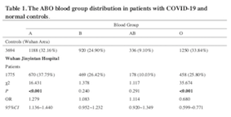

#Intermediate Applied Statistics Quiz II

###1. 첨부된 논문1은 혈액형과 COVID-19의 감염에 대한 분석이다. Table 1, S1에는 Data와 이를 요약한 Pearson 카이제곱 검정통계량, p-value, OR, 95% CI등이 나와 있다. 이들이 어떻게 구해진 것인지 하나의 예 를 들어 보이시오.




위의 테이블에서 하나의 그룹을 택하여 같은 통계량이 나오는지를 확인해보자.

이를 확인해보면 우한지역의 Normal control 집단은 총 3694명과, Patients 집단은 1775명으로 이루어져있다.

각 혈액형 그룹내에서 control과 treatment를 비교하고싶다면, 그때의 행렬은 $2 \times 2$형태에 열은 특정 혈액형집단과 그에 대한 여집합집단으로 이루어져야한다.


```r
library(epitools)
a <- matrix(c(469,1775-469,920,3694-920),2,2)
chisq.test(a)
```

```
## 
## 	Pearson's Chi-squared test with Yates' continuity correction
## 
## data:  a
## X-squared = 1.3777, df = 1, p-value = 0.2405
```

```r
odds.ratio <- (469/1306)/(920/2774)
oddsratio.wald(a)
```

```
## $data
##           Outcome
## Predictor  Disease1 Disease2 Total
##   Exposed1      469      920  1389
##   Exposed2     1306     2774  4080
##   Total        1775     3694  5469
## 
## $measure
##           odds ratio with 95% C.I.
## Predictor  estimate     lower    upper
##   Exposed1   1.0000        NA       NA
##   Exposed2   1.0828 0.9515635 1.232136
## 
## $p.value
##           two-sided
## Predictor  midp.exact fisher.exact chi.square
##   Exposed1         NA           NA         NA
##   Exposed2  0.2280304    0.2324257  0.2274537
## 
## $correction
## [1] FALSE
## 
## attr(,"method")
## [1] "Unconditional MLE & normal approximation (Wald) CI"
```

위의 코드는 B형 혈액형을 기준으로 Control과 Treatment 집단을 나누어 통계량값을 구해본 결과이다.

확인해보면, Oddsratio와 Pearson chi-square Statistics, oddsraio의 CI 등이 같게 나옴을 확인할 수 있다.

###2. 첨부된 논문2는 온도 및 습도의 COVID-19의 전파력과의 관계에 대한 분석이다. 분석방법 전반에 걸쳐 comment하시오.

위의 논문을 살펴보면, 코로나바이러스가 고온 혹은 다습한 날씨에서 transmission하는 전파력이 낮아진다는 주장을 하고 있다.

연구진들은 역학조사데이터를 얻고 나서 특정기간(3일) 동안 약 100여 곳의 도시들의 습도와 온도 데이터를 얻어 재생산지수와 독립변수들 간의 관계를 파악하고자 몇가지 회귀분석을 사용하였다. 

COVID-19가 지금 큰 영향을 전 세계에 주고 있지만, 이 바이러스가 발현하게 된 시기는 그닥 긴 시기가 아닌데, 연구진들은 분석을 할 떄, 2020년 1월 중순에서 3일동안,  21일 부터 23일까지의 온도와 습도를 얻어 이들의 평균치를 사용하여 재생산지수와의 관계를 분석하였다.

물론 코로나사태 이후 동안 오랜기간이 지났던 것 은 아니지만, panel regression에 적용할 때 조금 더 오랜기간동안의 습도와 온도들의 평균치를 사용할 수 있지 않았나에 대한 생각이 들었다.

논문의 앞 부분에는 인플루엔자의 전파력을 설명하면서, 코로나와 타 바이러스(사스, 인플루엔자)가 온도와 습도로 인해 변하는 영향력이 비슷하다고 언급을 한 부분이 있었는데, 

연구분석을 위해 데이터를 조금 더 오랜기간 동안 측정하여 분석을 하거나, 이 전 바이러스의 전파력에 대한 연구에서 측정단위를 정하는 부분에서 조금 더 참고를 하거나 이에 대한 설명이 추가로 되어있었다면 더 좋았을 것이라 생각한다.

