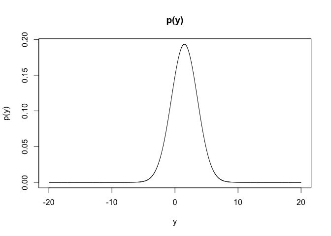

## Bayesian Statistics HW1


#### 1.1

**(a) For $\sigma=2$, write the formula for the marginal probability density for $Y$ and sketch it.**
 
$$f(y)= \sum_\theta{f(y,\theta)}=\sum_\theta{P(\theta)f(y|\theta)}$$

$$=P(\theta=1)f(y|\theta=1)+P(\theta=2)f(y|\theta=2)$$

$$0.5N(Y|1,2^2)+0.5N(Y|2,2^2)$$


```r
y <- seq(-20,20,0.01)
py <- 0.5*dnorm(y,1,2)+0.5*dnorm(y,2,2)
plot(y,py,type='l',main='p(y)',xlab='y',ylab='p(y)')
```

<!-- -->


**(b) What is $P(\theta=1|y=1)$ again supposing $\sigma=2$?**

By bayes theorem, 

$$P(\theta=1|y=1)=\frac{P(\theta=1,y=1)}{f(y=1)}$$
$$=\frac{P(\theta=1)f(y=1|\theta=1)}{\sum_\theta{P(\theta)f(y=1|\theta)}}$$
$$=\frac{0.5N(1|1,2^2)}{0.5N(1|1,2^2)+0.5N(1|2,2^2)}$$
$$=\frac{1}{1+exp(-1/8)}$$
**(c) Describe how the posterior density of $\theta$ changes in shape as $\sigma$ as increased and as it is decreased.**

If as $\sigma \rightarrow \infty$,

$$P(\theta=1|y) = \frac{P(\theta=1)f(y|1,\sigma^2)}{P(\theta=1)f(y|1,\sigma^2)+P(\theta=2)f(y|2,\sigma^2)}$$
$$=\frac{P(\theta=1)exp(-\frac{(y-1)^2}{2\sigma^2})}{P(\theta=1)exp(-\frac{(y-1)^2}{2\sigma^2})+P(\theta=2)exp(-\frac{(y-2)^2}{2\sigma^2})}$$

$$\rightarrow P(\theta=1)$$

As $\sigma \rightarrow \infty$,

$$P(\theta=1|y)=\frac{exp(-\frac{(y-1)^2}{2\sigma^2})}{exp(-\frac{(y-1)^2}{2\sigma^2})+exp(-\frac{(y-2)^2}{2\sigma^2})}$$
$$= \frac{1}{1+exp(-\frac{(2y-3)}{2\sigma^2})}$$

$$ 0, \ y>3/2$$

$$1,\ y< 3/2$$
posterior density $P(\theta|y)$ goes to prior $P(\theta)$ if $\sigma$ goes to infinity, 

and if $\sigma$ goes to zero, posterior density $P(\theta|y)$ will have high variability which depends on data.


#### 1.2 Show that (1.8) and (1.9) hold if *u* is a vector

Suppose $\mathbf{U} = (U_1,..,U_n)^T \in \mathbf{R^n}$ is n-dimensional random vector.

Then $E(\mathbf{U})= (E(U_1),..,E(U_n))^T=(E(E(U_1|V)),..,E(E(U_n|V)))^T$. Then (1.8) still holds for vector $\mathbf{U}$'s components.

(1.9) also holds for diagonal elements $V(U_i)=E(V(U_i|V))+V(E(U_i|V))$ and also for off diagonal elements.

$$E(Cov(U_i,U_j|V))+Cov(E(U_i|V),E(U_j|V))$$

$$=E(E(U_i,U_j|V)-E(U_i|V)(E(U_j|V)) + E(E(U_i|V)E(U_j|V))-E(E(U_i|V)E(U_j|V))$$
$$=E(U_i,U_j)-E(E(U_i|V)E(U_j|V))+E(E(U_i|V)E(U_j|V))-E(E(U_i|V)E(U_j|V))$$
$$=E(U_i,U_j)-E(U_i)E(U_j)=Cov(U_i,U_j)$$.


#### 1.3

$$P(child\ is\ Xx| child\ has\ brown\ eyes\ \&\ parents\ have\ brown\ eyes )$$

$$\frac{0\cdot(1-p)^4+\frac{1}{2}\cdot4p(1-p)^3+\frac{1}{2}\cdot4p^2(1-p)^2}
{1\cdot(1-p)^4+1\cdot4p(1-p)^3+\frac{3}{4}4p^2(1-p)^2}$$

$$=\frac{2p(1-p)+2p^2}{(1-p)^2+4p(1-p)+3p^2} = \frac{2p}{1+2p}$$

$$P(Judy\ is\ Xx|n\ children\ all\ have\ brown\ eyes\ \&\ all\ previous\ information) = 
\frac{\frac{2p}{1+2p}\cdot(\frac{3}{4})^n}{\frac{2p}{1+2p}\cdot(\frac{3}{4})^n}+\frac{1}{1+2p}\cdot1$$

$$P(Judy's\ child\ is\ Xx| all\ the\ given\ information)=\frac{\frac{2p}{1+2p}\cdot(\frac{3}{4})^n}{\frac{2p}{1+2p}\cdot(\frac{3}{4})^n+\frac{1}{1+2p}}(\frac{2}{3})+\frac{\frac{1}{1+2p}}{\frac{2p}{1+2p}\cdot(\frac{3}{4})^n+\frac{1}{1+2p}}(\frac{1}{2})$$

$$P(Grandchild\ is\ xx| all\ the\ given\ information)$$

$$=\frac{\frac{2}{3}\frac{2p}{1+2p}\cdot(\frac{3}{4})^n+\frac{1}{2}\frac{1}{1+2p}}
{\frac{2p}{1+2p}\cdot(\frac{3}{4})^n+\frac{1}{1+2p}}(\frac{1}{4}2p(1-p)+\frac{1}{2}p^2)$$

$$=\frac{\frac{2}{3}\frac{2p}{1+2p}\cdot(\frac{3}{4})^n+\frac{1}{2}\frac{1}{1+2p}}
{\frac{2p}{1+2p}\cdot(\frac{3}{4})^n+\frac{1}{1+2p}}(\frac{1}{2}p)$$


#### 1.4


(a).

$$P(favorite\ wins|point\ spreads=8)=\frac{8}{12}$$

$$P(favorite\ wins\ by\ at\ least\ 8| point\ spread=8)=\frac{5}{12}$$

$$P(favorite\ wins\ by\ at\ least\ 8|point\ spread=8\ and\ favorite\ wins)=\frac{5}{8}$$
(b). Let d= (outcome-point spread). Then $d \approx N(\bar{d}=-1.25,s^2=(10.1^2))$

$$P(favorite\ wins|point\ spreads=8)=P(d\geq0)=0.45$$

$$P(favorite\ wins\ by\ at\ least\ 8| point\ spread=8)=P(d\geq8)=0.18$$

$$P(favorite\ wins\ by\ at\ least\ 8|point\ spread=8\ and\ favorite\ wins)=\frac{0.18}{0.45}=0.4$$


#### 1.5

(a).

Our goal is guessing probability $P(election\ is\ tied|given\ information)$.

Assume that in two party, each candidate receives between 30% - 70% of the vote that follows Uniform distribution ($\frac{y}{n} \sim Unif(0.3,0.7)$).

Then we can express 

$$P(election\ is\ tied|n)= P(\frac{y}{n}=0.5) = 1/0.4n,\ n\ is\ even,\ o.w\ zero$$
n is the total number of votes and y be the number received by candidate.

We can write $P(election\ is\ tied,n=even)= P(election\ is\ tied|n=even)P(n=even)= \frac{1}{0.8n}$

National election has 435 individual districts, then the probability of at least one of them being tied is, 

$$P(at\ least\ one\ election\ is\ tied)=1-(1-\frac{1}{0.8n})^{435} \approx \frac{435}{0.8n}$$ 

as n goes to infinity.


(b).

Given information implies $\hat{P}(election\ decided\ within\ 100\ votes)=\frac{49}{20597}$ and 

vote gap written as $|2y-n| \leq 100$.

Let $d=\ 2y-n,$

$$P(election\ is\ tied\ within\ 100\ votes)=P(d=0|d \leq 100)P(d \leq 100)$$

$$=\frac{1}{100-(-100)+1}\frac{49}{20597} = \frac{1}{201}\frac{49}{20597}$$.

By using (a), 

$$P(at\ least\ one\ election\ is\ tied)$$
$$= 1- (1-P(election\ is\ tied\ within\ 100\ votes))^{435} \approx 435 \times\frac{49}{201\times20597}= 0.00514$$

#### 1.6

$$P(identical\ twins| twin\ brother)$$
$$= \frac{P(identical\ twins)P(twin\ brother|identical\ twins)}{\sum_{twins}P(twins)P(twin\ brother|twins)} = \frac{\frac{1}{300}\frac{1}{2}}{\frac{1}{300}\frac{1}{2}+\frac{1}{125}\frac{1}{4}}=\frac{5}{11}$$

#### 1.8

(a).

Person A already saw rolled die, then his belief about probability about issue is updated and will be biased. This situation seens to have subjectivity, but i think, if two people A and B's are both rational persons, A & B build same probablity about 6 appears as 1/6.

(b).

A and B have different belief about soccer. B's knowledge about soccer affect hisb belief about probability, then B allocate probablity about Brazil's win more higher than A, who will allocate probability about all countries equally.

#### 1.9

(a).


```r
simulation = function(seed=NULL){
  if(!is.null(seed)){
    set.seed(seed)
  }
time <- cumsum(rexp(50,1/10))
time <- time[time <= 420]
patients <- length(time)
wait_pat <- 0
wait_time <- 0
doc <- c(0,0,0)

for (i in (1:length(time))){
  wait <- max(min(doc)-time[i],0)
  wait_time <- wait_time + wait
  wait_pat <- wait_pat + (wait > 0)
  doc_start <- max(c(min(doc),time[i]))
  doc_end <- doc_start + runif(1,5,20)
  doc[which.min(doc)] = doc_end
}

result <- c('patients'=patients,'wait_pat'=wait_pat,
            'avg_wait_time'=avg_wait_time <- ifelse(wait_pat==0,0,wait_time/wait_pat)
            ,'hospital_closed'=hospital_closed <- max(max(doc,420))
)
return(result)

}

simulation(2020311194)
```

```
##        patients        wait_pat   avg_wait_time hospital_closed 
##       47.000000        4.000000        3.958816      428.354702
```


(b).


```r
iteration <- replicate(100,simulation())

q25 <- apply(iteration,1,quantile,0.25)
q75 <- apply(iteration,1,quantile,0.75)

q25; q75
```

```
##        patients        wait_pat   avg_wait_time hospital_closed 
##       39.000000        3.000000        2.885335      420.000000
```

```
##        patients        wait_pat   avg_wait_time hospital_closed 
##       46.000000        8.000000        5.363889      430.994808
```

