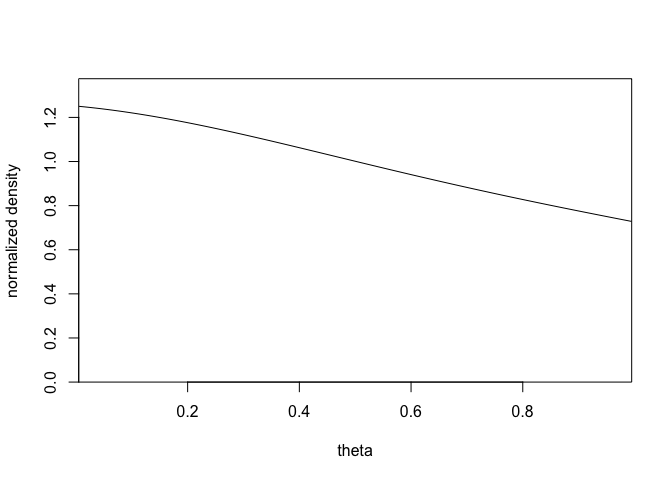
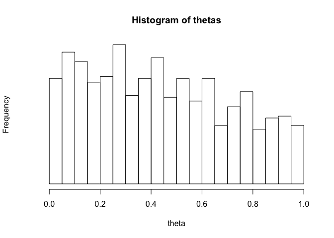

# Bayesian Statistics HW2

## 2-1.

동전의 앞면이 나올 확률 $\theta$에 대한 Prior distribution이 $Beta(4,4)$를 따르며, 동전을 10번 던졌을 때 동전의 앞면이 3번 미만으로 나오는 사건에 대하여 prior와 likelihood를 정리하면 다음과 같다.

$p(\theta) \sim \theta^3(1-\theta)^3,\ Beta(\alpha, \beta) \propto \theta^{\alpha-1}(1-\theta)^{\beta-1} $

$f(y|\theta) = \dbinom{10}{0}(1-\theta)^{10}+\dbinom{10}{1}\theta(1-\theta)^{9}+\dbinom{10}{2}\theta^2(1-\theta)^8 = (1-\theta)^{10}+10\theta(1-\theta)^{9}+45\theta^2(1-\theta)^{8}$.

Posterior Density는 prior와 likelihood의 곱에 비례하므로, 아래와 같이 표현할 수 있다.

$p(\theta|y) \propto \theta^3(1-\theta)^{13}+10\theta^4(1-\theta)^{12}+45\theta^5(1-\theta)^{11}$


Posterior density의 sketch는 아래와 같다.


```r
theta <- seq(0,1,.01)
dens <- theta^3*(1-theta)^13 + 10*theta^4*(1-theta)^12 +
45*theta^5*(1-theta)^11
plot (dens~theta, main='Posterior', type="l", xlab="theta", yaxt="n",  cex=2)
```

<!-- -->


## 2-2.

동전의 앞면이 나올 확률을 $\pi$라 하고, 동전이 앞면이 나올 때 까지 추가로 던진 횟수를 N이라고 할 시 , 이에 대한 기댓값은 다음과 같다.

$E[N|\pi] = 1\cdot\pi+2\cdot(1-\pi)\pi+3\cdot(1-\pi)^2\pi+ \cdots = 1/\pi$


첫 두번 째 toss가 tail이 나온 후 동전 $C_1$와 $C_2$ 중 랜덤하게 동전을 선택하는 확률은 베이즈정리에 따라 아래와 같이 표현 할 수 있다.

$P(C=C_1|TT) = \frac{P(C=C_1)P(TT|C=C_1)}{P(C=C_1)P(TT|C=C_1)+P(C=C_2)P(TT|C=C_2)}= \frac{0.5(0.4^2)}{0.5(0.4^2)+0.5(0.6^2)}=\frac{16}{52}$.


이후 동전이 앞면이 나올 때 까지의 시행횟수 N에 대한 posterior expectation은 다음과 같다.

$E(N|TT) = E[E(N|TT,C)|TT] = P(C=C_1|TT)E(N|C=C_1,TT)+P(C=C_2|TT)E(N|C=C_2,TT)$

$=\frac{16}{52}\frac{1}{0.6}+\frac{36}{52}\frac{1}{0.4}=2.24$.


## 2-3.

$E[y] = 1000\cdot\frac{1}{6} = 166.7,\ sd[y] = \sqrt{1000\cdot\frac{1}{6}\frac{5}{6}}=11.8.$

```r
y <- seq(100,240,1)
dens <- dnorm(y,1000*(1/6),sqrt(1000*(1/6)*(5/6)))
plot(dens~y, main="Approx Dist", type='l',xlab='y',yaxt='n',cex=2)
```

<!-- -->


5%,25%,50%,75%,95% points는 차례대로 다음과 같다.

$5\%\ point = 166.7 - 1.65(11.8) = 147.2$

$25\%\ point = 166.7 - 0.67(11.8) = 158.8$

$50\%\ point = 166.7$

$75\%\ point = 166.7 + 0.67(11.8) = 174.6$

$95\%\ point = 166.7 + 1.65(11.8) = 186.1$

rounding하면 차례대로 각 point들은 147, 150, 167, 175, 186이다.


## 2-4.


### 2-4a.
$E(y|\theta=\frac{1}{12}) = 83.3, sd(y|\theta=\frac{1}{12}) = 8.7$,

$E(y|\theta=\frac{1}{6}) = 166.7, sd(y|\theta=\frac{1}{6}) = 11.8$,

$E(y|\theta=\frac{1}{4}) = 250, sd(y|\theta=\frac{1}{4}) = 13.7$.


```r
y <- seq(50,300,1)
dens <- function(x,theta){
dnorm(x,1000*theta, sqrt(1000*theta*(1-theta)))  
}
mixture_dens <- 0.25*dens(y,1/12)+0.5*dens(y,1/6)+0.25*dens(y,1/4)
plot(mixture_dens~y,main="prior predictive aprrox dist", yaxt='n',type='l',cex=2)
```

<!-- -->


### 2-4b.

위에서 그려진 data y의 분포는 정규분포를 따르지 않지만, 근사적으로 정규분포 3개가 서로 overlap 되어있는 모습으로 볼 수 있다. 고로 전체 데이터의 5%에 해당하는 point는 y전체 데이터의 25%를 차지하고 있는 첫번째 정규분포에서 20%에 해당하는 부분으로 생각할 수 있다. 

이러한 방법으로 데이터의 25%에 해당하는 포인트는 첫번 째 봉우리와 두번째 봉우리의 사이로 볼 수 있으며, 50% 포인트는 데이터의 정중앙, 75% 포인트는 두번 째 봉우리와 세번 째 봉우리의 사이, 95% 포인트는 세번째 봉우리의 80%에 해당하는 포인트와 대응된다. 

고로 각 point들은 아래와 같다.

$5\%\ point = 83.3-(0.84)8.7 = 75.9$

$25\%\ point \sim 120\ (from\ the\ graph)$

$50\%\ point = 166.7$

$75\%\ point = 205\sim210$

$95\%\ point = 250+(0.84)13.7 = 262$.


## 2-5.

### 2-5a.

$P(y=k) =\int_0^1P(y=k|\theta)d\theta$

$=\int_0^1\dbinom{n}{k}\theta^k(1-\theta)^{n-k}d\theta$

$=\dbinom{n}{k}\frac{\Gamma(k+1)\Gamma(n-k+1)}{\Gamma(n+2)} = \frac{1}{n+1}$.

### 2-5b.

$\theta$의 posterior mean $\frac{\alpha+y}{\alpha+\beta+n}$이 $\frac{\alpha}{\alpha+\beta}$와 $\frac{y}{n}$ 사이에 있다는 것을 보이기 위해서는, $\frac{\alpha+y}{\alpha+\beta+n} = \lambda\frac{\alpha}{\alpha+\beta}+(1-\lambda)\frac{y}{n},\ \lambda \in (0,1)$임을 보이면 된다.

이를 $\lambda$에 관한 식으로 풀면, 

$\frac{\alpha+y}{\alpha+\beta+n} = \frac{y}{n}+\lambda(\frac{\alpha}{\alpha+\beta}-\frac{y}{n})$,


$\frac{n\alpha-\alpha{y}-\beta{y}}{(\alpha+\beta+n)n}=\lambda(\frac{n\alpha-\alpha{y}-\beta{y}}{(\alpha+\beta)n})$.

$\lambda= \frac{\alpha+\beta}{\alpha+\beta+n}$가 되며, 이는 늘 0과 1 사이에 존재한다.

고로 posterior mean은 prior mean과 data의 가중평균이 된다.

### 2-5c.

Uniform prior distribution은 $Beta(1,1)$이며, 고로 prior variance는 $\frac{\alpha\beta}{(\alpha+\beta)^2(\alpha+\beta+1)} = \frac{1}{12}$이다.

Posterior variance는 다음과 같다.

$\frac{(1+y)(1+n-y)}{(2+n)^2(3+n)}=(\frac{1+y}{2+n})(\frac{1+n-y}{2+n})(\frac{1}{3+n})$.

앞의 두 factor들은 두개의 합이 1이 되는 값들이며, 이들의 곱은 $\frac{1}{4}$ 근처에서 머무를 것이다.

세번째 factor는 n이 1보다 크거나 같다면, $\frac{1}{3}$보다 작다. 고로 Posterior variance는 prior variance보다 작은 값을 갖는다.

### 2-5d.

사전분포가 베타분포를 따를 때, 사후분포의 분산이 사전분포의 분산보다 작은 것을 보이는 경우의 수는 무수히 많다. 일례로 n이 매우 커진다면, 사후분포는 명백히 사전분포의 분산보다 작은 값을 가지게 된다. 만약 n과 y가 모두 1인 경우를 생각해보자. 이 때 사전분포가 $Beta(1,4)$를 따른다면, 사후분포의 분산은 0.055이며, 사전분포의 분산은 0.026을 갖는다.


## 2-7

### 2-7a.

이항분포는 exponential family에 속하며, natural parameter에 대한 부분은 다음과 같이 표현할 수 있다.

$\phi(\theta) = log(\frac{\theta}{1-\theta})$.

Uniform prior density인 $\phi(\theta), p(\theta) \propto 1 $는 $\theta = e^{\phi}/(1+e^{\phi})$로 표현이 가능하다.

고로,

$$q(\theta) = p(\frac{e^{\phi}}{1+e^{\phi}})|\frac{d}{d\theta}log(\frac{\theta}{1-\theta})| \propto \theta^{-1}(1-\theta)^{-1}$$.

### 2-7b.

만약 y가 0 이라면, $p(\theta|y) \propto \theta^{-1}(1-\theta)^{n-1}$는 $\theta=0$ 주변에서 무한히 적분되어 계산이 불가능하며, y가 n인 경우에는 $\theta=1$ 주변에서 위와 같다.

## 2-8

### 2-8a

$$\theta|y \sim N(\frac{\frac{1}{40^2}180+\frac{n}{20^2}150}{\frac{1}{40^2}+\frac{n}{20^2}},\frac{1}{\frac{1}{40^2}+\frac{n}{20^2}})$$

### 2-8b

$$\tilde{y} |y \sim N(\frac{\frac{1}{40^2}180+\frac{n}{20^2}150}{\frac{1}{40^2}+\frac{n}{20^2}},\frac{1}{\frac{1}{40^2}+\frac{n}{20^2}}+20^2)$$

### 2-8c

95% posterior interval for $\theta|y=150,\ n=10:\ 150.7 \pm 1.96(6.25) = [138,163]$

95% posterior interval for $\tilde{y}|y=150,\ n=10:\ 150.7 \pm 1.96(20.95) = [110,192]$


### 2-8d

95% posterior interval for $\theta|y=150,\ n=100:[146,154]$

95% posterior interval for $\tilde{y}|y=150,\ n=100:[111,189]$


## 2-9

### 2-9a.

$\alpha + \beta = \frac{E(\theta)(1-E(\theta))}{var(\theta)}-1 = 1.67$

$\alpha = (\alpha+\beta)E(\theta) = 1$

$\beta= (\alpha+\beta)(1-E(\theta))=0.67$


```r
theta <- seq(0,1,.001)
dens <- dbeta(theta,1,.67)
plot (theta, dens,
type="l", xlab="theta", ylab="", yaxt="n", cex=2)
lines (c(1,1),c(0,3),col=0)
lines (c(1,1),c(0,3),lty=3)
```

<!-- -->

### 2-9b

$n=1000,\ y=650$이면, $p(\theta|y)=Beta(\alpha+650,\beta+350)=Beta(651,350,67)$이다.


```r
theta <- seq(0,1,.001)
dens <- dbeta(theta,651,350.67)
cond <- dens/max(dens) > 0.001
plot (theta[cond], dens[cond],
type="l", xlab="theta", ylab="", yaxt="n", cex=2)
```

<!-- -->


## 2-10

### 2-10a

$$p(data|N) = \begin{cases}
\frac{1}{N}\ if\ N \geq 203\\
0\ ohterwise
\end{cases}
\  $$

$$p(N|data) \propto p(n)p(data|N)$$

$$=\frac{1}{N}(0.01)(0.99)^{N-1}\ for\ N \geq 203$$

$$\frac{1}{N}(0.99)^N\ for\ N \geq 203$$.

### 2-10b

$$p(N|data) = c\frac{1}{N}(0.99)^N$$
$\sum_Np(N|data)=1$ 이므로, c는 다음을 통해 계산할 수 있다.

$$\frac{1}{c} = \sum_{N=203}^\infty\frac{1}{N}(0.99)^N$$
이는 analytically 하게 계산할 수 있지만, 컴퓨터의 numerical computation으로 도출하는 것이 훨씬 쉽다.


$$Approximation\ on\ the\ computer:\ \sum_{N=203}^{1000}\frac{1}{N}(0.99)^N = 0.04658$$

$$Error\ in\ the\ approximation:\ \sum_{N=1001}^\infty\frac{1}{N}(0.99)^N < \frac{1}{1001}\sum_{N=1001}^\infty(0.99)^N$$

$$=4.3 \times 10^{-6}$$
고로 $\frac{1}{c} = 0.04658,\ c=21.47$이다.

$$E(N|data) = \sum_{N=203}^\infty Np(N|data)$$

$$c\sum_{N=203}^\infty(0.99)^N = 21.47\cdot\frac{(0.99)^{203}}{1-0.99} = 279.1$$

$$sd(N|data) = \sqrt{\sum_{N=203}^\infty (N-279.1)^2c\frac{1}{N}(0.99)^N}$$

$$\approx \sqrt{\sum_{N=203}^{1000}(N-279.1)^221.47\frac{1}{N}(0.99)^N} = 79.6$$.


### 2-10c

improper discrete uniform prior density on $N:p(N) \propto 1$이 한가지 방법이 될 수 있다.

이 density는 improper posterior density($p(N) \propto \frac{1}{N},\ for\ N \geq203 $)를 갖는다.

prior($p(N) \propto 1/N$) 는 improper하지만, proper prior density를 갖는데, $\sum_N1/N^2$가  수렴하기 때문이다.

또한 

* data point가 한 개 이상이라면, 사후분포는 위의 사전분포를 갖는 하에서 proper하며

* data point가 단 하나뿐이라면 noninformative prior를 쓰는 것보다 실용적이지 못한 결과를 갖는다.


## 2-11

### 2-11a


```r
dens <- function (y, th){
dens0 <- NULL
for (i in 1:length(th))
dens0 <- c(dens0, prod (dcauchy (y, th[i], 1)))
dens0}
y <- c(-2, -1, 0, 1.5, 2.5)
step <- .01
theta <- seq(step/2, 1-step/2, step)
dens.unnorm <- dens(y,theta)
dens.norm <- dens.unnorm/(step*sum(dens.unnorm))
plot (theta, dens.norm, ylim=c(0,1.1*max(dens.norm)),
type="l", xlab="theta", ylab="normalized density",
xaxs="i", yaxs="i", cex=2)
```

<!-- -->

### 2-11b


```r
thetas <- sample (theta, 1000, step*dens.norm,
replace=TRUE)
hist (thetas, xlab="theta", yaxt="n",
breaks=seq(0,1,.05), cex=2)
```

<!-- -->

### 2-11c


```r
y6 <- rcauchy (length(thetas), thetas, 1)
hist (y6, xlab="new observation", yaxt="n",
nclass=100, cex=2)
```

<!-- -->


## 2-12

포아송 분포의 pdf는 다음과 같으며

$p(y|\theta) = \theta^ye^{-\theta}/y!$, $J(\theta)=E(d^2logp(y|\theta)/d\theta^2|\theta)=E(y/\theta^2)=1/\theta$이다.

이는 improper gamma density $\Gamma(1/2,0)$와 상응한다.


## 2-13

### 2-13a

$y_i$를 fatal accidents in year i의 빈도라 하고 $\theta$를 한 해에 일어날 사고빈도의 기댓값이라 하자. 그렇다면 $y_i|\theta \sim Pois(\theta)$를 갖는다.

편의를 위해 conjugate family를 이용하자. 만약 $\theta$의 사전분포가 $\Gamma(\alpha,\beta)$라면, 사후분포는 $\Gamma(\alpha+10\bar{y},\beta+10)$을 갖는다.

$\alpha,\beta$가 모두 0인 noninformative prior distribution을 가정하자.(n=10)
사후분포는 $\theta|y \sim \Gamma(238,10)$을 갖는다.

$\tilde{y}$ 를 1986년의 fatal accidents의 횟수라 하자. $\theta$가 주어졌을 때 predictive distribution for $\tilde{y}$는 $Pois(\theta)$를 갖는다.

아래는 $\tilde{y}$의 95% posterior interval을 구하는 두 가지 방법이다.

* Simulation


```r
theta <- rgamma(1000,238)/10
y1986 <- rpois(1000,theta)
print (sort(y1986)[c(25,976)])
```

```
## [1] 15 34
```

* Normal approximation 

감마분포로부터 $E(\theta|y) = 238/10=23.8,\ sd(\theta|y)=\sqrt{238/10} =1.54$를 얻을 수 있으며

포아송 분포로부터 $E(\tilde{y}|\theta)=\theta,\ sd(\tilde{y}|\theta)=\sqrt{\theta}$를 얻을 수 있다.

Formula (1.6)과 (1.7)로 부터 다음과 같은 식을 얻을 수 있다.

$$E(\tilde{y}|y)=E(E(\tilde{y}|\theta,y|y)=E(\theta|y)=23.8$$

$$var(\tilde{y}|y) = E(var(\tilde{y}|\theta,y)|y)+var(E(\tilde{y}|\theta,y)|y)$$

$$=E(\theta|y)+var(\theta|y) = 26.2=5.12^2$$.

$p(\tilde{y}|y)$의 정규근사를 통해 $\tilde{y}$의 95% interval은 $[23.8 \pm 1.96(5.12)] = [13.8,33.8]$를 갖는다. $\tilde{y}$는 반드시 정수여야하며, 95% 신용구간은 최소한 [13,34]를 포함한다.


### 2-13b

1976년과 1977년의 추정된 numbers of passenger miles는 각각 $3.863 \times 10^{11},\ 4.3 \times 10^{11}$
이다.

$x_i$=number of passenger miles flown in year i, $\theta$=expected accident rate per passenger mile이라고 하자.

$y_i|x_i,\theta \sim Pois(x_i\theta)$.

$\theta$에 대한 prior로 $\Gamma(0,0)$을 사용하면 이에 대한 사후분포는 아래와 같다.

$$y|\theta \sim \Gamma(10\bar{y},10\bar{x})=\Gamma(238,5.716 \times 10^{12})$$.

Given $\theta$에서 predictive distribution for $\tilde{y}$는 $Pois(\tilde{x}\theta)=Pois(8\times10^{11}\theta)$이다.

$tilde{y}$의 95% posterior interval을 구하는 두 가지 방법은 아래와 같다.

* Simulation


```r
theta <- rgamma(1000,238)/5.716e12
y1986 <- rpois(1000,theta*8e11)
print (sort(y1986)[c(25,976)])
```

```
## [1] 22 47
```

* Normal Approximation

$E(\theta|y) = 238/(5.716 \times 10^{12}) = 4.164 \times 10^{-11},\ sd(\theta|y) = \sqrt{238}/(5.716 \times 10^{12}) = 0.270 \times 10^{-11}$, $E(\tilde{y}|\theta)=(8\times 10^{11})\theta,\ sd(\tilde{y}|\tilde{x},\theta)=\sqrt{(8 \times 10^{11})\theta)}$.

$$E(\tilde{y}|y) = E(E(\tilde{y}|\theta,y)|y) = 33.3$$

$$var(\tilde{y}|y) = E(var(\tilde{y}|\theta,y)|y) +var(E(\tilde{y}|\theta,y)|y)$$

$$(8 \times 10^{11})(4.164 \times 10^{-11})+(8 \times 10^{11})(0.270 \times 10^{-11})^2 = 38=6.2^2$$.

$\tilde{y}$는 정수값을 가져야 하므로, interval은 적어도 [21,46]을 포함해야한다.


### 2-13c

238을 6919(total number of deaths in the data)로 대체하여 (a)를 반복하면, 

1000번의 simulation의 결과는 95% posterior interval [638,750]을 갖는다.


### 2-13d

위의 c와 같이 값을 대체하여 (b)를 반복하면, 95% posterior interval은 [900,1035]을 갖는다.

### 2-13e

한 해에 더 많은 mile을 비행할수록 더 많은 사고가 기대되기에, 일반적으로 model (b)와 (d)에서는 Poisson model을 사용하는 것이 보다 합리적이다. 반면 만약 항공사의 안전이 개선된다면, 사고율이 시간에 따라 감소할 것으로 기대되며, 사고빈도의 기댓값은 roughly하게 constant값을 가질 것이다. 이에는 time trend를 모델에 넣는 것이 합리적으로 사료된다.

또한 사고는 독립적으로 이루어지는 것으로 기대된다. 허나 승객들의 사망은 독립이 아니다.(비행기사고가 나면 탑승객들은 한 묶음에 엮여있으므로) 고로 포아송 모델은 총사망빈도보다는 사고빈도에 적용하는 것이 합리적이다. 만약 관심분야가 총사망자라면 어떻게 될 것인가? 

이때는 compound model을 사용하는 것이 합리적인데, 예를 들어 accidents에 대해서는 포아송분포를 적용하고, 사고가 일어났을 때 사망에 대하여는 다른 분포를 적용하는 것이다.


## 2-16

### 2-16a

$$p(y) \int p(y|\theta)p(\theta)d\theta$$

$$\int_0^1\binom{n}{y}\theta^y(1-\theta)^{n-y}\frac{\Gamma(\alpha+\beta)}{\Gamma(\alpha)\Gamma(\beta)}
\int_0^1\theta^{\alpha+1}(1-\theta)^{\beta-1}d\theta$$

$$\frac{\Gamma(n+1)}{\Gamma(y+1)\Gamma(n-y+1)}\frac{\Gamma(\alpha+\beta)}{\Gamma(\alpha)\Gamma(\beta)}\int_0^1\theta^{y+\alpha-1}(1-\theta)^{n-y+\beta-1}d\theta$$

$$\frac{\Gamma(n+1)}{\Gamma(y+1)\Gamma(n-y+1)}\frac{\Gamma(\alpha+\beta)}{\Gamma(\alpha)\Gamma(\beta)}\frac{\Gamma(y+\alpha)\Gamma(n-y+\beta)}{\Gamma(n+\alpha+\beta)}$$

### 2-16b

우리는 y에 따라 $p(y)$가 어떻게 변하는지를 알고 싶기 때문에, $p(y)$ factor에 관심을 갖는다. 고로 
$\Gamma(a+y)\Gamma(b+n-y)/\Gamma(y+1)\Gamma(n-y+1)$가 y에 따라 변하는 것을 확인하면 된다.

위의 식은 $a=b=1$일 때 1이며, $p(y)$는 이 때 constant이다. 

$p(y)$가 in y에서 constant라 가정해보자. (특히 $p(0)=p(n)$과 $p(0)=p(1)$에서)
첫번째 식을 통해 다음과 같은 식 도출이 가능하다. 

$$\Gamma(a)\Gamma(b+n)=\Gamma(a+n)\Gamma(b)$$.

$\Gamma(t)=(t-1)\Gamma(t-1)$을 떠올려본다면, 우리는 $\Gamma(a)\Gamma(b)(b+n-1)\cdots(b+1)b=\Gamma(a)\Gamma(b)(a+n-1)\cdots(a+1)a$를 성립시켜야한다.

여기서 모든 product의 모든 항들이 positive이기때문에, $a=b$이다.

$p(0)=p(1)$은 $\Gamma(a)\Gamma(b+n)/\Gamma(1)\Gamma(n+1)=\Gamma(a+1)\Gamma(b+n-1)/\Gamma(2)\Gamma(n)$을 내포하며, 위와 같은 방식으로 $b+n-1=na$를 얻을 수 있다. $a=b$이기 때문에, 이는 $a+n-1=na$로 정리되며, 이 식의 유일한 해는 $a=1$이다.

그러므로 $a=b=1$은 $p(y)$가 constant in y가 되기 위한 필요충분조건이다.


## 2-17

### 2-17a

Let $\mu = \sigma^2$, so that $\sigma = \sqrt{\mu}$. Then $p(\sigma^2)=p(\mu)=p(\sqrt{\mu})d\sqrt{\mu}/d\mu=p(\sigma)(1/2)\mu^{-1/2}=(1/2)p(\sigma)/\sigma$,

which is proportional to $1/\sigma^2$ if $p(\sigma) \propto \sigma^{-1}$.

### 2-17b

$p(\sigma/data) \propto \sigma^{-1-n}exp(-c/\sigma^2)$, which may be written as $(\sigma^2)^{-1/2-n/2}exp(-c/\sigma^2)$. $p(\sigma^2|data) \propto (\sigma^2)^{-1-n/2}exp(-c/\sigma^2)$.

We have defined $c=nv/2$, and assume this quantity to be positive.

Let $(\sqrt{a},\sqrt{b})$ be the 95% interval of highest density for $p(\sigma|data)$.

Then 

$$a^{-1/2-n/2}exp(-c/a)=b^{-1/2-n/2}exp(-c/b)$$.

Equivalently, $(-1/2-n/2)loga-c/a=(-1/2-n/2)logb-c/b$.

if (a,b) were the 95% interval of highest density for $p(\sigma^2|data)$, then

$$a^{-1-n/2}exp(-c/a)=b^{-1-n/2}exp(-c/b)$$

That is, $(-1-n/2)loga-c/a=(-1-n/2)logb-c/b$. Combining the two equations, $1/2loga=1/2logb$, so that $a=b$, in which case [a,b] cannot be a 95% interval, and we have a contradiction.


## 2-20

### 2-20a

$$p(\theta|y \geq 100) \propto p(y \geq 100|\theta)p(\theta)$$

$$\propto exp(-100\theta)\theta^{\alpha-1}exp(-\beta\theta)$$


$$p(\theta|y \geq 100) = \Gamma(\theta|\alpha,\beta+100)$$

### 2-20b

$$p(\theta|y=100) \propto p(y=100|\theta)p(\theta)$$

$$\propto \theta exp(-100\theta)\theta^{\alpha-1}exp(-\beta\theta)$$

$$p(\theta|y=100) = \Gamma(\theta|\alpha+1,\beta+100)$$
### 2-20c

The variance of $\theta$ decreases given more information : in this case,

$$E(var(\theta|y)|y \geq 100) \leq var(\theta|y \geq 100)$$

Plugging in y=100 to get $var(\theta|y=100)$ is not the sa,e as averaging over the distribution of $y|y \geq 100$ on the left side of above inequality.


## Probability of a girl birth given placenta previa


```r
library(ggplot2)
theme_set(theme_minimal())
df1 <- data.frame(theta = seq(0.375, 0.525, 0.001)) 
a <- 438
b <- 544
# dbeta computes the posterior density
df1$p <- dbeta(df1$theta, a, b)
df2 <- data.frame(theta = seq(qbeta(0.025, a, b), qbeta(0.975, a, b), length.out = 100))
# compute the posterior density
df2$p <- dbeta(df2$theta, a, b)
```


```r
ggplot(mapping = aes(theta, p)) +
  geom_line(data = df1) +
  # Add a layer of colorized 95% posterior interval
  geom_area(data = df2, aes(fill='1')) +
  # Add the proportion of girl babies in general population
  geom_vline(xintercept = 0.488, linetype='dotted') +
  # Decorate the plot a little
  labs(title='Uniform prior -> Posterior is Beta(438,544)', y = '') +
  scale_y_continuous(expand = c(0, 0.1), breaks = NULL) +
  scale_fill_manual(values = 'lightblue', labels = '95% posterior interval') +
  theme(legend.position = 'bottom', legend.title = element_blank())
```

<!-- -->


## Illustrate the effect of prior in binomial model


```r
library(ggplot2)
theme_set(theme_minimal())
library(tidyr)
a <- 437
b <- 543
df1 <- data.frame(theta = seq(0.375, 0.525, 0.001))
df1$pu <- dbeta(df1$theta, a+1, b+1)
n <- c(2, 20, 200) # prior counts
apr <- 0.488 # prior ratio of success
helperf <- function(n, apr, a, b, df)
  cbind(df, pr = dbeta(df$theta, n*apr, n*(1-apr)), po = dbeta(df$theta, n*apr + a, n*(1-apr) + b), n = n)
df2 <- lapply(n, helperf, apr, a, b, df1) %>% do.call(rbind, args = .) %>%
  gather(grp, p, -c(theta, n), factor_key = T)
df2$title <- factor(paste0('alpha/(alpha+beta)=0.488, alpha+beta=',df2$n))
levels(df2$grp) <- c('Posterior with unif prior', 'Prior', 'Posterior')
```


```r
ggplot(data = df2) +
  geom_line(aes(theta, p, color = grp)) +
  geom_vline(xintercept = 0.488, linetype = 'dotted') +
  facet_wrap(~title, ncol = 1) +
  labs(x = '', y = '') +
  scale_y_continuous(breaks = NULL) +
  theme(legend.position = 'bottom', legend.title = element_blank())
```

<!-- -->


## Derive Jefferey's prior for Binomial Distribution.


$$p(y|\theta = \binom{n}{y}\theta^y(1-\theta)^{n-y}$$

Reparameterize the model with $\phi=g(\theta)$ to get

$$p(y|\phi) = \binom{n}{y}h(\phi)^y(1-h(\phi))^{n-y}$$.

Denote $p_J(\phi)$ Jeffrey's prior,

$$p_J(\phi) = p_J(h(\phi))|\frac{dh}{d\phi}|$$.


$$l: log(p(y|\theta)) \propto ylog(\theta) + (n-y)log(1-\theta)$$

$$\frac{\partial l}{\partial \theta}=\frac{y}{\theta}-\frac{n-y}{1-\theta}$$

$$\frac{\partial^2 l}{\partial \theta^2}=-\frac{y}{\theta^2}-\frac{n-y}{(1-\theta)^2}$$

$$I(\theta) = -E(\frac{\partial^2 l}{\partial \theta^2}|\theta)$$

$$\frac{n\theta}{\theta^2}+\frac{n-n\theta}{(1-\theta)^2}$$

$$\frac{n}{\theta(1-\theta)}$$

$$\theta^{-1}(1-\theta)^{-1}$$

$$p_J(\theta) = \sqrt{I(\theta)}$$

$$\propto \theta^{-1/2}(1-\theta)^{-1/2}$$ 

which is $Beta(1/2,1/2)$

