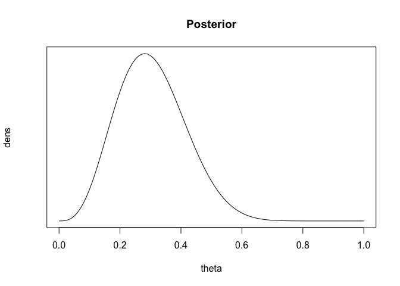
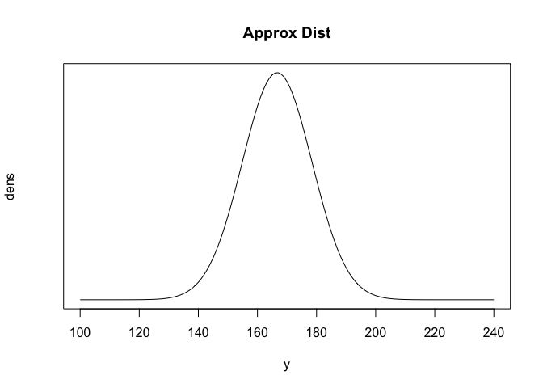
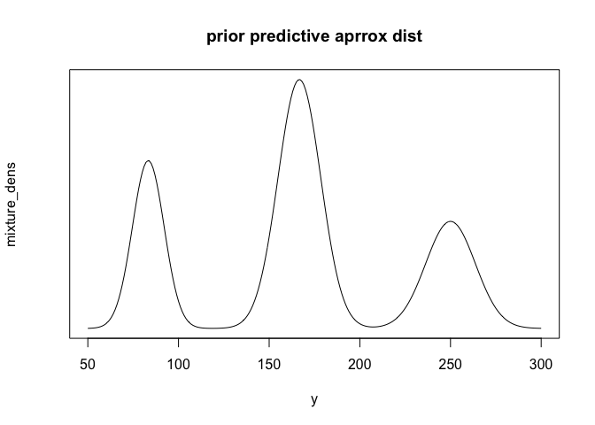
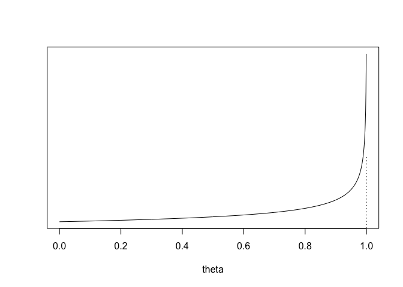
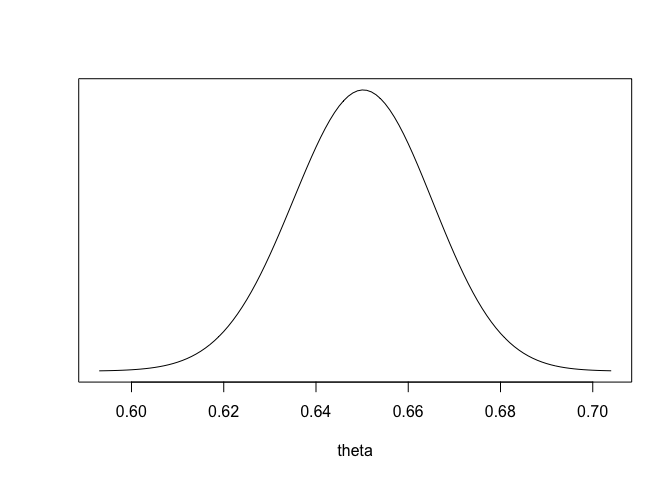

# Bayesian Statistics HW2

## 2-1.

동전의 앞면이 나올 확률 $\theta$에 대한 Prior distribution이 $Beta(4,4)$를 따르며, 동전을 10번 던졌을 때 동전의 앞면이 3번 미만으로 나오는 사건에 대하여 prior와 likelihood를 정리하면 다음과 같다.

$p(\theta) \sim \theta^3(1-\theta)^3,\ Beta(\alpha, \beta) \propto \theta^{\alpha-1}(1-\theta)^{\beta-1} $

$f(y|\theta) = \dbinom{10}{0}(1-\theta)^{10}+\dbinom{10}{1}\theta(1-\theta)^{9}+\dbinom{10}{2}\theta^2(1-\theta)^8 = (1-\theta)^{10}+10\theta(1-\theta)^{9}+45\theta^2(1-\theta)^{8}$.

Posterior Density는 prior와 likelihood의 곱에 비례하므로, 아래와 같이 표현할 수 있다.

$p(\theta|y) \propto \theta^3(1-\theta)^{13}+10\theta^4(1-\theta)^{12}+45\theta^5(1-\theta)^{11}$


Posterior density의 sketch는 아래와 같다.


```r
theta <- seq(0,1,.01)
dens <- theta^3*(1-theta)^13 + 10*theta^4*(1-theta)^12 +
45*theta^5*(1-theta)^11
plot (dens~theta, main='Posterior', type="l", xlab="theta", yaxt="n",  cex=2)
```

<!-- -->


## 2-2.

동전의 앞면이 나올 확률을 $\pi$라 하고, 동전이 앞면이 나올 때 까지 추가로 던진 횟수를 N이라고 할 시 , 이에 대한 기댓값은 다음과 같다.

$E[N|\pi] = 1\cdot\pi+2\cdot(1-\pi)\pi+3\cdot(1-\pi)^2\pi+ \cdots = 1/\pi$


첫 두번 째 toss가 tail이 나온 후 동전 $C_1$와 $C_2$ 중 랜덤하게 동전을 선택하는 확률은 베이즈정리에 따라 아래와 같이 표현 할 수 있다.

$P(C=C_1|TT) = \frac{P(C=C_1)P(TT|C=C_1)}{P(C=C_1)P(TT|C=C_1)+P(C=C_2)P(TT|C=C_2)}= \frac{0.5(0.4^2)}{0.5(0.4^2)+0.5(0.6^2)}=\frac{16}{52}$.


이후 동전이 앞면이 나올 때 까지의 시행횟수 N에 대한 posterior expectation은 다음과 같다.

$E(N|TT) = E[E(N|TT,C)|TT] = P(C=C_1|TT)E(N|C=C_1,TT)+P(C=C_2|TT)E(N|C=C_2,TT)$

$=\frac{16}{52}\frac{1}{0.6}+\frac{36}{52}\frac{1}{0.4}=2.24$.


## 2-3.

$E[y] = 1000\cdot\frac{1}{6} = 166.7,\ sd[y] = \sqrt{1000\cdot\frac{1}{6}\frac{5}{6}}=11.8.$

```r
y <- seq(100,240,1)
dens <- dnorm(y,1000*(1/6),sqrt(1000*(1/6)*(5/6)))
plot(dens~y, main="Approx Dist", type='l',xlab='y',yaxt='n',cex=2)
```

<!-- -->


5%,25%,50%,75%,95% points는 차례대로 다음과 같다.

$5\%\ point = 166.7 - 1.65(11.8) = 147.2$

$25\%\ point = 166.7 - 0.67(11.8) = 158.8$

$50\%\ point = 166.7$

$75\%\ point = 166.7 + 0.67(11.8) = 174.6$

$95\%\ point = 166.7 + 1.65(11.8) = 186.1$

rounding하면 차례대로 각 point들은 147, 150, 167, 175, 186이다.


## 2-4.


### 2-4a.
$E(y|\theta=\frac{1}{12}) = 83.3, sd(y|\theta=\frac{1}{12}) = 8.7$,

$E(y|\theta=\frac{1}{6}) = 166.7, sd(y|\theta=\frac{1}{6}) = 11.8$,

$E(y|\theta=\frac{1}{4}) = 250, sd(y|\theta=\frac{1}{4}) = 13.7$.


```r
y <- seq(50,300,1)
dens <- function(x,theta){
dnorm(x,1000*theta, sqrt(1000*theta*(1-theta)))  
}
mixture_dens <- 0.25*dens(y,1/12)+0.5*dens(y,1/6)+0.25*dens(y,1/4)
plot(mixture_dens~y,main="prior predictive aprrox dist", yaxt='n',type='l',cex=2)
```

<!-- -->


### 2-4b.

위에서 그려진 data y의 분포는 정규분포를 따르지 않지만, 근사적으로 정규분포 3개가 서로 overlap 되어있는 모습으로 볼 수 있다. 고로 전체 데이터의 5%에 해당하는 point는 y전체 데이터의 25%를 차지하고 있는 첫번째 정규분포에서 20%에 해당하는 부분으로 생각할 수 있다. 

이러한 방법으로 데이터의 25%에 해당하는 포인트는 첫번 째 봉우리와 두번째 봉우리의 사이로 볼 수 있으며, 50% 포인트는 데이터의 정중앙, 75% 포인트는 두번 째 봉우리와 세번 째 봉우리의 사이, 95% 포인트는 세번째 봉우리의 80%에 해당하는 포인트와 대응된다. 

고로 각 point들은 아래와 같다.

$5\%\ point = 83.3-(0.84)8.7 = 75.9$

$25\%\ point \sim 120\ (from\ the\ graph)$

$50\%\ point = 166.7$

$75\%\ point = 205\sim210$

$95\%\ point = 250+(0.84)13.7 = 262$.


## 2-5.

### 2-5a.

$P(y=k) =\int_0^1P(y=k|\theta)d\theta$

$=\int_0^1\dbinom{n}{k}\theta^k(1-\theta)^{n-k}d\theta$

$=\dbinom{n}{k}\frac{\Gamma(k+1)\Gamma(n-k+1)}{\Gamma(n+2)} = \frac{1}{n+1}$.

### 2-5b.

$\theta$의 posterior mean $\frac{\alpha+y}{\alpha+\beta+n}$이 $\frac{\alpha}{\alpha+\beta}$와 $\frac{y}{n}$ 사이에 있다는 것을 보이기 위해서는, $\frac{\alpha+y}{\alpha+\beta+n} = \lambda\frac{\alpha}{\alpha+\beta}+(1-\lambda)\frac{y}{n},\ \lambda \in (0,1)$임을 보이면 된다.

이를 $\lambda$에 관한 식으로 풀면, 

$\frac{\alpha+y}{\alpha+\beta+n} = \frac{y}{n}+\lambda(\frac{\alpha}{\alpha+\beta}-\frac{y}{n})$,


$\frac{n\alpha-\alpha{y}-\beta{y}}{(\alpha+\beta+n)n}=\lambda(\frac{n\alpha-\alpha{y}-\beta{y}}{(\alpha+\beta)n})$.

$\lambda= \frac{\alpha+\beta}{\alpha+\beta+n}$가 되며, 이는 늘 0과 1 사이에 존재한다.

고로 posterior mean은 prior mean과 data의 가중평균이 된다.

### 2-5c.

Uniform prior distribution은 $Beta(1,1)$이며, 고로 prior variance는 $\frac{\alpha\beta}{(\alpha+\beta)^2(\alpha+\beta+1)} = \frac{1}{12}$이다.

Posterior variance는 다음과 같다.

$\frac{(1+y)(1+n-y)}{(2+n)^2(3+n)}=(\frac{1+y}{2+n})(\frac{1+n-y}{2+n})(\frac{1}{3+n})$.

앞의 두 factor들은 두개의 합이 1이 되는 값들이며, 이들의 곱은 $\frac{1}{4}$ 근처에서 머무를 것이다.

세번째 factor는 n이 1보다 크거나 같다면, $\frac{1}{3}$보다 작다. 고로 Posterior variance는 prior variance보다 작은 값을 갖는다.

### 2-5d.

사전분포가 베타분포를 따를 때, 사후분포의 분산이 사전분포의 분산보다 작은 것을 보이는 경우의 수는 무수히 많다. 일례로 n이 매우 커진다면, 사후분포는 명백히 사전분포의 분산보다 작은 값을 가지게 된다. 만약 n과 y가 모두 1인 경우를 생각해보자. 이 때 사전분포가 $Beta(1,4)$를 따른다면, 사후분포의 분산은 0.055이며, 사전분포의 분산은 0.026을 갖는다.


## 2-7

### 2-7a.

이항분포는 exponential family에 속하며, natural parameter에 대한 부분은 다음과 같이 표현할 수 있다.

$\phi(\theta) = log(\frac{\theta}{1-\theta})$.

Uniform prior density인 $\phi(\theta), p(\theta) \propto 1 $는 $\theta = e^{\phi}/(1+e^{\phi})$로 표현이 가능하다.

고로,

$$q(\theta) = p(\frac{e^{\phi}}{1+e^{\phi}})|\frac{d}{d\theta}log(\frac{\theta}{1-\theta})| \propto \theta^{-1}(1-\theta)^{-1}$$.

### 2-7b.

만약 y가 0 이라면, $p(\theta|y) \propto \theta^{-1}(1-\theta)^{n-1}$는 $\theta=0$ 주변에서 무한히 적분되어 계산이 불가능하며, y가 n인 경우에는 $\theta=1$ 주변에서 위와 같다.

## 2-8

### 2-8a

$$\theta|y \sim N(\frac{\frac{1}{40^2}180+\frac{n}{20^2}150}{\frac{1}{40^2}+\frac{n}{20^2}},\frac{1}{\frac{1}{40^2}+\frac{n}{20^2}})$$

### 2-8b

$$\tilde{y} |y \sim N(\frac{\frac{1}{40^2}180+\frac{n}{20^2}150}{\frac{1}{40^2}+\frac{n}{20^2}},\frac{1}{\frac{1}{40^2}+\frac{n}{20^2}}+20^2)$$

### 2-8c

95% posterior interval for $\theta|y=150,\ n=10:\ 150.7 \pm 1.96(6.25) = [138,163]$

95% posterior interval for $\tilde{y}|y=150,\ n=10:\ 150.7 \pm 1.96(20.95) = [110,192]$


### 2-8d

95% posterior interval for $\theta|y=150,\ n=100:[146,154]$

95% posterior interval for $\tilde{y}|y=150,\ n=100:[111,189]$


## 2-9

### 2-9a.

$\alpha + \beta = \frac{E(\theta)(1-E(\theta))}{var(\theta)}-1 = 1.67$

$\alpha = (\alpha+\beta)E(\theta) = 1$

$\beta= (\alpha+\beta)(1-E(\theta))=0.67$


```r
theta <- seq(0,1,.001)
dens <- dbeta(theta,1,.67)
plot (theta, dens,
type="l", xlab="theta", ylab="", yaxt="n", cex=2)
lines (c(1,1),c(0,3),col=0)
lines (c(1,1),c(0,3),lty=3)
```

<!-- -->

### 2-9b

$n=1000,\ y=650$이면, $p(\theta|y)=Beta(\alpha+650,\beta+350)=Beta(651,350,67)$이다.


```r
theta <- seq(0,1,.001)
dens <- dbeta(theta,651,350.67)
cond <- dens/max(dens) > 0.001
plot (theta[cond], dens[cond],
type="l", xlab="theta", ylab="", yaxt="n", cex=2)
```

<!-- -->


