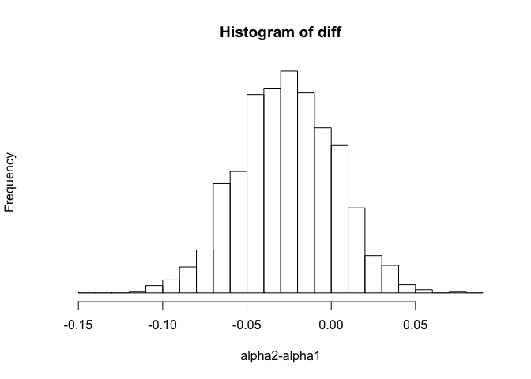
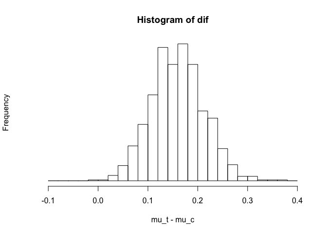
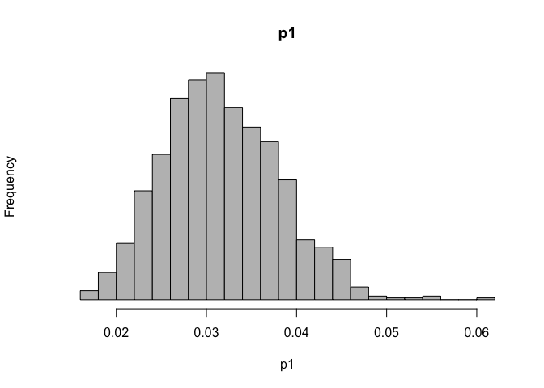
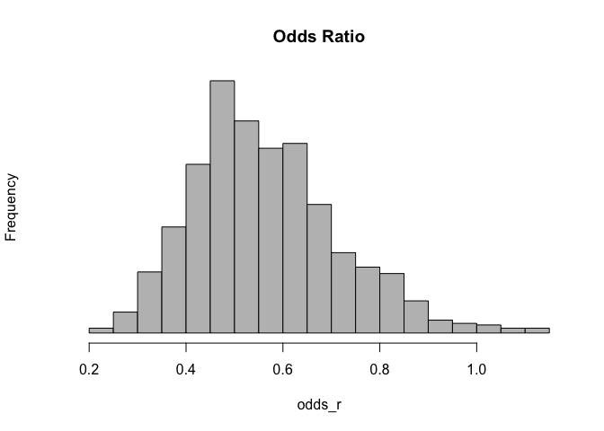
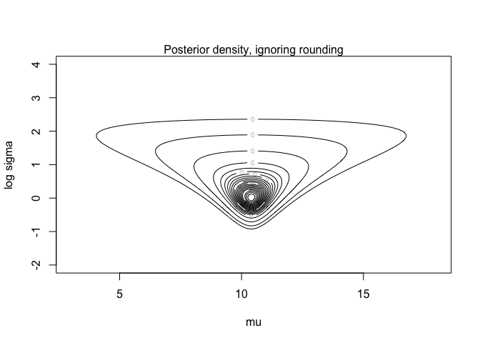
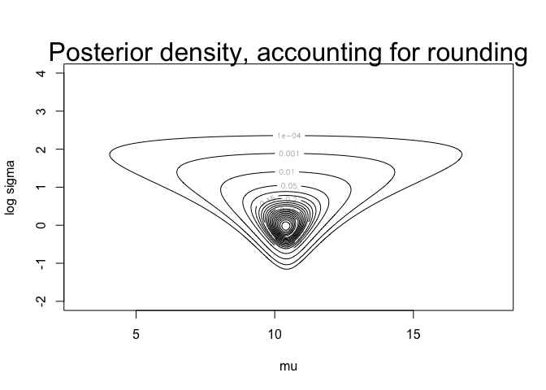

 
 
# Bayes Statistics HW3

## 1

### 1-(a) Write the marginal posterior distribution for $\alpha$

Lets denote $p(\theta)$ as $Dirichlet(a_1,..,a_n)$.

Then posterior distribution is $p(\theta|y) = Dirichlet(y_1+a_1,..,y_n+a_n$.

By the properties of Dirichlet, marginal posterior dist of ($\theta_1,\theta_2,1-\theta_1-\theta_2$) is also Dirichlet : $p(\theta_1,\theta_2|y) \propto \theta_1^{y_1+a_1-1}\theta_2^{y_2+a_2-1}(1-\theta_1-\theta_2)^{y_{rest}+a_{rest}-1}$, where $y_{rest}=y_3+..y_J$, $a_{rest}=a_3+..a_J$.

do a variable transformation to $(\alpha,\beta)=(\frac{\theta_1}{\theta_1+\theta_2},\theta_1+\theta_2)$.

Jacobian is $|1/\beta|$, 

$$p(\alpha,\beta|y) \propto \beta(\alpha\beta)^{y_1+a_1-1}((1-\alpha)\beta)^{y_2+a_2-1}(1-\beta)^{y_{rest}+a_{rest}-1}$$

$$= \alpha^{y_1+a_1-1}(1-\alpha)^{y_2+a_2-1}\beta_{y_1+y_2+a_1+a_2-1}(1-\beta)^{y_{rest}+a_{rest}-1}$$

$$\propto Beta(\alpha|y_1+a_1,y_2+a_2)Beta(\beta|y_1+y_2+a_1+a_2,y+{rest}+a_{rest})$$
Posterior density is separated by two factors for $\alpha$ and $\beta$, they are independent, 

therefore $\alpha|y \sim Beta(y_1+a_2,y_2+a_2)$.


### (1-b) show that this distribution is identical to the posterior distribution for $\alpha$ obtained by treating $y_1$ as an observation from the binomial distribution with probability $\alpha$ and sample size $y_1+y_2$, ignoring the data $y_3,...,j_J.$

 The $Beta(y_1+a_1,y_2+a_2)$ posterior distribution also be derived from a $Beta(a_1,a_2)$ prior dist and a binomial observation $y_1$ with sample size $y_1+y_2$.
 

## 2

Assume independent uniform prior distributions on the multinomial parameters. 

Then the posteriors are independent multinomial :

$$(\pi_1,\pi_2,\pi_3)|y \sim Dirichlet(295,308,39)$$
$$(\pi_1^*,\pi_2^*,\pi_3^*)|y \sim Dirichlet(289,333,20)$$,

and $\alpha_1=\frac{\pi_1}{\pi_1+\pi_2},\alpha_2=\frac{\pi_1^*}{\pi_1^*+\pi_2^*}$. From the properties of Dirichlet distribution, 

$\alpha_1|y \sim Beta(295,308)$
$\alpha_2|y \sim Beta(289,333)$.


```r
set.seed(2020311194)
alpha.1 <- rbeta(2000,295,308)
alpha.2 <- rbeta(2000,289,333)
diff <- alpha.2- alpha.1
hist(diff,xlab="alpha2-alpha1",yaxt="n", breaks = seq(-.15,.09,.01),cex=2)
```

<!-- -->

```r
print (mean(diff>0))
```

```
## [1] 0.191
```

This is histogram of 2000 draws from posterior. Based on histogram, posterior probability that there was a shift toward Bush is 19.4%.

If we use normal approximations for the dist of $\alpha_1$ and  $\alpha_2$ with means and st.d computed from relevant beta dist, can get the same answer.

## 3

### 3-(a)

Data dist is $p(y|\mu_c,\mu_t,\sigma_c,\sigma_t)= \prod_{i=1}^32N(y_{ci}|\mu_c,\sigma_c^2)\prod_{i=1}^{36}N(y_{ti}|\mu_t,\sigma_t^2)$.

$(\mu_c,\sigma_c)$ are independent of $(\mu_t,\sigma_t)$ in the posterior.


So in this model, we can analyze two separately. 

The marginal posterior for $\mu_c$ and $\mu_t$ are :

$$\mu_c|y \sim t_{31}(1.013,0.24^2/32)$$

$$\mu_t|y \sim t_{35}(1.173,0.20^2/36)$$.

### 3-(b)


```r
mu.c <- 1.013 + (0.24/sqrt(32))*rt(1000,31)
mu.t <- 1.173 + (0.20/sqrt(36))*rt(1000,35)
dif <- mu.t - mu.c
hist (dif, xlab="mu_t - mu_c", yaxt="n",
breaks=seq(-.1,.4,.02), cex=2)
```

<!-- -->

```r
print (sort(dif)[c(25,976)])
```

```
## [1] 0.05868759 0.26396430
```


Based on histogram, 95% posterior interval for average treatment effect is [0.05,0.27]

## 4

### 4-(a),(b)
Set Uniform prior for our model's prior. In binomial model, Uniform can be noninformative prior.

Let Uniform prior($Beta(1/2,1/2)$) as our prior. 

Then $p(p_0) \propto 1,\ p(p_1) \propto 1$, 

$p(p_0,p_1|n_i,y_i) \propto p(p_0,p_1)\prod_{i=1}^2f(y_i|p_0,p_1)$

$\propto p_0^{39}(1-p_0)^{674}p_1^{22}(1-p_1)^{680}$.


Two experiments are independent, they can dealt seperately.

$p(p_0) \sim Beta(40,675)$

$p(p_1) \sim Beta(23,681)$

```r
set.seed(2020311194)
p0 <- rbeta(1000,40,675)
p1 <- rbeta(1000,22,680)

hist(p0, breaks=20, col='grey', yaxt='n',main="p0")
```

<!-- -->

```r
hist(p1, breaks=20, col='grey', yaxt='n',main="p1")
```

<!-- -->

```r
odds_r <- (p1/(1-p1))/(p0/(1-p0))

hist(odds_r,breaks=30,col='grey',yaxt='n',main='Odds Ratio')
```

<!-- -->


### 4-(c)


```r
#Compare Jeffrey and Uniform prior
set.seed(2020311194)
p0 <- rbeta(1000,39.5,674.5)
p1 <- rbeta(1000,21.5,679.5)

odds_r1 <- (p1/(1-p1))/(p0/(1-p0))
mean(odds_r) ; mean(odds_r1)
```

```
## [1] 0.564724
```

```
## [1] 0.559396
```

```r
var(odds_r) ; var(odds_r1)
```

```
## [1] 0.02306329
```

```
## [1] 0.0235932
```

```r
quantile(odds_r,c(0.25,0.5,0.75,0.99)) ; quantile(odds_r1,c(0.25,0.5,0.75,0.99))
```

```
##       25%       50%       75%       99% 
## 0.4557233 0.5458081 0.6511201 1.0087703
```

```
##       25%       50%       75%       99% 
## 0.4500328 0.5366413 0.6471813 1.0028043
```

Comparing with Jeffrey's prior and my choice, difference is small.


## 5

### 5-(a)

$p(\sigma^2|y) \sim Inv-\chi^2(n-1,s^2),\ p(\mu|\sigma^2,y) \sim N(\bar{y},\sigma^2/n)$ with n=5, $\bar{y}$=10.4, $s^2$ = 1.3.

### 5-(b)

$$p(\mu,\sigma^2|y) \propto \frac{1}{\sigma^2}\prod_{i=1}^n(\Phi(\frac{y_i+0.5-\mu}{\sigma})-\Phi(\frac{y_i-0.5-\mu}{\sigma}))$$

### 5-(c)


```r
post.a <- function(mu,sd,y){
ldens <- 0
for (i in 1:length(y)) ldens <- ldens +
log(dnorm(y[i],mu,sd))
ldens}
post.b <- function(mu,sd,y){
ldens <- 0
for (i in 1:length(y)) ldens <- ldens +
log(pnorm(y[i]+0.5,mu,sd) - pnorm(y[i]-0.5,mu,sd))
ldens}
summ <- function(x){c(mean(x),sqrt(var(x)),
quantile(x, c(.025,.25,.5,.75,.975)))}
nsim <- 2000
y <- c(10,10,12,11,9)
n <- length(y)
ybar <- mean(y)
s2 <- sum((y-mean(y))^2)/(n-1)
mugrid <- seq(3,18,length=200)
logsdgrid <- seq(-2,4,length=200)
contours <- c(.0001,.001,.01,seq(.05,.95,.05))
logdens <- outer (mugrid, exp(logsdgrid), post.a, y)
dens <- exp(logdens - max(logdens))
contour (mugrid, logsdgrid, dens, levels=contours,
xlab="mu", ylab="log sigma", label=0, cex=2)
mtext ("Posterior density, ignoring rounding", 3)
```

<!-- -->

```r
sd <- sqrt((n-1)*s2/rchisq(nsim,4))
mu <- rnorm(nsim,ybar,sd/sqrt(n))
print (rbind (summ(mu),summ(sd)))
```

```
##                               2.5%        25%       50%       75%     97.5%
## [1,] 10.384610 0.8058220 9.0456124 10.0022985 10.384453 10.770302 11.779308
## [2,]  1.439714 0.8063883 0.6947574  0.9888535  1.239987  1.640318  3.426055
```

```r
logdens <- outer (mugrid, exp(logsdgrid), post.b, y)
dens <- exp(logdens - max(logdens))
contour (mugrid, logsdgrid, dens, levels=contours,
xlab="mu", ylab="log sigma", labex=0, cex=2)
```

```
## Warning in plot.window(xlim, ylim, ...): "labex" is not a graphical parameter
```

```
## Warning in title(...): "labex" is not a graphical parameter
```

```
## Warning in axis(side = side, at = at, labels = labels, ...): "labex" is not a
## graphical parameter

## Warning in axis(side = side, at = at, labels = labels, ...): "labex" is not a
## graphical parameter
```

```
## Warning in box(...): "labex" is not a graphical parameter
```

```r
mtext ("Posterior density, accounting for rounding",
cex=2, 3)
```

<!-- -->

```r
dens.mu <- apply(dens,1,sum)
muindex <- sample (1:length(mugrid), nsim, replace=T,
prob=dens.mu)
mu <- mugrid[muindex]
sd <- rep (NA,nsim)
for (i in (1:nsim)) sd[i] <- exp (sample
(logsdgrid, 1, prob=dens[muindex[i],]))
print (rbind (summ(mu),summ(sd)))
```

```
##                             2.5%        25%       50%       75%     97.5%
## [1,] 10.3702 0.6956568 8.8793970 10.0100503 10.386935 10.763819 11.668342
## [2,]  1.3473 0.7143081 0.5929691  0.9043828  1.186318  1.556144  3.208582
```

### 5-(d)


```r
z <- matrix (NA, nsim, length(y))
for (i in 1:length(y)){
lower <- pnorm (y[i]-.5, mu, sd)
upper <- pnorm (y[i]+.5, mu, sd)
z[,i] <- qnorm (lower + runif(nsim)*(upper-lower), mu, sd)}
mean ((z[,1]-z[,2])^2)
```

```
## [1] 0.1582345
```


## 7

Poisson's parameter is relative with frequency of some event. We are given that total number of bicycles and others is $b+v$. The likelihood we are trying to find is $p(b|b+v)$.

Using Bayes' Rule, we can derive likelihood.

$$p(b|b+v) = \frac{p(b+v|b)p(b)}{p(b+v)}$$
$$=\frac{p(v)p(b)}{p(b+v)}$$

$$=\frac{Pois(\theta_v)Pois(\theta_v)}{Pois(\theta_b+\theta_v)}$$

Sum of Pois dist is also Pois dist, then we can get that denominator.

$$p(b|b+v) = \frac{\frac{e^{-\theta_v}\theta_v^v}{v!}\frac{e^{-\theta_b}\theta_b^b}{b!}}{\frac{e^{-(\theta_b+\theta_v)(\theta_b+\theta_v)^{b+v}}}{(b+v)!}}$$
$$=\frac{(b+v)!}{b!v!}(\frac{\theta_b}{\theta_b+\theta_v})^b(\frac{\theta_v}{\theta_b+\theta_v})^v$$
$$=\frac{(b+v)!}{b!v!}(\frac{\theta_b}{\theta_b+\theta_v})^b(1-\frac{\theta_b}{\theta_b+\theta_v})^v$$

This is a binomial distribution with $b+v$ trials and prop $\frac{\theta_b}{\theta_b+\theta_v}$.


## 9

$$p(\mu,\sigma^2|y) \propto p(y|\mu,\sigma^2)p(\mu,\sigma^2)$$


$$ \propto \sigma^{-1}(\sigma^2)^{-((\nu_0+n)/2+1)}exp(-\frac{\nu_0\sigma^2_0+(n-1)s^2+\frac{n\kappa_0(\bar{y}-\mu_0)^2}{n_\kappa{_0}}+(n+\kappa_0)(\mu-\frac{\mu_0\kappa_0+n\bar{y}}{n+\kappa_0})^2}{2\sigma^2}) $$.

So, $\mu,\sigma^2|y \sim N-Inv-\chi^2(\frac{\mu_0\kappa_0+n\bar{y}}{n+\kappa_0},\frac{\sigma^2_n}{n+\kappa_0};n+\nu_0,\sigma^2_n),\ where\ \sigma^2_n =\frac{\nu_0\sigma^2_0+(n-1)s^2+\frac{n\kappa_0(\bar{y}-\mu_0)^2}{n+\kappa_0}}{n+\nu_0}$.


## 10 

$p(\sigma^2_j|y) \propto (\sigma^2_j)^{-n/2-1/2}exp(-(n-1)s^2/2\sigma^2_j)$ for each j.

Thus $p(1/\sigma^2_j|y) \propto (1/\sigma^2_j)^{n/2-3/2}exp(-(n-1)s^2/2\sigma^2_j)$, 

which implies that $(n-1)s^2/\sigma^2_j$ has a $\chi^2_{n-1}$ distribution.

Two independent $\chi^2$ divided by each degree of freedom, it is F distribution.

By this fact, $\frac{s_1^2/\sigma^2_1}{s_2^2/\sigma^2_2}$ has the $F_{n_1-1,n_2-1}$ distribution.


