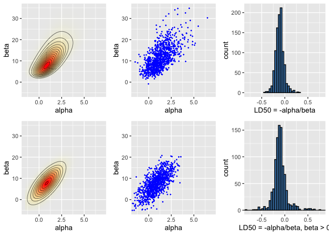

 
 
# Bayes Statistics HW4

## 4-2 


 $p(y_i|\theta) \propto (logit^{-1}(\alpha+\beta x_i))^{y_i}(1-logit^{-1}(\alpha+\beta x_i))^{n_i-y_i}$
 
 $l_i = logp(y_i|\theta) = constant+y_ilog(logit^{-1}(\alpha+\beta x_i))+(n_i-y_i)log(1-logit^{-1}(\alpha+\beta x_i))$ 
 
 $\frac{d^2l_i}{d\alpha^2} = -\frac{n_iexp(\alpha+\beta x_i)}{(1+exp(\alpha+\beta x_i))^2}$
 
 $\frac{d^2l_i}{d\alpha d\beta} = -\frac{n_i x_iexp(\alpha+\beta x_i)}{(1+exp(\alpha+\beta x_i))^2}$
 
 $\frac{d^2l_i}{d\beta^2} = -\frac{n_i x_i^2exp(\alpha+\beta x_i)}{(1+exp(\alpha+\beta x_i))^2}$
 
 The prior density on ($\alpha$,$\beta$) is uniform, so $logp(\theta|y) = constant+\sum_{i=1}^4l_i$, and 
 
 
\begin{equation*}
I(\hat\theta) = 
\begin{pmatrix}
\sum_{i=1}^4\frac{n_iexp(\alpha+\beta x_i)}{(1+exp(\alpha+\beta x_i))^2} & \sum_{i=1}^4\frac{n_i x_iexp(\alpha+\beta x_i)}{(1+exp(\alpha+\beta x_i))^2} \\
\sum_{i=1}^4\frac{n_i x_iexp(\alpha+\beta x_i)}{(1+exp(\alpha+\beta x_i))^2} & \sum_{i=1}^4\frac{n_i x_i^2exp(\alpha+\beta x_i)}{(1+exp(\alpha+\beta x_i))^2}  \\ 
\end{pmatrix}
|(\alpha,\beta)=(\hat\alpha,\hat\beta)
\end{equation*}

where $\hat\theta = (\hat\alpha,\hat\beta)$ is the posterior mode.

Denoteing I as 

\begin{equation*}
\begin{pmatrix}
a & c \\
c & b \\
\end{pmatrix}
\end{equation*}, the normal approximation variances of $\alpha$ and $\beta$ are the diagonal elements of  $I^{-1}:\frac{b}{ab-c^2}$, and $\frac{a}{ab-c^2}$, respectively.


## 4-3.

Let $\theta = LD50$ ; also introduce $\nu=\beta$.  Formula (4.1) suggests that the (asymptotic) posterior median and mode should coincide, and the (asymptotic) posterior standard variance should be the inverse of observed information, evaluated at the
posterior mode.

With some effort , it is possible to obtain decent numerical estimates for the posterior mode and standard deviation associated with this data set; we will take these values as proxies for their asymptotic analogues.

One way to proceed is : Observe that $p(\theta|y) = \int p(\theta,\nu|y)d\nu$, where $\alpha = -\theta\nu$ and $\beta = \nu$, and $|\nu|$ is the Jacobian related with the change in coordinates.

Fixing $\theta$ equal to a value around −0.12, which appears to be near the posterior mode, we may compute $\int p(\alpha,\beta|y)|\nu|d\nu$ numericaally. The region of integration is infinite, but the integrand decays rapidly after $\nu$ passes 50, so that it suffices to estimate the integral assuming that $\nu$ runs from 0 to, say, 70.

This procedure can be repeated fgor several values of $\theta$ near -0.12. The values may be compared directly to find the posterior mode for $\theta$. To three decimal places, we obtain -0.114.

One can fix a small value of $h$, such as $h=0.002$, and compute $d^2/d\theta^2logp(\theta|y)$, evaluated at $\theta$ equal to the posterior mode, bt the expression [$logp(-0.114+h|y)-2logp(-0.114|y)+logp(-0.114-h|y)$]/$h^2$.

## 4-4.

As $n \rightarrow \infty$, the posterior variance approaches zero - that is, the posterior distribution becomes thick near a single point. Any one-to-one continuous transformation on the
real numbers is locally linear in the neighborhood of that point.

## 4-6.

### 4-6a

$$\frac{d}{da}E(L(a|y))=\frac{d}{da}\int(\theta-a)^2p(\theta|y)d\theta = -\int(\theta-a)p(\theta|y)d\theta = -2(E(\theta|y)-a)=0\ if\ a=E(\theta|y)$$.

This calculus shows that $L(a|y)$ has zero derivative at $a=E(\theta|y)$. Also the second derivative is positive so this is minimum value.


### 4-6b

Can apply the argument from 4-6c with $k_o=k_1=1$.

### 4-6c

$$\frac{d}{da}E(L(a|y))=\frac{d}{da}(\int_{-\infty}^a k_1(a-\theta)p(\theta|y)d\theta+\int_{a}^{\infty}k_0(\theta-a)p(\theta|y)d\theta)$$

$$=k_1\int_{-\infty}^ap(\theta|y)d\theta-k_0\int_{a}^{\infty}p(\theta|y)d\theta$$

$$=(k_1+k_0)\int_{-\infty}^ap(\theta|y)d\theta-k_0$$.


This calculus shows that $L(a|y)$ has zero derivative at any a for which $\int_{-\infty}^ap(\theta|y)d\theta=k_0/(k_0+k_1)$. Also second derivative is positive, that is minimizing value.


## 4-7.

Denote posterior mean $m(y)=E(\theta|y)$ and consider $m(y)$ as an estimatior of $\theta$.

Unbiasedness means that $E(m(y)|\theta)=\theta$. The marginal Expectation of $\theta m(y)$ is $E(\theta m(y))=E[E(\theta m(y)|\theta)]=E[\theta^2]$. Also we can write $E(\theta m(y))=E[E(\theta m(y)|y)]=E[m(y)^2]$. It follows that $E[(m(y))-\theta)^2]=0$. This can only hold in degenerate problems for which $m(y)=\theta$ with probability 1.

## 4-9. 

Our goal is to show that the Bayes estimate has lower MSE than the maximum likelihood estimate for any value of $\theta \in [0,1]$ when sigma is sufficiently large.

The maximum likelihood estimate which restricted to the interval [0,1], takes value 0 with probability $\Phi(-c/\sigma)$ and takes value 1 with probability $1-\Phi((1-c)/\sigma)$; these are just the probabilities that y is less than 0 or greater than 1. For very large $\sigma$, these probabilities both approach $\Phi(0) =1/2$. Thus, the MSE of maximum likelihood estimate is approximately $1/2[(1-\theta)^2+\theta^2]=1/2-\theta+\theta^2$.

On the other hand, $p(\theta|y) \propto \ N(\theta|y,\sigma^2)$ for $\theta \in [0,1]$.
$E(\theta|y)\ is \ \int_0^1N(\theta|y,\sigma^2)d\theta/\int_0^1N(\theta|y,\sigma)d\theta$.
For very large $\sigma$, $N(\theta|y,\sigma^2)$ is approximately constant over small ranges of $\theta$. So the Bayes estimate is close to $\int_0^1\theta d\theta = 1/2$. Hence, for large $\sigma$, the MSE of the $E(\theta|y)$ is about $(\theta-1/2)^2=1/4-\theta+\theta^2$.

The difference in MSE is independent of the truv value of $\theta$. Also, for large $\sigma$ the maximum likelihood estimate generally chooses 0 or 1, each with probability almost 1/2, whereas the Bayes estimate chooses 1/2 with probability almost 1.

## 4-11.

For this problems, the prior should be a mixture of a spike at $\theta=0$ and a flat prior for $\theta  \neq 0$. Let's write prior as

$$p(\theta)=\lambda N(\theta|0,\tau_1^2)+(1-\lambda)N(\theta|0,\tau_2^2)$$,

work through the algebra, and then take the limit $\tau_1 \rightarrow 0$ and $\tau_2 \rightarrow \infty$.

$p(\theta|y) \propto p(\theta)N(\bar{y}|\theta,\sigma^2/n)$

$\propto \lambda N(\theta|0,\tau_1^2)N(\bar{y}|\theta,\sigma^2/n)+(1-\lambda)N(\theta|0,\tau_2^2)N(\bar{y}|\theta,\sigma^2/n)$

$\propto \lambda N(\bar{y}|0,\tau_1^2+\sigma^2/n)N(\theta|\frac{\frac{n}{\sigma^2}\bar{y}^2}{\frac{1}{\tau_1^2}+\frac{n}{\sigma^2}},\frac{1}{\frac{1}{\tau_1^2}+\frac{n}{\sigma^2}})$ +
$(1-\lambda)N(\bar{y}|0,\tau_2^2+\sigma^2/n)N(\theta|\frac{\frac{n}{\sigma^2}\bar{y}^2}{\frac{1}{\tau_2^2}+\frac{n}{\sigma^2}},\frac{1}{\frac{1}{\tau_2^2}+\frac{n}{\sigma^2}})$

In last step, we have replaced the factorization $p(\theta)p(y|\theta)$ by the factorization $p(y)p(\theta|y)$. 

The result is a mixture of two mormal densities in $\theta$/. In the limit $\tau_1 \rightarrow 0$ and $\tau_2 \rightarrow \infty$, this is 

$$p(\theta|y) = \lambda N(\bar{y}|0,\sigma^2/n)N(\theta|0,-\tau_1^2)_(1-\lambda) N(\theta|\bar{y},\sigma^2/n)$$.

The estimate $\hat\theta$ cannot be the posterior mean. Since the two normal densities have much different variances, it would also not make sense to use a posterior mode estimate. 

The mode of the hump of the posterior which has greater mass is more reasonable estimate.

That is, 

$$Set\ \hat\theta=0\ if: \lambda N(\bar{y}|0,\sigma^2/n) > (1-\lambda)N(\bar{y}|0,\tau_2^2)$$

$$\lambda\frac{1}{\sqrt{2\pi/n\sigma}}exp(-\frac{1}{2}\frac{n}{\sigma^2}y^2) > (1-\lambda)\frac{1}{\sqrt{2\pi\tau_2}}$$,

and set $\hat\theta=\bar{y}$ o.w.


For condition on above to be equivalent to "if $\bar{y} < 1.96\sigma/\sqrt{n}$", as specified, we must have 

$$0.146\lambda\frac{1}{\sqrt{2\pi/n\sigma}}=(1-\lambda)\frac{1}{\sqrt{2\pi\tau_2}}$$

$$\frac{\lambda}{1-\lambda} = \frac{\sigma}{0.146\sqrt{n/\tau_2}}$$.

Since we consider the limit $\tau_2 \rightarrow \infty$, this means that $\lambda$ goes to 0. That would be acceptable, nbut the more serious problem here is that the limiting value for $\lambda \tau_2$ depends on n, and thus the prior for $\theta$ depends on n. Prior cannot depend on the data, so there is no prior for which the given estimate $\hat\theta $ is a reasonable posterior summary.


## Ex.


```r
library(ggplot2)
library(gridExtra)
library(tidyr)
library(MASS)
df1 <- data.frame(
  x = c(-0.86, -0.30, -0.05, 0.73),
  n = c(5, 5, 5, 5),
  y = c(0, 1, 3, 5)
)
A = seq(-1.5, 7, length.out = 100)
B = seq(-5, 35, length.out = 100)
# make vectors that contain all pairwise combinations of A and B
cA <- rep(A, each = length(B))
cB <- rep(B, length(A))
# a helper function to calculate the log likelihood
logl <- function(df, a, b)
  df['y']*(a + b*df['x']) - df['n']*log1p(exp(a + b*df['x']))
# calculate likelihoods: apply logl function for each observation
# ie. each row of data frame of x, n and y
p <- apply(df1, 1, logl, cA, cB) %>% rowSums() %>% exp()


nsamp <- 1000
samp_indices <- sample(length(p), size = nsamp,
                       replace = T, prob = p/sum(p))
samp_A <- cA[samp_indices[1:nsamp]]
samp_B <- cB[samp_indices[1:nsamp]]
# add random jitter, see BDA3 p. 76
samp_A <- samp_A + runif(nsamp, A[1] - A[2], A[2] - A[1])
samp_B <- samp_B + runif(nsamp, B[1] - B[2], B[2] - B[1])

#Compute LD50 conditional beta >0
bpi <- samp_B > 0
samp_ld50 <- -samp_A[bpi]/samp_B[bpi]

xl <- c(-1.5, 7)
yl <- c(-5, 35)
pos <- ggplot(data = data.frame(cA ,cB, p), aes(x = cA, y = cB)) +
  geom_raster(aes(fill = p, alpha = p), interpolate = T) +
  geom_contour(aes(z = p), colour = 'black', size = 0.2) +
  coord_cartesian(xlim = xl, ylim = yl) +
  labs(x = 'alpha', y = 'beta') +
  scale_fill_gradient(low = 'yellow', high = 'red', guide = F) +
  scale_alpha(range = c(0, 1), guide = F)
sam <- ggplot(data = data.frame(samp_A, samp_B)) +
  geom_point(aes(samp_A, samp_B), color = 'blue', size = 0.3) +
  coord_cartesian(xlim = xl, ylim = yl) +
  labs(x = 'alpha', y = 'beta')
his <- ggplot() +
  geom_histogram(aes(samp_ld50), binwidth = 0.04,
                 fill = 'steelblue', color = 'black') +
  coord_cartesian(xlim = c(-0.8, 0.8)) +
  labs(x = 'LD50 = -alpha/beta')
bioassayfun <- function(w, df) {
  z <- w[1] + w[2]*df$x
  -sum(df$y*(z) - df$n*log1p(exp(z)))
}
w0 <- c(0,0)
optim_res <- optim(w0, bioassayfun, gr = NULL, df1, hessian = T)
w <- optim_res$par
S <- solve(optim_res$hessian)
dmvnorm <- function(x, mu, sig)
  exp(-0.5*(length(x)*log(2*pi) + log(det(sig)) + (x-mu)%*%solve(sig, x-mu)))

p <- apply(cbind(cA, cB), 1, dmvnorm, w, S)

# sample from the multivariate normal 
normsamp <- mvrnorm(nsamp, w, S)
bpi <- normsamp[,2] > 0
normsamp_ld50 <- -normsamp[bpi,1]/normsamp[bpi,2]

pos_norm <- ggplot(data = data.frame(cA ,cB, p), aes(x = cA, y = cB)) +
  geom_raster(aes(fill = p, alpha = p), interpolate = T) +
  geom_contour(aes(z = p), colour = 'black', size = 0.2) +
  coord_cartesian(xlim = xl, ylim = yl) +
  labs(x = 'alpha', y = 'beta') +
  scale_fill_gradient(low = 'yellow', high = 'red', guide = F) +
  scale_alpha(range = c(0, 1), guide = F)

sam_norm <- ggplot(data = data.frame(samp_A=normsamp[,1], samp_B=normsamp[,2])) +
  geom_point(aes(samp_A, samp_B), color = 'blue', size = 0.3) +
  coord_cartesian(xlim = xl, ylim = yl) +
  labs(x = 'alpha', y = 'beta')

his_norm <- ggplot() +
  geom_histogram(aes(normsamp_ld50), binwidth = 0.04,
                 fill = 'steelblue', color = 'black') +
  coord_cartesian(xlim = c(-0.8, 0.8)) +
  labs(x = 'LD50 = -alpha/beta, beta > 0')

grid.arrange(pos, sam, his, pos_norm, sam_norm, his_norm, ncol = 3)
```

<!-- -->


