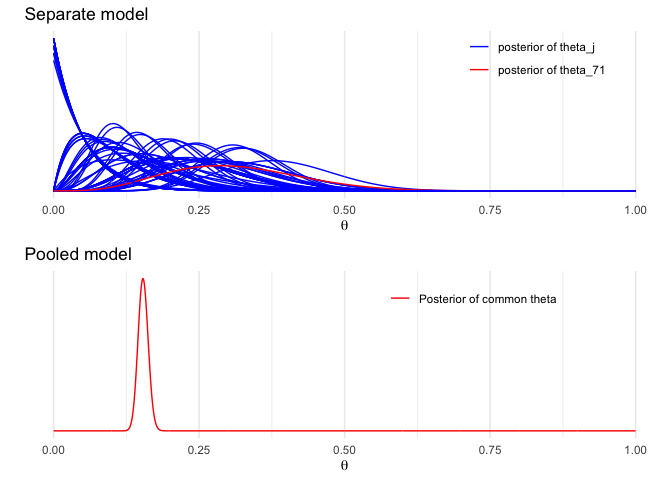
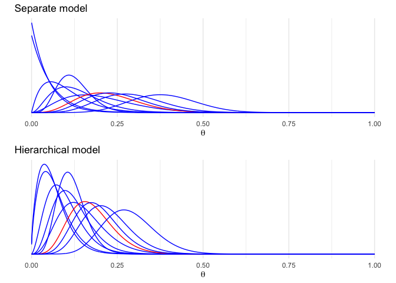

 
 
# Bayes Statistics HW5


## 5-4.

### 5-4a

Yes. The joint distribution is 

$$p(\theta_1,..,\theta_{2J}) = {2J \choose J}(\prod_{j=1}^JN(\theta_{p(j)}|1,1)N(\theta_{p(j)}|-1,1))$$,

where the sum is over all permutations p of (1,...,2J). The density above is obviously invariant permutations of the indexex (1,...,2J).


### 5-4b

The covariance of $\theta_i, \theta_j$ is negative. If $\theta_i$ is large, then it probably comes from the N(1,1) distribution, which means that it is more likely than not that $\theta_j$ from the N(-1,1) distribution, which means that $\theta_j$ will probably be negative. Conversely, if $\theta_i$ is negative, $\theta_j$ is most likely positive.

Then, $(\theta_1,..,\theta_{2J})$ can't be written as a mixture form.

### 5-4c

As $J \rightarrow \infty$, the negative $Cor(\theta_i,\theta_j)$ approaches zero, and the joint distribution approaches iid. To put it another way, the distinction disappears between independently assigning each $\theta_j$ to one of two groups, and picking exactly half of the $\theta_j$'s each group.

## 5-5

Let $\mu(\phi) =E(\theta_j|\phi)$.

$$cov(\theta_i,\theta_j) = E(cov(\theta_i,\theta_j|\phi))+cov(E(\theta_i|\phi),E(\theta_j|\phi))$$

$$0+cov(\mu(\phi)),\mu(\phi))$$

$$=var(\mu(\phi)) \geq 0.$$


## 5-7

### 5-7(a)

From formula (2.7), $E(y) = E(E(y|\theta)) = \theta = \alpha/\beta$. Because $y|\theta \sim Pois(\theta), E(y|\theta) = \theta$. 

From formula (2.8), 

$$var(y)=E(var(y|\theta))+var(E(y|\theta))=E(\theta)+var(\theta)=\alpha/\beta+\alpha/\beta^2 = \alpha/\beta^2(\beta+1),\ var(y|\theta)=\theta$$.


### 5-7(b)

To solve this problems, $n,s, \bar{y}$ are essentially treated like constants.

From (2.7) and (3.3),

$$E(\sqrt{n}(\mu-\bar{y})/s|y)=E(E(\sqrt{n}(\mu-\bar{y})/s|\sigma,y)|y) =E((\sqrt{n}/s)E(\mu-\bar{y}|\sigma,y|y)=E((\sqrt{n}/s\cdot0|y) =E(0|y)=0.$$

We must have $n > 1$ for $s$ to be defined, but in order for the expectation to exist, we must have $n >2$. 

We can compute from (2.8), (3.3), and (3.5) that

$$var(\sqrt{n}(\mu-\bar{y}/s|y)=var(E(\sqrt{n}(\mu-\bar{y}/s|\sigma,y|y)+E(var(\sqrt{n}(\mu-\bar{y})/s|\sigma,y)|y)$$

$$=var(0|y)+E((n/s^2)var(\mu|\sigma,y)|y)$$

$$E((n/s^2)\sigma^2/n|y)$$

$$E(\sigma^2|y)/s^2 =\frac{n-1}{n-3}$$.

For this to work, we need  $n > 3$.

## 5-8

Let $p_m(\theta|y)$ denote the posterior density of $\theta$ corresponding to the prior density $p_m(\theta)$.If $p(\theta) = \sum_n\lambda_mp_m(\theta),$ the posterior density of $\theta$ is proportional to $\sum_m\lambda_mp_m(\theta)p(y|\theta)=\sum_m\lambda_mp_m(y)p_m(\theta|y):$ mixture of the posterior densities $p_m(\theta|y)$ with weights proportional to $\lambda_mp_m(y)$.

Since each $p_m(\theta)$ is conjugate for the model for y given $\theta$, the preceding computation demonstrates that the class of finite mixture prior densities is also conjugate.

Consider an example : $p_1(\theta) \sim N(1,0.5^2), p_2(\theta) \sim N(-1,0.5^2)$, and suppose $\lambda_1=0.9, \lambda_2=0.1$. We know that $p_1(\theta|y) \sim N(1.5/14,1/14)$ and $p_2(\theta|y) \sim N(-6.5/14,1/14)$. We also know $p(\theta|y)$ will be a weighted sum of these conditional posterior densities with weights $\lambda_mp_m(y)/\sum_k\lambda_kp_k(y)$ for $m=1,2$.


$p_1(y) = N(-0.25|1,0.5^2+1/10)=0.072$, and $p_2(y) = N(-0.25|-1,0.5^2+1/10)=0.302$.

So the weights for $p_1(\theta|y)$ and $p_2(y)$ are not 0.9 and 0.1 but are, $\frac{0.9\cdot0.072}{0.9\cdot0.072+0.1\cdot0.302}=0.68$ and $\frac{0.1\cdot0.302}{0.9\cdot0.072+0.1\cdot0.302}=0.32$.


```r
theta <- seq(-3,3,.01)
prior <- c (0.9, 0.1)
dens <- prior[1]*dnorm(theta,1,0.5) +
prior[2]*dnorm(theta,-1,0.5)
plot (theta, dens, ylim=c(0,1.1*max(dens)),
type="l", xlab="theta", ylab="", xaxs="i",
yaxs="i", yaxt="n", bty="n", cex=2)
mtext ("prior density", cex=2, 3)
```

<!-- -->

```r
marg <- dnorm(-.25,c(1,-1),sqrt(c(0.5,0.5)^2+1/10))
posterior <- prior*marg/sum(prior*marg)
dens <- posterior[1]*dnorm(theta,1.5/14,sqrt(1/14)) +
posterior[2]*dnorm(theta,-6.5/14,sqrt(1/14))
plot (theta, dens, ylim=c(0,1.1*max(dens)),
type="l", xlab="theta", ylab="", xaxs="i",
yaxs="i", yaxt="n", bty="n", cex=2)
mtext ("posterior density", cex=2, 3)
```

<!-- -->


## 5-9

### 5-9a

Consider the limit $(\alpha+\beta) \rightarrow \infty$ with $\alpha/\beta$ fixed at any nonzero value. The likelihood is 

$$p(y|\alpha,\beta) \propto \prod_{j=1}^J\frac{[\alpha\cdots(\alpha+y_i-1)][\beta\cdot n_j-y_j-1)]}{(\alpha+\beta)\cdots(\alpha+\beta+n_j-1)}$$

$$\approx \prod_{j=1}^J\frac{\alpha^{y_j}\beta^{n_j-y_j}}{(\alpha+\beta)^n_j}$$

$$=\prod_{j=1}^J(\frac{\alpha}{\alpha+\beta})^y_j(\frac{\beta}{\alpha+\beta})^{n_j-y_j}$$,

which is constants, so the pior density determindes whether the posterior density has a finite integral in this limit. A uniform prior density on $log(\alpha+\beta)$ has an infinite integral in this limit, and so the posterior density does also in this case.

### 5-9b

$$\begin{equation*}
\begin{vmatrix}
\frac{\beta}{(\alpha+\beta)^2} & -\frac{\alpha}{(\alpha+\beta)^2} \\
-\frac{1}{2}(\alpha+\beta)^{-3/2} & -\frac{1}{2}(\alpha+\beta)^{-3/2} \\
\end{vmatrix}
\end{equation*} = constant \cdot (\alpha+\beta)^{-5/2}$$


## 5-12

Applying formula (2.7) and (2.8),

$$E(\theta_j|\tau,y) = E[E(\theta_j|\mu,\tau,y)|\tau,y] = E[\frac{\frac{1}{\sigma_j^2}y_j+\frac{1}{\tau^2}\mu}{\frac{1}{\sigma_j^2}+\frac{1}{\tau^2}}|\tau,y]=\frac{\frac{1}{\sigma_j^2}y_j+\frac{1}{\tau^2}\hat\mu}{\frac{1}{\sigma_j^2}+\frac{1}{\tau^2}}$$

$$var(\theta_j|\tau,y) = E[var(\theta_j|\mu,\tau,y)|\tau,y]+var[E(\theta_j|\mu,\tau,y)|\tau,y]=\frac{1}{\frac{1}{\sigma^2}+\frac{1}{\tau^2}}+(\frac{\frac{1}{\tau^2}}{\frac{1}{\sigma^2}+\frac{1}{\tau^2}})^2V_\mu$$, where expressions for $\hat\mu=E(\mu|\tau,y)$ and $V_\mu=var(\mu|\tau,y)$ are given in (5.20).


## Ex: Hierarchical model for Rats experiment


```r
library(ggplot2)
theme_set(theme_minimal())
library(gridExtra)
library(tidyr)
library(latex2exp)
y <- c(0,0,0,0,0,0,0,0,0,0,0,0,0,0,1,1,1,1,1,1,1,1,2,2,2,2,2,2,2,2,
        2,1,5,2,5,3,2,7,7,3,3,2,9,10,4,4,4,4,4,4,4,10,4,4,4,5,11,12,
        5,5,6,5,6,6,6,6,16,15,15,9,4)
n <- c(20,20,20,20,20,20,20,19,19,19,19,18,18,17,20,20,20,20,19,19,18,18,25,24,
       23,20,20,20,20,20,20,10,49,19,46,27,17,49,47,20,20,13,48,50,20,20,20,20,
       20,20,20,48,19,19,19,22,46,49,20,20,23,19,22,20,20,20,52,46,47,24,14)
x <- seq(0.0001, 0.9999, length.out = 1000)
```


```r
bdens <- function(n, y, x)
    dbeta(x, y+1, n-y+1)
df_sep <- mapply(bdens, n, y, MoreArgs = list(x = x)) %>%
  as.data.frame() %>% cbind(x) %>% gather(ind, p, -x)
labs1 <- paste('posterior of', c('theta_j', 'theta_71'))
plot_sep <- ggplot(data = df_sep) +
  geom_line(aes(x = x, y = p, color = (ind=='V71'), group = ind)) +
  labs(x = expression(theta), y = '', title = 'Separate model', color = '') +
  scale_y_continuous(breaks = NULL) +
  scale_color_manual(values = c('blue','red'), labels = labs1) +
  theme(legend.background = element_blank(), legend.position = c(0.8,0.9))
# The last one is for emphasize colored red
plot_sep
```

<!-- -->


```r
df_pool <- data.frame(x = x, p = dbeta(x, sum(y)+1, sum(n)-sum(y)+1))
plot_pool <- ggplot(data = df_pool) +
  geom_line(aes(x = x, y = p, color = '1')) +
  labs(x = expression(theta), y = '', title = 'Pooled model', color = '') +
  scale_y_continuous(breaks = NULL) +
  scale_color_manual(values = 'red', labels = 'Posterior of common theta') +
  theme(legend.background = element_blank(), legend.position = c(0.7,0.9))
grid.arrange(plot_sep, plot_pool)
```

<!-- -->


```r
A <- seq(0.5, 6, length.out = 100)
B <- seq(3, 33, length.out = 100)
cA <- rep(A, each = length(B))
cB <- rep(B, length(A))
lpfun <- function(a, b, y, n) log(a+b)*(-5/2) +
  sum(lgamma(a+b)-lgamma(a)-lgamma(b)+lgamma(a+y)+lgamma(b+n-y)-lgamma(a+b+n))
lp <- mapply(lpfun, cA, cB, MoreArgs = list(y, n))
df_marg <- data.frame(x = cA, y = cB, p = exp(lp - max(lp)))
```


```r
title1 <- TeX('The marginal of $\\alpha$ and $\\beta$')
ggplot(data = df_marg, aes(x = x, y = y)) +
  geom_raster(aes(fill = p, alpha = p), interpolate = T) +
  geom_contour(aes(z = p), colour = 'black', size = 0.2) +
  coord_cartesian(xlim = c(1,5), ylim = c(4, 26)) +
  labs(x = TeX('$\\alpha$'), y = TeX('$\\beta$'), title = title1) +
  scale_fill_gradient(low = 'yellow', high = 'red', guide = F) +
  scale_alpha(range = c(0, 1), guide = F)
```

<!-- -->


```r
nsamp <- 100
samp_indices <- sample(length(df_marg$p), size = nsamp,
                       replace = T, prob = df_marg$p/sum(df_marg$p))
samp_A <- cA[samp_indices[1:nsamp]]
samp_B <- cB[samp_indices[1:nsamp]]
df_psamp <- mapply(function(a, b, x) dbeta(x, a, b),
                  samp_A, samp_B, MoreArgs = list(x = x)) %>%
  as.data.frame() %>% cbind(x) %>% gather(ind, p, -x)
```


```r
indtonum <- function(x) strtoi(substring(x,2))
title2 <- TeX('Beta($\\alpha,\\beta$) given posterior draws of $\\alpha$ and $\\beta$')
plot_psamp <- ggplot(data = subset(df_psamp, indtonum(ind) <= 20)) +
  geom_line(aes(x = x, y = p, group = ind), color='forestgreen') +
  labs(x = expression(theta), y = '', title = title2) +
  scale_y_continuous(breaks = NULL)
df_psampmean <- spread(df_psamp, ind, p) %>% subset(select = -x) %>%
    rowMeans() %>% data.frame(x = x, p = .)
```


```r
title3 <- TeX('Population distribution (prior) for $\\theta_j$')
plot_psampmean <- ggplot(data = df_psampmean) +
  geom_line(aes(x = x, y = p), color='forestgreen') +
  labs(x = expression(theta), y = '', title = title3) +
  scale_y_continuous(breaks = NULL)
grid.arrange(plot_psamp, plot_psampmean)
```

<!-- -->


```r
plot_sep7 <- ggplot(data = subset(df_sep, indtonum(ind)%%7==0)) +
  geom_line(aes(x = x, y = p, color = (ind=='V49'), group = ind)) +
  labs(x = expression(theta), y = '', title = 'Separate model', color = '') +
  scale_y_continuous(breaks = NULL) +
  scale_color_manual(values = c('blue', 'red'), guide = F) +
  theme(legend.background = element_blank(), legend.position = c(0.8,0.9))
bdens2 <- function(n, y, a, b, x)
  rowMeans(mapply(dbeta, a + y, n - y + b, MoreArgs = list(x = x)))
df_hier <- mapply(bdens2, n, y, MoreArgs = list(samp_A, samp_B, x)) %>%
  as.data.frame() %>% cbind(x) %>% gather(ind, p, -x)
```


```r
plot_hier7 <- ggplot(data = subset(df_hier, indtonum(ind)%%7==0)) +
  geom_line(aes(x = x, y = p, color = (ind=='V49'), group = ind)) +
  labs(x = expression(theta), y = '', title = 'Hierarchical model', color = '') +
  scale_color_manual(values = c('blue', 'red'), guide = F) +
  scale_y_continuous(breaks = NULL) +
  theme(legend.background = element_blank(), legend.position = c(0.8,0.9))
grid.arrange(plot_sep7, plot_hier7)
```

<!-- -->


```r
qq_separate<-data.frame(id=1:length(n), n=n, y=y,
               q10=qbeta(0.1,y+1,n-y+1), q90=qbeta(0.9,y+1,n-y+1))
qh <- function(q, n, y) colMeans(mapply(function(q, n, y, a, b)
    mapply(qbeta, q, a + y, n - y + b), q, n, y, MoreArgs = list(samp_A, samp_B)))
qq_hier <- data.frame(id=1:length(n), n=n, y=y,
                      qh(0.05, n, y), qh(0.95, n, y))
ggplot(data=qq_separate[seq(1,length(n),by=3),], aes(x=jitter(n,amount=1),ymin=q10,ymax=q90)) + geom_linerange() + xlim(c(0,60))
```

<!-- -->

