#Ybigta 교육세션 ML 심화(1)

___

##Regression

---

###Simple Linear Regression

&nbsp;&nbsp;&nbsp;&nbsp;단순선형회귀는 singele predictor variable인  X와 quantitative response Y에 대한 관계를 매우 직관적으로 설명하는 방법이다. 이는 즉 X와 Y간에 선형적인 관계가 있다는 것을 가정하며 시작한다. 수학적으로 우리는 이를 아래와 같이 표기한다.

$$Y\approx {\beta}_0 + {\beta}_1X$$
여기의 ${\beta}_0$와 ${\beta}_1$은 두개의 unknown constants이며 각각 순서대로 intercept 와 slope terms을 의미한다. 이 둘은 parameters 혹은 coefficients로도 불린다. 우리는 이러한 함수의 관계를 추정하기 위해서 추정치인 $\hat{\beta}_0$ $\hat{\beta}_1$를 우리의 training data를 통해 얻을 수 있고, 이를 통해 미래의 어떠한 정량적 값들을 예측하는 것이다. 이를 도식화 하면 아래와 같다.

$$\hat{y}=\hat{\beta}_0 + \hat{\beta}_1x$$

&nbsp;&nbsp;&nbsp;&nbsp;우리의 목표는 실제 X와 Y의 관계를 추정하여 추후에 들어오는 미래 데이터를 미리 예측하는 것이다. 하지만 모든 일에는 예상치 못하는 변수가 있고, 아무리 훈련 데이터간의 관계를 잘 추정하였다하더라도 이 것이 미래에도 지금 갖고있는 데이터처럼 일이 발생할 것이라는 것으로 이어지지 않는다. 

앞서 위에서 우리는 Y와 X의 관계를 근사적으로 표현해보았지만, 이 둘간의 **true** relationship은 아마도 이런 모양일 것이다.

$$Y={\beta}_0+{\beta}_1X+{\epsilon}$$

위에 맨처음에 보여준 식과는 다르게 뒤에 요상한 엡실론이 포함되었다. 지도학습의 관접해서 우리는  Y를 추정할때 $Y=f(X)+{\epsilon}$의 식을 두어 표기하는데, 회귀에서 unknown function인  $f(X)$가 ${\beta}_0+{\beta}_1X$에 대응된다. 여기서 error ${\epsilon}$은 실제 Y와 X의 관계가 선형적 관계가 아닐수도 있다는 것을 나타내며, 혹은 Y의 변동을 야기하는 다른 변수일수도, 아니면 측정에서의 오류일수도 있음을 보여준다. 우리는 그래서 단순선형회귀에서 이러한 error term이 X에 대해서 독립이며 $N(0,{\sigma}^2)$에서 나온 iid한 놈이라고 가정을 한다. 

이 단순선형회귀에서 $X_{i}$는 확률변수가 아닌 상수이다. 이는 실험자에 의해 통제된 값이며 통제된 환경에서 설정되었음을 나타낸다. 반대로 $Y_{i}$는 이러한 $X_{i}$들에 대응하는 확률변수이다. 여기서부터 사실 X를 통제한다는 것이 비현실적인 가정이며, prediction의 관점에서 그 가치가 떨어지는 가정이라고 할 수있다.

우리가 선형회귀를 하면서 중요한 것은 X와 Y의 관계를 잘 설명하면서 예측한 값과 실제값간의 차이를 최소로하는 모델을 찾는 것이 목표이다. 이를 가능하게하는 방법으로는 가장 일반적인 approach인 RSS를 최소화하는 것이 있다. 

 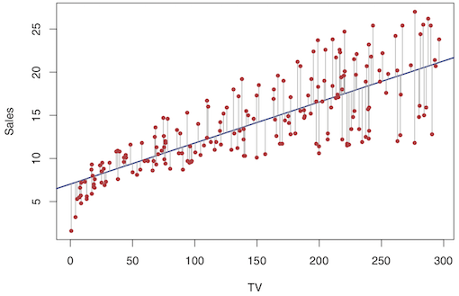
 
 위의 그림을 보자. 빨간색 점들은 우리가 갖고있는 $y_{i}$값이며 직선이 표현하고 있는 것은 추정한 $\hat{y}_{i}$들의 나열이다. 그렇다면 잔차 $e_{i}$는 $y_{i}-\hat{y}_{i}$를 의미하고 이는 *i*번째 관찰된 response value와 *i*번째 우리가 추정한 선형모델의 response value간의 차이를 나타낸다. 우리는 이를 RSS라고 칭하며 아래와 같이 표현가능하다.
 
 $$RSS=e_1^2+e_2^2+...+e_{n}^2$$
 
 또는 $$RSS=\sum\limits_{k=1}^n(y_{k}-\hat{\beta}_0-\hat{\beta}_1x_{k})^2$$
 
로 표현할 수 있다. 최소제곱법은 이러한 잔차제곱합 RSS를 최소화 하는 $\hat{\beta}_0$과 $\hat{\beta}_1$를 구하는 것인데, 이러한 해를 구하면 베타의 추정치들은 아래와 같다.

 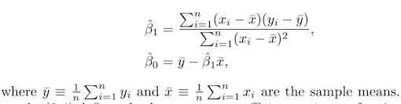
 
 
####Interpretation of the Coefficient Estimates

추정한 회귀계수들의 의미를 살펴보면 아래와 같이 요약할 수 있다.

* slope ${\beta}_1$은 독립변수 X가 한단위 증가할 때의 종속변수 Y의 평균적 변화량을 의미한다.

* 절편계수 ${\beta}_0$은 의미를 갖지않고, 선형회귀식을 보정하는 역할이다.

* 회귀계수의 추정과정을 살펴보면 이들은 주어진 X와 Y에 대해 완전히 의존하며, 이는 즉 다른 X값들이 반영되면 다른 결과값을 도출함을 의미한다.

####Assessing the accuracy of the Coefficient Estimates

우리는 추정한 회귀계수들이 실제의 회귀계수값과 얼마나 비슷한지, 얼마나 멀리떨어져있을지에 대해서 궁금증을 가질 것이다. 이때는 회귀계수 ${\beta}_0$, ${\beta}_1$의 표준오차(Standard error)를 통한 신뢰구간 추정을 통해 접근해볼 수 있다.

$\hat{\beta}_0$, $\hat{\beta}_1$의 표준오차를 구하기전에 이들의 분포는 아래와 같이 표현할 수 있다.
$$\hat{\beta}_0 \sim N({\beta}_0,Var(\hat{\beta}_0)), \hat{\beta}_0 \sim N({\beta}_1,Var(\hat{\beta}_1))$$
 이중 $\hat{\beta}_1$에 대해서만 $Var(\beta_1)$을 구해보자.
 
 $${\epsilon} \sim N(0,{\sigma}^2)$$
 $$\sum\limits_{i=1}^n(x_{i}-\bar{x})(y_{i}-\bar{y}) = \sum\limits_{i=1}^n(x_{i}-\bar{x})y_{i}$$
 를 이용하자. $\sum\limits_{i=1}^n(x_{i}-\bar{x})(y_{i}-\bar{y})$는 $S_{xy}$로 표현가능.
 
 먼저 $k_{i}= \frac{(x_{i}-\bar{x})}{S_{xx}}$로 두자. 그렇다면 아래와 같은 식전개를 통해 $Var({\beta}_1)$를 얻을 수 있다.
 
 $$V(\hat{\beta}_1) = V(\sum{k_{i}}y_{i})=\sum{k_{i}}V(y_{i})=\sum{k^2}{\sigma}^2=\frac{\sum(x_{i}-\bar{x})^2{\sigma}^2}{S_{xx}}=\frac{\sigma^2}{S_{xx}}$$
 $Var(y_{i})={\sigma}^2$인 이유는,${\epsilon} \sim N(0,{\sigma}^2)$으로 정의했고, ${\epsilon}$끼리 서로 독립이므로 $y_{i}$도 서로 독립이고 분산이 ${\sigma}^2$이 된다.

이와 같이 비슷한 방법을 통해 ${\beta}_0$에 대해서도 분산의 추정치를 구하여 표준오차를 구하면 두 회귀계수는 아래와 같이 표현할 수 있다.

$SE(\hat{\beta}_0)= \sqrt{{\sigma}^2[\frac{1}{n}+\frac{\bar{x}^2}{\sum\limits_{i=1}^n(x_{i}-\bar{x})^2}]}$, $SE(\hat{\beta}_1)=\sqrt{\frac{\sigma^2}{\sum\limits_{i=1}^n(x_{i}-\bar{x})^2}}$

표준오차 SE를 ${\beta}_0$과 ${\beta}_1$에 대해 신뢰구간을 표현하면 아래와 같이 쓸 수 있다.

$$[\hat{\beta}\pm{t}_{n-2,{\alpha}/2} SE(\hat{\beta})]$$
신뢰구간의 의미는 특정한 값을 가지는 알 수 없는 parameter의 값을 특정 %의 확률로 포함하는 구간을 의미하는데, 이는 조금 더 엄밀히 말하면 **같은 방법으로 일정한 개수만큼 모집단에서 100개의 표본 데이터셋을 추출했을 때 함께 계산되는 100개의 신뢰구간들 중 parameter를 포함한 신뢰구간들의 개수가 nn% x 100개 정도는 된다**의 의미를 갖는다.

&nbsp;&nbsp;&nbsp;&nbsp;표준오차는 또한 회귀계수에 대한 가설검정을 위해 사용되기도 한다. 
$H_0$ : There is no relationship between X and Y

$H_{a}$ : There is some relationship between X and Y

이 가장 흔하게 사용되는 가설검정의 form이다.

수하적으로 표현하면 이는 

$$H_0 : {\beta}_1=0$$

$$H_{a} : {\beta}_1 \neq 0$$
이다. 만약 여기서 ${\beta}_1$=0이면, 이 모델은 $Y={\beta}_0+{\epsilon}$으로 reduced form의 형태를 띄며, X는 Y와 관련되지 않은 predictor가 된다. 가설검정을 위해서는 t-통계량을 사용하여 이는 아래와 같은 식을 갖고,

$$t=\frac{{\hat\beta}_1-0}{SE(\hat{\beta}_1)} \sim t(n-2)$$
$H_0$하에서 $\hat{\beta}_1$이 따르는 분포는 위와 같고 이를 통해 얻은 t 통계량 값이 critical value의 바깥, 즉 기각역에 속하면 우리는 귀무가설 $H_0$를 기각한다. 이는 우리가 $\hat{\beta}_1$이 0이라고 가정하여 문제를 접근한 후, 그 중심값보다 상당히 먼 곳에(기각역에 속하는 영역) $\hat{\beta}_1$의 통계량이 위치하는 것은 기존에 생각한 $H_0$로 여긴 분포를 갖는게 아닌 아예 다른 분포를 갖는다는 것을 의미한다. 곧 이는 $\hat{\beta}_1$이 0이 아닌 유의한 어떠한 값을 가짐을 보여준다.

####Assessing the Accuracy of the Model

&nbsp;&nbsp;&nbsp;&nbsp;앞에서 우리가 단순선형회귀모형의 계수를 추정하고 기울기의 계수가 유의한지 test를 했으니, 이번에는 모델의 성능이 얼마나 정확한지에 대해서 평가를 해보는 시간을 가져보자! 이 책에서는 두가지를  대표적으로 소개하는데, **멋쟁이12기최연수**님의 자료를 참고하여 한가지를 더 넣어보았다.

* Residual Standard Error(RSE)

* RMSE(평균제곱근오차) **멋쟁이최연수님의아이디어**

* R-squared

먼저 RSE를 살펴보자. 우리가 true regression line을 추정할 수 있다고 가정해보자. 그렇다면 우리는 Y를 완벽하게 예측할 수 있을까? 

아쉽게도 우리는 Y의 관계식에 random한 error term이 있다는 것을 잊으면 안된다. 이 ${\epsilon} \sim N(0,{\sigma}^2)$는 irreducible하고 어쩔 수 없는 오차를 수반한다.
RSE는 결국 이러한 ${\epsilon}$의 표준편차에 대한 추정치를 의미하며 평균적으로 종속변수 Y가 true regression line에서 얼마나 떨어져있는가를 보여주는 추정치이다.

$$RSE=\sqrt{\frac{1}{n-2}RSS}=\sqrt{\frac{1}{n-2}\sum\limits_{i=1}^n(y_{i}-\hat{y}_{i})^2}$$

&nbsp;&nbsp;&nbsp;&nbsp;평균제곱근오차는 RSS를 자유도(n-2)대신 n으로 나눈 것이다.
n이 매우크다면 RSE와 RMSE의 차이가 미미하겠지만, RMSE는  prediction관점에서 많이 사용된다.

$$RMSE=\sqrt{\frac{1}{n}RSS}$$

이 두 RSE와 RMSE는 모델 잘 fitting이 되었는지를 측정하는 것으로 여겨진다.

&nbsp;&nbsp;&nbsp;&nbsp;R-squared는 총 변동 중에 설명된 변동의 비율을 보여주는 지표다. RSE 와 RMSE 가 절대적인 값으로 모델의 오차에 대한 정보를 제공한다면,
$R^2$는상대적인 값으로써 𝑌의 단위에 상관없이 변동에 대한 설명 비율로 모델의 설명력에 대한 정보를 제공하는 것에 위의 두개와 차이점을 갖는다.

$$R^2= \frac{SST-SSE}{SST}=1-\frac{SSE}{SST}$$
위의 식처럼 표현되고 
$$SST = \sum(y_{i}-\bar{y}^2)$$ 은 Total sum of squares(총 변동),

$$SSE=\sum(y_{i}-\hat{y}^2)$$은 Residual sum of squares(설명되지않은 변동),

$$SSR=\sum(\hat{y}_{i}-\bar{y}^2)$$은 Explained sum of squares(설명된 변동)
을 의미한다.

 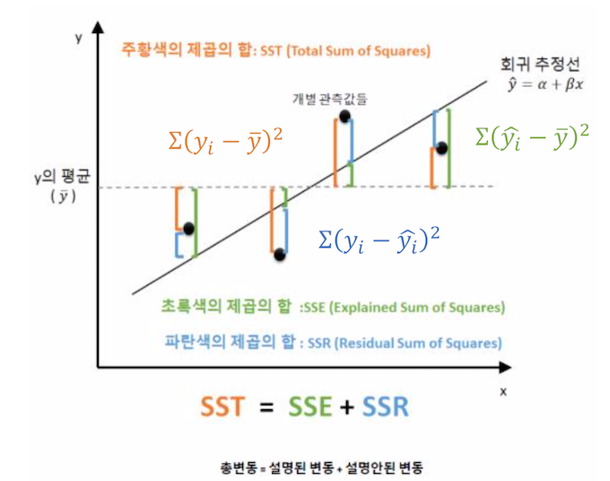

사진으로 쉽게 표현하면 위와 같이 표현할 수 있다.(**연수야 고마워!**)

###Multiple Linear Regression

&nbsp;&nbsp;&nbsp;&nbsp;다중선형회귀는 단순선형회귀와 유사하지만 독립변수 X의 개수 p개라는 점만 다르다. 이 또한 역시 독립변수 X와 Y간에 근사적인 선형관계가 있다고 가정한 모델이며, 선형 직선 혹은 선형 평면 또는 그 이상의 선형관계를 나타내는 모델이다.

$$Y= {\beta}_0+ {\beta}_1X_1+...+{\beta}_{p}X_{p}+{\epsilon}$$
위의 식이 다중선형회귀의 기본 형태이며 이를 추정하는 모델(회귀선)은 아래와 같다.

$$\hat{Y}={\hat\beta}_0+{\hat\beta}_1X_1+...+{\hat\beta}_{p}X_{p}$$

RSS는 단순회귀와 같은 식이지만 $\hat{y}_{i}$만 다르다는 차이가 있다.

 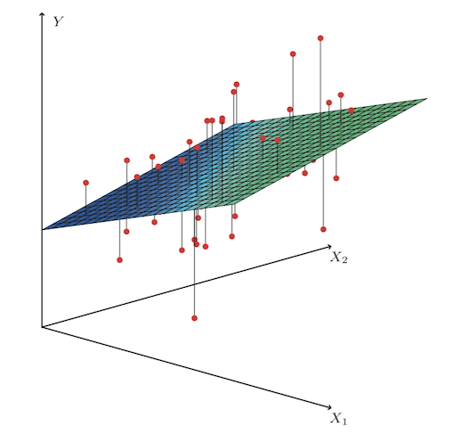
 
 위 그림은 3차원일 때의 두개의 predictor와 하나의 response Y를 보여주며 여기서 최소제곱회귀선은 선형평면의 형태를 띈다. 
 
 다중선형회귀에서 ${\beta}$를 추정하는 것을 선형대수학적으로 계산하면 아래와 같은 과정을 거친다.
 
  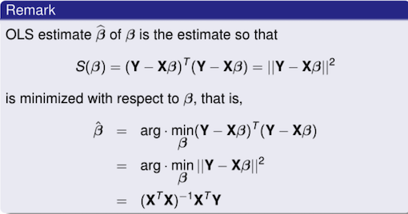
  
  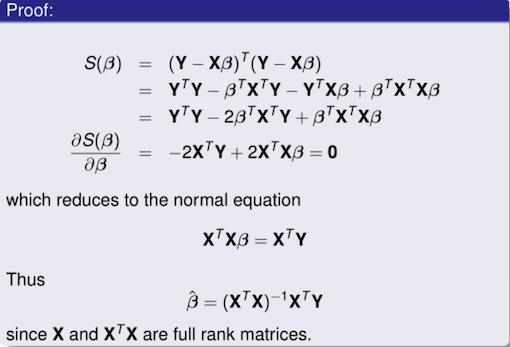
  
  
 추정한 회귀선에서 기울기 계수 $\hat{\beta}_{i}$의 의미는 다른 독립변수들의 선형성에 대해 조절했을 때(**Y와 공변하지 않을 때**) 독립변수 $X_{i}$가 한 단위 증가할 때 종속변수 Y의 평균적인 순 변화량을 의미한다. 이는 한개의 독립변수 X가 움직일 때 나머지 독립변수들은 통제를 한 상태에서 Y와 하나의 독립변수 X간의 변화량 관계를 설명하는데, 여기서 조심해야할 것은 **나머지 변수를 통제시킨다는 의미가 그 변수들을 무시하고 생각한다는 뜻과 다르다는 것**이다. 그렇기 때문에 다중선형회귀를 했을 때의 계수 ${\hat\beta}_{i}$는 단순선형회귀를 했을 때의 ${\hat\beta}_{i}$와 다르다.(무시와 통제의 차이)
 

####F-test

단순선형회귀와는 다르게 다중선형회귀에서는 독립변수와 종속변수 간의 선형관계 유무를 판별할 때에는 F-test를 사용하여 검정한다. 이러한 이유는
독립변수와 종속변수가 jointly 유의한 선형 관계를 가지는지에 대한 문제를 논하기 때문인데, 여러 회귀계수값들에 대해서 각각 독립적 T-test를 실시한다고 해도 만들어진 서로 다른 귀무가설들이 독립이 아니란 보장이 없기 때문이다. 또한 여러개의 귀무가설들이 각각 검정되는 경우 이 중 하나라도 기각될 확률이 커지고, 귀무가설을 과소평가할 가능성이 높기 때문이다.

$$H_{0}:{\beta}_1={\beta}_2=...={\beta}_{p}$$

$H_{a}:$ at least one ${\beta}_{j}$ is non-zero

$$F=\frac{(SST-SSE)/p}{SSE/(n-p-1)}$$

####Deciding on Important Variables

* Forward selection(전진선택법) : 절편계수만 존재하는 모델에서 시작하여($Y={\beta}_0+{\epsilon}$) RSS를 최소화하는 변수를 추가하는 방법, 특정 목적에 도달할 때 까지 계속한다.

* Backward selection(후진제거법) : 모든 독립변수 p개가 존재하는 모형에서 출발. 통계적으로 가장 유의하지 않은 변수를 제거해나감. 모든 계수들이 유의할때까지 반복. 
* Mixed selection : 절편 계수만 존재하는 모형에서 시작하여 RSS를 최소화하는 변수 추가해나감. 특정변수를 추가했을때 통계적으로 유의하지않은 계수가 발생시 그변수를 제거. 최종모델의 모든변수들이 유의하고 다른변수를 추가하면 유의하지않아질 때까지반복

model fit에 대한 정확성을 판단할 수 있는 척도로 다중회귀에서는 $adjusted R^2$를 사용한다. 최소제곱법은 종속변수와 아무리 관련없는 변수라도 어떤형태로든 RSS를 최소화하는 회귀직선을 추정하는데, 변수의 개수가 증가할수록 RSS는 감소하고 $R^2$는 증가할 수밖에 없다. 하지만 실제로 변수를 추가해서 RSS가 감소하고 $R^2$가 증가하는 것이 실제로 추가된 독립변수가 종속변수에 큰 영향을 주는 변수여서인지는 확실하게 알 수가없다. 그리하여 우리는 $R^2$의 대안으로 $adjusted R^2$를 쓴다.

$$Adjusted-R^2 =1-\frac{SSE/n-K}{SST/n-1}$$

다중선형회귀에서도 앞에서 배운 단순선형회귀와 마찬가지로 추정된 회귀계수는 추정치일 뿐, 우리는 true relationship을 절대 알 수가 없다. 함수f� 에대해 선형모형을 가정하는 것은 단지 가정일 뿐이고,true regression line을 안다고 하더라도 random 하게 발생하는 ${\epsilon}$� 까지는 통제 불가능하다.

###Other Considerations in the Regression

####Qualitative Predictors

많은 경우에 독립변수 중에 질적변수가 존재한다. 회귀에서는 이러한 변수를 만나면 어떻게 처리를 해야할까? 이때는 Dummy variable을 만들면 된다. (독립변수를 0,1의 값으로 변환한 변수)

 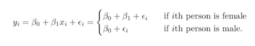
 이는 $x_{i}$를 i번째 사람이 female이면 x가 1, male이면 0으로 변환을 해준다.
 만약 질적독립변수가 3개 이상의 클래스를 가질경우에는 단일더미변수가 모든 가능한 클래스를 나타낼 수가 없다. 이때 필요한 더미변수의 갯수는 (범주의 개수-1)개 만큼 만들어 줘야한다.
 
 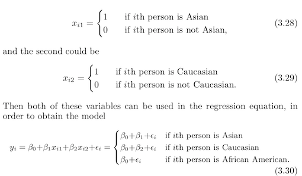
 
 
 
 ---
 
 &nbsp;&nbsp;&nbsp;&nbsp;지금까지 다룬 선형회귀는 단순하면서도 결과 해석이 가능하고 비교적 높은 정확도를 보여준다. 하지만 이런 선형회귀는실제에서 종종 지켜지기 힘든 엄격한 가정들을 품고있다. 예를 들어 아래와 같은 것들이 있다.
 
* Addictive 가정 : 독립변수 $X_{j}$에 따른 종속변수 Y의 변화가 다른 독립변수들의 값에 상관없이 독립이라는 것

* Linear 가정 : 독립변수 $X_{j}$가 한 단위 변화할 때 종속변수 Y의 변화량이 $X_{j}$의 값과 상관없이 상수라는 것.

하지만 실제로 한 독립변수가 다른 독립변수에 영향을 미치는 일은 종종 일어난다. 매체광고로 인한 sale을 예측하는데에 변수로 tv와 radio가 있다고 해보자. 만약 radio광고에 투자할수록 tv의 광고 또한 커진다고 한다면, 한 변수가 증가함에 따라 다른 변수의 기울기계수 역시 변화하게 될 것이다. 이를 마케팅에서는 **Synergy Effect**, 통계학에서는 **Interaction Effect**라 한다.

Interaction term을 통해 우리는 이러한 효과를 모형에서 고려할 수 있으며, 위의 예시를 식으로 적는다면 아래와 같은 꼴일 것이다.

$$Y={\beta}_0+{\beta}_1X_1+{\beta}_2X_2+{\beta}_3X_1X_2+{\epsilon}$$

$$={\beta}_0+({\beta}_1+{\beta}_3X_2)X_1+{\beta}_2X_2+{\epsilon}$$
이렇게 된다면 종속변수 Y에 대한 효과는 더이상 상수가 아니다.

####Non-linear relationship

어떤 독립변수는 종속변수와의 관계를 plot으로 그려보았을 때 비선형적인 관계를 가질 수도있다.(사실 매우매우 대부분의 변수관계들이 그럴 것이다.) 이럴 때는 단순하게 회귀분석을 함에 있어서 비선형함수를 회귀식에 포함시켜주면 된다. 하지만 그만큼 식이 복잡해지고 설명을 하기엔 선형회귀보다는 어려울 것이다. 아니면 다른 방법으로는 적절한 변환을 통해 X와 Y의 비선형관계를 선형화하거나 정규분포화 시키는 방법 등을 통해 입력변수 X를 깔끔하게 변환하여 모델에 집어넣는 것도 하나의 해결책이다.(ex. skewed된 데이터를 적절한 transformation을 통해 대칭형태로 만든다는 등)

####Non-constant Variance of Error Terms

&nbsp;&nbsp;&nbsp;&nbsp;우리는 error term에 대해서 몇가지 가정을 넣어놓았다. 

* Normality(정규성)

* Homoskedasticity(등분산성)

* Independent(독립성)

하지만 종종 잔차도 plot을 확인해보면 이러한 가정을 만족하지 않는 경우도 많다. 예를 들어 오차의 분산이 constant term이 아닐 경우에는 heteroskedasticity(이분산성)을 띄게 되는데, 이럴 때에는 response Y에 대한 적절한 변환을 통해 등분산가정을 만족하게 변환을 해줄 수 있다.

 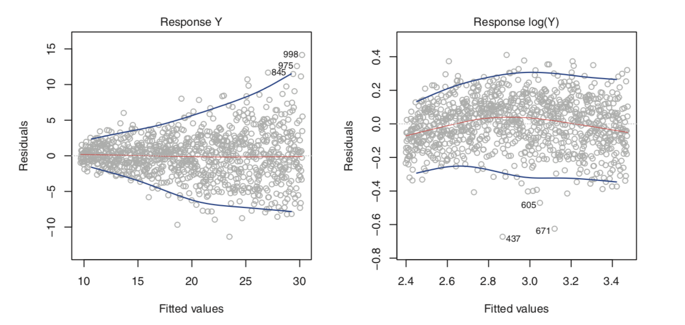
 
 위의 그림은 ISL의 사진을 첨부한 것인데, Y에 로그변환을 통해 적절하게 이분산성을 없앤 모습을 보여준다.
 
####Outliers

&nbsp;&nbsp;&nbsp;&nbsp;Outlier란 종속변수 $y_{i}$가 관측된 데이터 범위 내에서 멀리 떨어진 아주 작은 값이나 큰 값을 말한다. 이는 측정을 하는데 생긴 오류일수도 있고 입력오류일수도 있으며 아니면 정말 특이한 값이 데이터 안에 존재하는 경우 일수도 있다. 혹은 모델의 다른 독립변수가 고려되지 않아 발생하는 신호일수도 있고 이상치가 생기는 이유는 굉장히 다양하기에 이를 처리함에 있어서는 신중하게 처리해야한다.

####Collinearity

공선성은 두 개이상의 독립변수들이 서로 높은 선형관계를 가지는 것이다. 이는 추론관점에서 개별계수들을 해석하는데 장애물이 되기도 한다. 또한 예측관점에서도 비슷한 값을 갖는 RSS가 나올 수 있는 회귀 계수들의 조합이 많아진다. 이는 추정한 회귀계수의 불확실성을 높히며 계수가 유의하지 않을 확률이 올라가게 된다.

 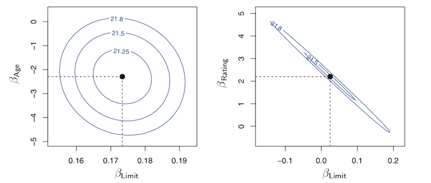
 
 공선성을 detecting하는 간단한 방법으로는 입력변수들간의 상관계수 행렬을 체크해보는 것이다. 상관계수의 절대값이 큰 원소가 있다면 이는 두 변수간에 corelation이 상당히 높다는 것을 의미하고 이는 공선성 문제가 데이터 내에 존재한다는 것을 의미한다. 하지만 상관계수 행렬만으로는 항상 이를 detecting할 수는 없는데, 이는 세개 이상의 변수가 행렬의 원소값이 특별히 높지 않더라도 서로 공선성이 존재할 수가 있기 때문이다. 우리는 이러한 상황을 다중공선성이 존재한다고 표현한다. 다중공선성 문제를 맞딱들였을 때는 상관계수 행렬보다는 *variance inflation factor*(VIF)를 계산하는 것이 더 나은 방법이다.
 
 $$VIF(\hat{\beta}_{j})=\frac{1}{1-R^2_{X_{j}|X_{-j}}}$$
 
VIF의 식은 위와 같으며 $R^2_{X_{j}|X_{-j}}$이 1에 가까워 지면 공선성이 존재한다는 뜻이고 VIF가 커진다. 일반적으로 VIF의 값이 5나 10을 초과하면 공선성의 문제가 존재한다는 것을 나타낸다.

공선성을  해결하는 방법으로 차원축소를 통해 변수를 조절하는 방법이 있다. 차원축소를 하기 위해 아래와 같은 두가지 방법이 종종 사용된다.

* variable selection 

* PCA 

먼저 변수선택은 공선성이 존재하는 두 가지의 변수 중, 한가지만 채택하여 추정모델에 넣는 것이다. 이는 간편하고 해석이 용이하다는 장점이 있지만, 하나의 입력변수를 완전히 삭제해버리는 것이기 때문에 우리가 가지고 있는 기본 정보를 손실한다는 단점 또한 존재한다.

간단한 모델로 입력변수가 2개만 존재하는 $Y={\beta}_0+{\beta}_1X_1+{\beta}_2X_2+{\epsilon}$모델을 생각해볼 때 PCA는 입력변수 X1과 X2간의 Linear comnination을 통해 축을 회전시켜 두 축(PC1,PC2)가을 independent한 관계로 바꾸어 한개의 축만 채택하여 차원을 축소하는 방법이다.

이는 PC1만을 채택하여 하나의 변수를 버리는 것과 비슷하게 보여지지만, PC1은 결국 ${\alpha}X_1+{\beta}X_2$꼴의 선형결합이기 때문에, 정보를 손실하지 않고도 차원을 축소하여 공선성을 해결할 수 있는 방법이다. 하지만 이러한 선형결합으로 인해 모델 해석이 어려워진다는 단점 또한 존재한다.

 

##The Basics of Decision Trees

&nbsp;&nbsp;&nbsp;&nbsp;Tree-based model은 단순하며 해석에 용이한 지도학습의 방법 중 하나이다. 순서는 Decision tree를 Regression과 classification 두 가지로 나누어 설명하며, 의사결정나무모형 이후에 Bagging과 random forests, boosting을 간단하게 설명하도록 할 것이다.

###Regression Trees

먼저 Regression Tree model로 간단한 예시를 *An Introduction to Statistical Learning with R(ISLR)*교재에서 가져와 보이겠다.

 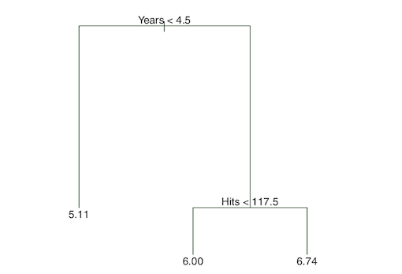
 
  위는 *Hitters* 데이터 셋을 사용하였으며, 농구선수 들의 Salary를 선수들이 프로리그에서 경기한 햇수와 슛팅횟수를 통해 데이터를 분류한 간단한 사진이다.
  
  맨 윗줄의 분할 규칙을 보면(top split) 먼저 선수들의 집단을 프로리그에서 뛴 햇수가 4.5년 이상인지 이하인지로 구분을 함을 알 수 있다. 그 아래 node는 햇수로 선수들을 두 집단으로 구분한 뒤 , 슛팅횟수 117.5개를 기준으로 또 그룹 split을 함을 확인할 수 있다. 이 그림을 2차원의 평면 위에서 그림으로 표현한다면 아래와 같이 나타난다.
  
  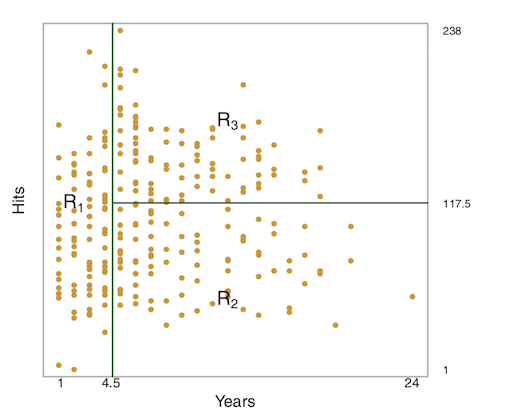

&nbsp;&nbsp;&nbsp;&nbsp;위와 같은 세가지 regions에서 각각 region에 속해있는 player들의 mean response value를 구하는 것을 predicted Y로 설정하는 것이 기본적인 regression decision tree method의 매커니즘이다. 위의 그림에서 $R_1,R_2, R_3$의 region을 우리는 트리의 *terminal nodes*, 혹은 *leaves*라고 칭한다.

 위의 간단한 예시를 해석한다면 우리는 Salary를 결정하는 요소중 가장 중요한 factor는 Years라는 것을 알 수 있고, 리그에서 뛴지 4.5년이상이 된 플레이들 중에서는  이전 년도의 number of hits이 salary에 영향을 미친다는 것을 알 수 있다. 위 예시의 회귀 나무 모형은 Hits, Years, Salary간의 true relationship을 지나치게 단순화 하여 표현한 가능성이 높지만, 이는 회귀모형의 장점이며, 해석에 용이하고 시각화하기 편하다는 장점이 있다.
 
 
####Process of building regression tree
 
&nbsp;&nbsp;&nbsp;&nbsp;Rough하게 말해서 우리는 회귀트리를 만드는 것을 두가지 단계로 설명할 수 있다.

* predictor space를 set of possible values인 $X_1,X_2,...,X_{p}$가 $\mathbf{J}$ 개의 distinct한 non-overlapping 한 $R_1,R_2,...,R_{J}$구역에 속하게 정의한다.

* 모든 관측치는 region $R_{j}$에 속하며, $R_{j}$에 속하는 training observations들의 mean of response value로 예측을 시행한다.

 첫번째 Step에서 predictor Space가 two regions으로만 나뉘어져 있다고 가정을 해보고, $R_1$ 구역의 response mean이 10, $R_2$구역의 response mean이 20이라고 가정해보자. 여기서 Given observation이 $X=x$, if $x\in{R_1}$이면 우리는 10으로 예측을 하는 것이다.
 
 두번째 단계에서 우리는 regions을 어떻게 모양을 정의할 수 있을까? 실제로 region은 어느 모양으로도 형성될 수 있으며, 고차원에서는 우리가 생각하는 것 처럼 예쁜 직선으로만 경계를 나누지는 않을 것이다. 하지만 결국 region들의 모양이 어떻게 되던간의 우리의 목표는 RSS, 즉 잔차제곱합을 최소화하는 $R_1,..,R_{J}$를 찾는 것이다.
 
 
 $$\sum\limits_{j=1}^J\sum\limits_{i\in{R_j}}(y_{i}-\hat{y}_{R_{j}})^2$$
 RSS는 위처럼 표현되며, 여기서 $\hat{y}_{R_{j}}$는 mean response for the training observations within the *j*th box이다. 하지만 불행히도 **J** box에 대해서 가능한 모든 partition을 고려하는 것은 매우힘들다. 이러한 이유로 우리는 top-down, greedy 접근방법을 사용하는데 이는 *recursive binary splitting*으로 불린다. 
 
 Recursive binary splitting을 수행하기 위해 우리는 첫단계로 predictor $X_{j}$와 cutpoint *s*를 지정해주고 이는 predictor space를 $\{X|X_{j}<s\}$와 $\{X|X_{j}\ge{s}\}$ 로 나는데, 이때 predictor나 cutpoint설정은 RSS의 감소를 최대화하는 것으로 나누는 것이다. 이를 수식으로 좀 더 자세하게 표현하면 아래와 같이 표현가능하며, 이때의 *j*와 *s*를 찾는 것은 그 아래의 eqation을 최소화하는 j와 s를 찾는 것과 같다.
 
 $R_1(j,s) = \{X|X_{j} <s\}$ and $R_2(j,s) = \{X|X_{j} \geq s\}$,
 
 $\sum\limits_{i:x_{i}\in{R_{1}(j,s)}}(y_{i}-\hat{y}_{R_{1}})^2$ + $\sum\limits_{i:x_{i}\in{R_{2}(j,s)}}(y_{i}-\hat{y}_{R_{2}})^2$

 Input variables들의 사이즈가 크지않다면 위의 식을 구하는 것은 그렇게 오래 걸리지는 않을 것이다. 그 다음으로 우리는 이러한 과정을 계속해서 반복하여 모든 resulting regions내에서 RSS를 최소화하게 데이터를 분할하는 최적의 prediction 와 cutpoint를 찾으면 된다.
 
 만약 모든 regions이 정의가 되었다면, 우리는 새로 들어오는 test 관측치에 대해서 그 test 관측치가 속하는 regions의 train 관측치의 평균을 예측값으로 사용하면 된다.
 
 
 
####Tree Pruning 

 앞서 소개한 방식은 training set에 대해 좋은 예측값을 갖는 것 같지만, 자료에 대해 과적합할 가능성이 매우크고, test set에 대해 형편없는 결과를 가져오기도 한다. 이는 짠 트리모델이 너무 복잡하기 때문인데, 그래서 적은 분할을 한 작은 트리들은 편향을 줄이는 것을 희생하며 낮은 variance와 더 나은 용이한 해석을 이끈다.
 
 위와 같은 방식의 한가지 대안으로는, 각 분할에서 RSS의 감소가 특정 threshold를 넘는 split만 채택을 하여 tree를 줄이는 것을 예로 들 수 있다. 이런 대안은 조금 더 작은 tree를 만들지만, 이는 근시안적인 방법이다. 그 이유로는 트리형성의 각 초기단계에서는 형편없어 보이는 split이 나중에 tree전체를 만들어 놓은 이후 보았을 때는 large reduction in RSS를 가져올 수도 있기 때문이다.
 
 그러므로, 트리모형을 설계를 하면서 얻을 수 있는 더 나은 전략은, 먼저 가능한 매우 큰 나무 $T_0$을 만든 이후에, subtree를 얻기 위해 마지막에서 가지를 쳐내는 것이다. **어떻게 나무에 가지치기를 하는 것이 가장 좋은 방법일까?** 직관적으로 우리는 가장 낮은 test error rate를 갖는 subtree를 찾는 것이다. 
 
subtree를 얻은 후에, 우리는 교차검증 또는 validation set 접근을 통해서 test error를 추정할수 있다. 하지만 모든 subtree에 대해 너무나 많은 조합의 수가 존재하기에, 교차검증 error를 추정하는 것은 매우 소모적이고 비현실적이다.

 이를 위해 우리는 *Cost complexity pruning* 또는 *weakest link pruning* method로 알려진 방법을 사용할 수 있다. 모든 subtree의 경우의 수를 찾는 것이 아니고 음수가 아닌 튜닝 파라미터 $\alpha$로 인덱싱된 트리의 시퀀스를 고려해보는 것이다.
 
 알고리즘을 간단하게 표현하면 아래와 같은 단계로 이루어진다.
 
 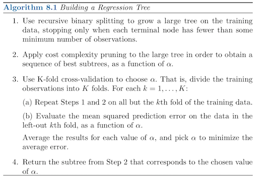

 
* Recursive binary splitting을 통해 traninig data로 큰 트리를 만들면서, 각 terminal node가 일정 수준의 minimum level의 관측치 갯수를 갖게 된다면 트리형성을 멈춘다.
 
* 최적의 subtree 시퀀스를 얻기위해 $\alpha$의 함수를 이용하여 cost complecity pruning을 적용한다.

* K-교차검증을 이용하여 $\alpha$를 결정한다.

* 각 $\alpha$값들의 결과를 평균내어 average error를 최소화하는 $\alpha$를 채택한다.

 $\alpha$를 이용하여 RSS에 penalty를 부과하여 가지치기를 하는 것을 식으로 표현하면 아래와 같이 나타낼 수 있다.
 
 $$\sum\limits_{m=1}^{|T|}\sum\limits_{x_{i}\in{R_{m}}}(y_{i}-\hat{y}_{R_{m}})^2 + {\alpha}|T|$$
 
 앞서 일반적인 의사결정나무모형에서 RSS를 최소화하는 매커니즘은 똑같지만 $\alpha$에 대한 항이 더하기로 추가되었다. 여기서 $T$는 terminal nodes의 갯수이며, 
$\alpha$는 튜닝 파라미터이다. 이 $\alpha$는 subtree의 모델 complexity와 training data에 fitting하는 것과 trade-off한 관계를 갖는다. 
쉽게 설명을 하면 $\alpha$가 0이라면 위의 식은일반적으로 우리가 RSS를 구하는 식과 같으며 그럴때의 RSS를 최소화하는 식은 트리의 깊이를 최대한으로 깊게 만들어 모든 관측치들을 하나하나 terminal node로 삼는 경우일 것이다.

만약 모든 것이 같고 여기서 $\alpha$가 0이 아니라면, tree를 가장 깊게 뻗었을 때는 잔차제곱합에 추가로 $\alpha$항이 추가되었기 때문에, RSS를 최소화하는 경우와 일치하지 않게 된다. 덧붙혀 $\alpha$가 0에 근사한 작은 값이 아니고 적당히 큰 숫자를 갖는다면 잔차제곱을 나타내는 $\sum$안의 왼쪽 항보다 오른쪽항이 전체식에 영향을 더 크게 주기때문에 이럴 경우라면 terminal node의 수를 줄이는 것이(=make smaller subtree) 위 식의 quantity를 minimize 시킬 것이다. 

###Classification Trees

&nbsp;&nbsp;&nbsp;&nbsp; Classification tree는 regression tree와 양적 response가 아닌 질적 response를 예측한다는 것을 제외하고는 매우 유사하다. 회귀의 경우 관측치에 대한 response는 같은 terminal node에 속한 training 관측치의 평균 response로 예측을 하는데 반해, 분류의 경우에는 training 관측치가 속한 region에서 *most commonly occuring class*에 속한 개별 관측치를 예측한다.

 분류나무의 결과를 해석할 때는 특정 terminal node region에 상응하는 class prediction 뿐만 아니라, 각 region에 들어있는 training 관측치 사이에서 *class proportions* 또한 포함한다.
 
 트리를 만들 때에는 회귀의 경우와 비슷하게 **Recursive binary splitting**을 사용하지만, binary split의 기준이 RSS가 아닌 *classification error rate*를 사용한다. classification error rate는 단순하게 가장 공통적인 class에 속하지 않은 region에 포함된 training 관측치의 일부분으로 생각하면 된다.
 
 $$E= 1-max_{k}(\hat{p}_{mk})$$
 
 아래의 식에서 $\hat{p}_{mk}$는 *k*th class인 *m*번째 region안에 있는 training 관측치의 비율을 나타낸다. 하지만 기껏 설명했지만 이 분류에러비율은 tree-growing에 있어서 충분하게 sensitive하지 않아서 다른 두 가지 방법이 더 선호되는데 이는 우리가 잘 알고 있는 *Gini index*와 *entropy*가 있다.
 
 지니지수는 아래와 같이 표현되는데,
 
 $$G=\sum\limits_{k=1}^K\hat{p}_{mk}(1-\hat{p}_{mk})$$
 
 쉽게 말해서 이 인덱스는 node의 purity를 측정하는 것이며, 이 값이 작으면 이는 node가 대개 단일 클래스로부터 나온 관측치로 이루어져있다는 것을 의미한다.
 
 $$D=-\sum\limits_{k=1}^K\hat{p}_{mk}log\hat{p}_{mk}$$
 
 위의 식은 Entropy에 대한 설명인데, 이 또한 지니계수와 비슷하게 수치가 작을 수록 *m*번째 노드가 pure하다는 것을 의미한다.
 
&nbsp;&nbsp;&nbsp;&nbsp;분류에러비율과 지니계수, 엔트로피는 모두 나무에 가지치기를 할때 이용하지만 보통 일반적으로 최종 가지치기한 나무의 예측 정확성이 main goal이라면 분류에러비율을 criterion으로 사용하는 것이 선호된다.

&nbsp;&nbsp;&nbsp;&nbsp;간단하게 요약하면 Tree모형은 아래와 같은 장단점을 갖는다.

* 설명이 매우 용이하고, 어떨때는 선형회귀보다 쉽게 설명할 수 있다.

* 비전문가라도 tree의 사이즈가 너무 크지만 않다면 해석이 쉽고 시각화하여 볼 수있다.

* dummy variable들을 따로 생성하지 않아도 질적 predictors를 조작하기에 매우 쉽다.

* 하지만 이 책에서 다루는 다른 회귀나 분류를 다루는 방법들과 동일한 예측 정확성을 갖지는 않는다

* 가장 큰 단점으로는 트리모형은 아주아주 *non-robust*하다. 달리말해, 데이터가 조금만 바뀌어도 최종 예측되는 트리에 아주 큰 변화를 야기한다.

하지만 우리는 bagging, random forest, boosting 등의 방법으로 트리모형의 성능을 향상 시킬 수 있다!

##Bagging, Random Forests, Boosting

&nbsp;&nbsp;&nbsp;&nbsp;앞서 말한 것처럼 트리모델은 데이터셋이 조금만 달라도 아주 다른 결과값을 낳을 수도 있다고 언급했다. 이는 편향은 작지만 높은 분산을 갖는다.  

이러한 high-variance를 해결하기 위한 방법으로는 *bagging*, 즉 *bootstrap aggregation*을 통해 통계학습방법의 분산감소를 얻을 수있다.

$$\hat{f}_{avg}(x) = \frac{1}{B}\sum\limits_{b=1}^B\hat{f}^b(x)$$

부트스트랩을 이용하는 것은 위와 같이 표현할 수 있다. 풀어서 설명하면, 우리가 가지고 있는 training data set을 여러번 (많이 혹은 아주 많이) 복원추출을 통해 resampling하여 여러개의 표본 sample을 얻은 후, 이들을 각각 학습 알고리즘에 넣어 분류 혹은 회귀를 시행한 후 그 결과값(MSE등)의 평균을 통하여 prediction을 하는 방법이다. B개 만큼의 트리가 생기는 거고 이를 averaging하면 분산을 감소시키는 효과를 볼 수 있다.

여기서 number of trees **B**(resampling을 통해 그만큼 하나의 training set에서 여러개의 data set을 만들기에 그만큼 트리가 생기는 것) 는 bagging에서 엄청 중요시 여겨지는 파라미터는 아닌데, 그 이유는 B가 매우커져도 이것이 과적합과 직결되지는 않기 때문이다. B를 크게 늘린다는 것은 나무의 깊이를 깊게해 매우 많은 split을 통해 terminal node를 늘리는 것의 의미가 아니며 오히려 error를 더 안정화시키게 만든다. 

####Out-of-Bag Error Estimation
 
&nbsp;&nbsp;&nbsp;&nbsp;평균적으로 bootstrap을 진행하면 관측치의 2/3정도만 사용되어진다.

이론적으로 N개의 관측치에 data에서 N개의 표본을 복원추출하게 될 경우 각 데이터가 뽑힐 확률은 아래와 같고, 

$$1-(1-\frac{1}{N})^N$$

N이 매우 커지면 위 식은 $1-\frac{1}{e}$로 수렴하는데 이는 약 0.63정도이기에 관측치의 2/3정도만 확률적으로 사용되어진다는 뜻이다.

그렇다면 남은 관측치의 1/3은 bagged tree에서 fitting되는데 사용되지 못한다는 뜻을 의미하는데, 이를 *out-of-bag*(OOB)관측치라고 칭한다. 우리는 이러한 OOB샘플들을 활용하여 트리모형에서의 decision에 가중치를 조정할수도 있고, 분류모형에서는 오분류율을 추정하는 등 다양한 용도로 사용할 수있다.

특히 OOB error의 결과는 bagged model에서 test error를 추정하는데 있어서 한번도 fittingdㅔ 사용되지 않은 response들을 갖고 추정을 하기때문에 타당하다.

이러한 Bagging기법은 의사결정나무에 적용을 하면 가지치기 작업을 생략할수도 있게 해주고, error의 variance를 줄여준다는 장점이 있지만, single decision tree와는 다르게 어떠한 변수가 procedure에서 얼마나 중요한 영향력을 갖는지를 체크할 수 없다. 즉 Bagging은 **해석을 희생하여 예측의 정확도를 향상시키는 방법**이라고 말할 수 있다.

하지만 비록 단일 의사결정나무보다는 해석에 용이하지 않더라도, 회귀트리에서의 RSS와 분류트리에서의 Gini index등을 통해 전체적으로 개략적인 각 변수의 중요도는 가늠할 수 있다. 우리는 bagging에서  부트스트랩을 통해얻은 B개의 트리들을 평균함으로써 RSS나 gini index가 얼마만큼 감소했는지를에 대해 total amount를 체크할 수 있는데, 여기서 가장 큰 값들을 보이는 변수들이 중요한 변수들이 된다.

 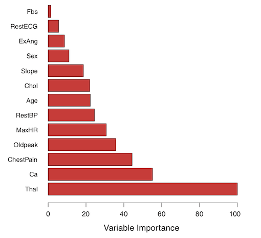
 
 위의 그림은 분류트리의 예시인데, value값이 제일 큰 Thai, Ca, ChestPain이 largest mean decrease in Gini index를 갖는 변수이고 개중에 제일 중요한 변수라는 뜻을 의미한다.
 

###Random Forest 

&nbsp;&nbsp;&nbsp;&nbsp; 랜덤포레스트 기법은 트리에 bagging을 적용한 방법을 트리간의 상관관계를 제거하는 매커니즘을 이용하여 예측정확도를 향상시키는 기법이다.
 
 랜덤포레스트를 짤 때, 트리의 각 split에서 알고리즘은 가능한 대부분의 predictors들을 고려하는 것을 허용하지는 않는다. p개의 predictors들이 있다면 이들을 전부사용하지 않고 일부만 사용하여 트리를 짜는 것이다.(보통 total number of predictors의 갯수에 제곱근을 취한 갯수만큼을 사용한다.) 이는 정확도를 위해 회귀와 분류를 수행함에 있어서 이상한 소리처럼 들리겠지만, 사실은 상당히 합당하다.
 
 만약 data set에서 매우 강력한 설명변수가 있다고 가정해보자. 이러한 data set을 통해 bagging을 수행하면 대부분 또는 모든 트리가 이 강한 설명변수를 top split에 놓아 사용할 것이고, 이는 결국 대부분의 bagged tree가 비슷한 모양을 갖게되는 결과를 낳는다. 더군다나 이럴 경우에 bagged tree에서 나오는 predictions은 매우 **highly correlated**되어있다. 불행하게도 많은 상관관계가 높은 quantities 들을 averaging 하는 것은 그렇지 않을 때의 결과보다 형편없는 reduction in variance를 갖는다. 이는 즉 bagging 기법은 단일 트리 setting 에서 상당한 분산감소효과를 가져오지 않는다는 것을 의미한다.
 
 랜덤포레스트는 각 split에 사용하는 변수를 predictor space 전체로 사용하는 것이 아닌, predictor의 부분집합을 사용하여 이러한 문제를 극복한다. 
 이러한 과정을 우리는 tree를 decorrelationg 한다고 생각할 수 있는데, 먼저 랜덤포레스트도 bagging과 유사하게 bootstrap을 통해 샘플을 추출하고, 사전에 모형적합에 이용할 변수의 수 m만큼을 p개의 변수들 중에서 random하게 뽑아 트리생성에 사용한다. 하나의 트리가 만들어지면 또 다른 트리를 형성할 때 만약 어떠한 강력한 설명변수가 있다고 해도 random하게 m개의 표본변수를 뽑아 수행하기 때문에, 다른 변수들이 split형성에 많은 기회를 갖게 되는 것이다.
 
&nbsp;&nbsp;&nbsp;&nbsp; bagging과 랜덤포레스트의 가장 큰 차이점은 predictor 부분집합의 사이즈에 관하여 가장 큰 차이점을 갖는다. 만약 랜덤포레스트에서 *m=p*로 놓는다면, 트리 분할에 모든 predictor의 전체집합을 사용한다는 의미이므로 이때는 bagging과 랜덤포레스트가 같은 결과를 낳는다. 랜덤포레스트는 일반적으로 $m=\sqrt{p}$개의 predictors를 사용하며, 이는 test error와 OOB error에 대해 bagging보다 나은 결과를 갖는다.

###Boosting 

&nbsp;&nbsp;&nbsp;&nbsp;앞에서는 bagging과 random forest에 대해서 살펴보았는데, 이번에는 prediction을 향상시키는 또 다른 방법인 boosting에 대해서 논의해보자.

bagging을 생각해보면 우리는 original training set을 bootstrap sampling을 통해 여러개로 카피하고, 각각의 복사본은 single predictive model을 만들기 위해 각각 트리를 형성한 후, 이에 대한 결과값(MSE, Gini index등..)을 결합하여 예측을 수행하였다. 이론적으로 bootstrap을 통해 생성된 트리들은 다른 트리들과 독립일 것이다. 부스팅은 이와 비슷하지만, 트리들이 독립적이지 않고 서로 sequentially하게 연결되어있는 것이 앞의 방법과 가장 큰 차이점이다.

 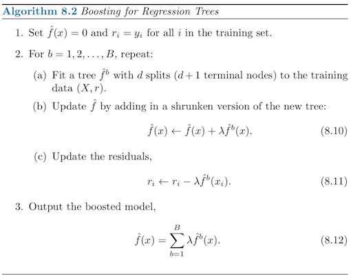
 
 위의 그림이 부스팅알고리즘을 도식화 한 것이다. 풀어서 설명하면 먼저 original data를 이용하여 d개의 terminal node를 갖는 tree model을 fitting한 후, 그 예측 결과와 실제 값의 차이를 산출하는데 이때 learning rate $\lambda$를 선택해 예측값에 learning rate를 곱한 값만큼을 제외한다. 그리고 다음 트리를 만드는 round에서 기존 outcome $Y$가 아닌 모형의 잔차를 이용하여 새로운 트리를 생성한다. 그리고 이러한 과정을 B번 반복하는 것이다.
 
 위에서 사용된 부스팅에는 세가지 파라미터가 있고 이는 아래와 같다.
 
 * The number of tree : $B$
 
 - 배깅과 랜덤포레스트와는 다르게 부스팅은 B가 매우 커질 수록 과적합이 될 가능성이 존재하는데, 고로 B값은 교차검증을 통해 결정한다.
 
 * learning rate(=shrinkage parameter) : $\lambda$
 
 - 이는 모형의 학습속도를 조절하는 것으로 보통 0.01, 0.001일 쓰지만 데이터에 따라 그 값을 달리한다. 만약 람다 값이 매우 작을 경우에는 모형이 적절하게 학습되기 위해 B가 매우 커야한다.
 
 * tree의 terminal node수 : $d$
 
 - 보통 d=1일 때 학습이 좋은 예측을 이끌며 이럴 경우 트리를 *stump model*이라 칭한다. d는 가법모형에서interaction effect를 반영하는 것과 유사하기 때문에 interaction depth로 불리기도 한다.
 
부스팅에서는 기존의 트리모델이 다음 트리에 sequential하게 영향을 주기 때문에 일반적으로 적은수의 terminal node를 사용하더라도 좋은 결과를 나타낼 수 있다.

###고생하셨습니당
 
 
 
 
 
 
